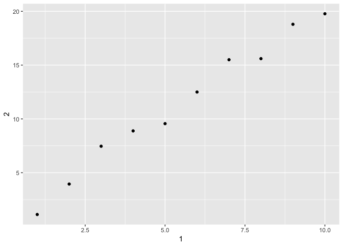

# May31
Julin N Maloof  
5/28/2017  


## Exercises 10.5

### 1
_How can you tell if an object is a tibble? (Hint: try printing mtcars, which is a regular data frame)._


```r
library(tidyverse)
```

```
## Loading tidyverse: ggplot2
## Loading tidyverse: tibble
## Loading tidyverse: tidyr
## Loading tidyverse: readr
## Loading tidyverse: purrr
## Loading tidyverse: dplyr
```

```
## Conflicts with tidy packages ----------------------------------------------
```

```
## filter(): dplyr, stats
## lag():    dplyr, stats
```

```r
mtcars
```

```
##                      mpg cyl  disp  hp drat    wt  qsec vs am gear carb
## Mazda RX4           21.0   6 160.0 110 3.90 2.620 16.46  0  1    4    4
## Mazda RX4 Wag       21.0   6 160.0 110 3.90 2.875 17.02  0  1    4    4
## Datsun 710          22.8   4 108.0  93 3.85 2.320 18.61  1  1    4    1
## Hornet 4 Drive      21.4   6 258.0 110 3.08 3.215 19.44  1  0    3    1
## Hornet Sportabout   18.7   8 360.0 175 3.15 3.440 17.02  0  0    3    2
## Valiant             18.1   6 225.0 105 2.76 3.460 20.22  1  0    3    1
## Duster 360          14.3   8 360.0 245 3.21 3.570 15.84  0  0    3    4
## Merc 240D           24.4   4 146.7  62 3.69 3.190 20.00  1  0    4    2
## Merc 230            22.8   4 140.8  95 3.92 3.150 22.90  1  0    4    2
## Merc 280            19.2   6 167.6 123 3.92 3.440 18.30  1  0    4    4
## Merc 280C           17.8   6 167.6 123 3.92 3.440 18.90  1  0    4    4
## Merc 450SE          16.4   8 275.8 180 3.07 4.070 17.40  0  0    3    3
## Merc 450SL          17.3   8 275.8 180 3.07 3.730 17.60  0  0    3    3
## Merc 450SLC         15.2   8 275.8 180 3.07 3.780 18.00  0  0    3    3
## Cadillac Fleetwood  10.4   8 472.0 205 2.93 5.250 17.98  0  0    3    4
## Lincoln Continental 10.4   8 460.0 215 3.00 5.424 17.82  0  0    3    4
## Chrysler Imperial   14.7   8 440.0 230 3.23 5.345 17.42  0  0    3    4
## Fiat 128            32.4   4  78.7  66 4.08 2.200 19.47  1  1    4    1
## Honda Civic         30.4   4  75.7  52 4.93 1.615 18.52  1  1    4    2
## Toyota Corolla      33.9   4  71.1  65 4.22 1.835 19.90  1  1    4    1
## Toyota Corona       21.5   4 120.1  97 3.70 2.465 20.01  1  0    3    1
## Dodge Challenger    15.5   8 318.0 150 2.76 3.520 16.87  0  0    3    2
## AMC Javelin         15.2   8 304.0 150 3.15 3.435 17.30  0  0    3    2
## Camaro Z28          13.3   8 350.0 245 3.73 3.840 15.41  0  0    3    4
## Pontiac Firebird    19.2   8 400.0 175 3.08 3.845 17.05  0  0    3    2
## Fiat X1-9           27.3   4  79.0  66 4.08 1.935 18.90  1  1    4    1
## Porsche 914-2       26.0   4 120.3  91 4.43 2.140 16.70  0  1    5    2
## Lotus Europa        30.4   4  95.1 113 3.77 1.513 16.90  1  1    5    2
## Ford Pantera L      15.8   8 351.0 264 4.22 3.170 14.50  0  1    5    4
## Ferrari Dino        19.7   6 145.0 175 3.62 2.770 15.50  0  1    5    6
## Maserati Bora       15.0   8 301.0 335 3.54 3.570 14.60  0  1    5    8
## Volvo 142E          21.4   4 121.0 109 4.11 2.780 18.60  1  1    4    2
```

```r
as_tibble(mtcars)
```

```
## # A tibble: 32 × 11
##      mpg   cyl  disp    hp  drat    wt  qsec    vs    am  gear  carb
## *  <dbl> <dbl> <dbl> <dbl> <dbl> <dbl> <dbl> <dbl> <dbl> <dbl> <dbl>
## 1   21.0     6 160.0   110  3.90 2.620 16.46     0     1     4     4
## 2   21.0     6 160.0   110  3.90 2.875 17.02     0     1     4     4
## 3   22.8     4 108.0    93  3.85 2.320 18.61     1     1     4     1
## 4   21.4     6 258.0   110  3.08 3.215 19.44     1     0     3     1
## 5   18.7     8 360.0   175  3.15 3.440 17.02     0     0     3     2
## 6   18.1     6 225.0   105  2.76 3.460 20.22     1     0     3     1
## 7   14.3     8 360.0   245  3.21 3.570 15.84     0     0     3     4
## 8   24.4     4 146.7    62  3.69 3.190 20.00     1     0     4     2
## 9   22.8     4 140.8    95  3.92 3.150 22.90     1     0     4     2
## 10  19.2     6 167.6   123  3.92 3.440 18.30     1     0     4     4
## # ... with 22 more rows
```

```r
class(mtcars)
```

```
## [1] "data.frame"
```

```r
class(as_tibble(mtcars))
```

```
## [1] "tbl_df"     "tbl"        "data.frame"
```

In the Rstudio Rmd interacre you can;t tell just by printing it (other than the row names go away).  At the console it is clear because we are told that a tiblle is a tibble.  Otherwise use `class()`


### 2
_Compare and contrast the following operations on a data.frame and equivalent tibble. What is different? Why might the default data frame behaviours cause you frustration?_


```r
df <- data.frame(abc = 1, xyz = "a")
df$x
```

```
## [1] a
## Levels: a
```

```r
df[, "xyz"]
```

```
## [1] a
## Levels: a
```

```r
df[, c("abc", "xyz")]
```

```
##   abc xyz
## 1   1   a
```


```r
dft <- as_tibble(df)
dft$x
```

```
## Warning: Unknown or uninitialised column: 'x'.
```

```
## NULL
```

```r
dft[, "xyz"]
```

```
## # A tibble: 1 × 1
##      xyz
##   <fctr>
## 1      a
```

```r
dft[, c("abc", "xyz")]
```

```
## # A tibble: 1 × 2
##     abc    xyz
##   <dbl> <fctr>
## 1     1      a
```

tibles require exact matches for column names.

tible extactions always always return a tibble, whereas dataframes can return a vector.

### 3
_If you have the name of a variable stored in an object, e.g. var <- "mpg", how can you extract the reference variable from a tibble?_


```r
var <- "hwy"
data(mpg)
mpg
```

```
## # A tibble: 234 × 11
##    manufacturer      model displ  year   cyl      trans   drv   cty   hwy
##           <chr>      <chr> <dbl> <int> <int>      <chr> <chr> <int> <int>
## 1          audi         a4   1.8  1999     4   auto(l5)     f    18    29
## 2          audi         a4   1.8  1999     4 manual(m5)     f    21    29
## 3          audi         a4   2.0  2008     4 manual(m6)     f    20    31
## 4          audi         a4   2.0  2008     4   auto(av)     f    21    30
## 5          audi         a4   2.8  1999     6   auto(l5)     f    16    26
## 6          audi         a4   2.8  1999     6 manual(m5)     f    18    26
## 7          audi         a4   3.1  2008     6   auto(av)     f    18    27
## 8          audi a4 quattro   1.8  1999     4 manual(m5)     4    18    26
## 9          audi a4 quattro   1.8  1999     4   auto(l5)     4    16    25
## 10         audi a4 quattro   2.0  2008     4 manual(m6)     4    20    28
## # ... with 224 more rows, and 2 more variables: fl <chr>, class <chr>
```

```r
get(var,mpg)
```

```
##   [1] 29 29 31 30 26 26 27 26 25 28 27 25 25 25 25 24 25 23 20 15 20 17 17
##  [24] 26 23 26 25 24 19 14 15 17 27 30 26 29 26 24 24 22 22 24 24 17 22 21
##  [47] 23 23 19 18 17 17 19 19 12 17 15 17 17 12 17 16 18 15 16 12 17 17 16
##  [70] 12 15 16 17 15 17 17 18 17 19 17 19 19 17 17 17 16 16 17 15 17 26 25
##  [93] 26 24 21 22 23 22 20 33 32 32 29 32 34 36 36 29 26 27 30 31 26 26 28
## [116] 26 29 28 27 24 24 24 22 19 20 17 12 19 18 14 15 18 18 15 17 16 18 17
## [139] 19 19 17 29 27 31 32 27 26 26 25 25 17 17 20 18 26 26 27 28 25 25 24
## [162] 27 25 26 23 26 26 26 26 25 27 25 27 20 20 19 17 20 17 29 27 31 31 26
## [185] 26 28 27 29 31 31 26 26 27 30 33 35 37 35 15 18 20 20 22 17 19 18 20
## [208] 29 26 29 29 24 44 29 26 29 29 29 29 23 24 44 41 29 26 28 29 29 29 28
## [231] 29 26 26 26
```

```r
select(mpg,matches(var))
```

```
## # A tibble: 234 × 1
##      hwy
##    <int>
## 1     29
## 2     29
## 3     31
## 4     30
## 5     26
## 6     26
## 7     27
## 8     26
## 9     25
## 10    28
## # ... with 224 more rows
```

```r
subset(mpg,select=var)
```

```
## # A tibble: 234 × 1
##      hwy
##    <int>
## 1     29
## 2     29
## 3     31
## 4     30
## 5     26
## 6     26
## 7     27
## 8     26
## 9     25
## 10    28
## # ... with 224 more rows
```

```r
mpg[var]
```

```
## # A tibble: 234 × 1
##      hwy
##    <int>
## 1     29
## 2     29
## 3     31
## 4     30
## 5     26
## 6     26
## 7     27
## 8     26
## 9     25
## 10    28
## # ... with 224 more rows
```

```r
mpg[[var]]
```

```
##   [1] 29 29 31 30 26 26 27 26 25 28 27 25 25 25 25 24 25 23 20 15 20 17 17
##  [24] 26 23 26 25 24 19 14 15 17 27 30 26 29 26 24 24 22 22 24 24 17 22 21
##  [47] 23 23 19 18 17 17 19 19 12 17 15 17 17 12 17 16 18 15 16 12 17 17 16
##  [70] 12 15 16 17 15 17 17 18 17 19 17 19 19 17 17 17 16 16 17 15 17 26 25
##  [93] 26 24 21 22 23 22 20 33 32 32 29 32 34 36 36 29 26 27 30 31 26 26 28
## [116] 26 29 28 27 24 24 24 22 19 20 17 12 19 18 14 15 18 18 15 17 16 18 17
## [139] 19 19 17 29 27 31 32 27 26 26 25 25 17 17 20 18 26 26 27 28 25 25 24
## [162] 27 25 26 23 26 26 26 26 25 27 25 27 20 20 19 17 20 17 29 27 31 31 26
## [185] 26 28 27 29 31 31 26 26 27 30 33 35 37 35 15 18 20 20 22 17 19 18 20
## [208] 29 26 29 29 24 44 29 26 29 29 29 29 23 24 44 41 29 26 28 29 29 29 28
## [231] 29 26 26 26
```

```r
mpg[,var]
```

```
## # A tibble: 234 × 1
##      hwy
##    <int>
## 1     29
## 2     29
## 3     31
## 4     30
## 5     26
## 6     26
## 7     27
## 8     26
## 9     25
## 10    28
## # ... with 224 more rows
```


### 4
_Practice referring to non-syntactic names in the following data frame by:_


```r
annoying <- tibble(
  `1` = 1:10,
  `2` = `1` * 2 + rnorm(length(`1`))
)
```

_1. Extracting the variable called 1._


```r
annoying$`1`
```

```
##  [1]  1  2  3  4  5  6  7  8  9 10
```

```r
annoying[,"1"]
```

```
## # A tibble: 10 × 1
##      `1`
##    <int>
## 1      1
## 2      2
## 3      3
## 4      4
## 5      5
## 6      6
## 7      7
## 8      8
## 9      9
## 10    10
```

```r
annoying %>% select(`1`)
```

```
## # A tibble: 10 × 1
##      `1`
##    <int>
## 1      1
## 2      2
## 3      3
## 4      4
## 5      5
## 6      6
## 7      7
## 8      8
## 9      9
## 10    10
```

_2. Plotting a scatterplot of 1 vs 2._

```r
qplot(data=annoying,x=`1`,y=`2`)
```

<!-- -->


_3. Creating a new column called 3 which is 2 divided by 1._


```r
annoying2 <- annoying %>% mutate(`3` = `2`/`1`) 
annoying2
```

```
## # A tibble: 10 × 3
##      `1`       `2`      `3`
##    <int>     <dbl>    <dbl>
## 1      1  1.115350 1.115350
## 2      2  3.946362 1.973181
## 3      3  7.460163 2.486721
## 4      4  8.885435 2.221359
## 5      5  9.560360 1.912072
## 6      6 12.498368 2.083061
## 7      7 15.500819 2.214403
## 8      8 15.600894 1.950112
## 9      9 18.794201 2.088245
## 10    10 19.771924 1.977192
```


_4. Renaming the columns to one, two and three._


```r
lessAnnoying <- annoying2 %>% rename(one=`1`, two=`2`, three=`3`)
lessAnnoying
```

```
## # A tibble: 10 × 3
##      one       two    three
##    <int>     <dbl>    <dbl>
## 1      1  1.115350 1.115350
## 2      2  3.946362 1.973181
## 3      3  7.460163 2.486721
## 4      4  8.885435 2.221359
## 5      5  9.560360 1.912072
## 6      6 12.498368 2.083061
## 7      7 15.500819 2.214403
## 8      8 15.600894 1.950112
## 9      9 18.794201 2.088245
## 10    10 19.771924 1.977192
```


### 5
_What does tibble::enframe() do? When might you use it?_

converts a vector to a tibble


```r
myVector <- c(a=1,b=2,c=3)
myVector
```

```
## a b c 
## 1 2 3
```

```r
myVector %>% enframe()
```

```
## # A tibble: 3 × 2
##    name value
##   <chr> <dbl>
## 1     a     1
## 2     b     2
## 3     c     3
```


### 6
_What option controls how many additional column names are printed at the footer of a tibble?_

`tibble.max_extra_cols`


```r
library(nycflights13)
flights
```

```
## # A tibble: 336,776 × 19
##     year month   day dep_time sched_dep_time dep_delay arr_time
##    <int> <int> <int>    <int>          <int>     <dbl>    <int>
## 1   2013     1     1      517            515         2      830
## 2   2013     1     1      533            529         4      850
## 3   2013     1     1      542            540         2      923
## 4   2013     1     1      544            545        -1     1004
## 5   2013     1     1      554            600        -6      812
## 6   2013     1     1      554            558        -4      740
## 7   2013     1     1      555            600        -5      913
## 8   2013     1     1      557            600        -3      709
## 9   2013     1     1      557            600        -3      838
## 10  2013     1     1      558            600        -2      753
## # ... with 336,766 more rows, and 12 more variables: sched_arr_time <int>,
## #   arr_delay <dbl>, carrier <chr>, flight <int>, tailnum <chr>,
## #   origin <chr>, dest <chr>, air_time <dbl>, distance <dbl>, hour <dbl>,
## #   minute <dbl>, time_hour <dttm>
```

```r
options(tibble.max_extra_cols=3)
flights
```

```
## # A tibble: 336,776 × 19
##     year month   day dep_time sched_dep_time dep_delay arr_time
##    <int> <int> <int>    <int>          <int>     <dbl>    <int>
## 1   2013     1     1      517            515         2      830
## 2   2013     1     1      533            529         4      850
## 3   2013     1     1      542            540         2      923
## 4   2013     1     1      544            545        -1     1004
## 5   2013     1     1      554            600        -6      812
## 6   2013     1     1      554            558        -4      740
## 7   2013     1     1      555            600        -5      913
## 8   2013     1     1      557            600        -3      709
## 9   2013     1     1      557            600        -3      838
## 10  2013     1     1      558            600        -2      753
## # ... with 336,766 more rows, and 12 more variables: sched_arr_time <int>,
## #   arr_delay <dbl>, carrier <chr>, ...
```

