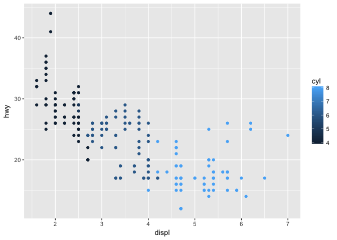

# Apr 26 assignment
Julin N Maloof  
4/25/2017  


## Pre-requisites  

```r
library(tidyverse)
```

```
## Loading tidyverse: ggplot2
## Loading tidyverse: tibble
## Loading tidyverse: tidyr
## Loading tidyverse: readr
## Loading tidyverse: purrr
## Loading tidyverse: dplyr
```

```
## Conflicts with tidy packages ----------------------------------------------
```

```
## filter(): dplyr, stats
## lag():    dplyr, stats
```

## 3.2


```r
ggplot(data = mpg) + 
  geom_point(mapping = aes(x = displ, y = hwy))
```

<!-- -->

### 3.2.4 Exercises

#### 1

```r
ggplot(mpg)
```

<!-- -->

Generates a blank plot

#### 2
_how many rows and columns are in mtcar?_

```r
dim(mtcars)
```

```
## [1] 32 11
```
32 rows and 11 columns

#### 3 
_what does the `drv` variable describe?_

```r
?mpg
```
`drv` indicates whether the car if front wheel, rear wheel, are four wheel drive

#### 4 
_make a scatterplot of `hwy` vs `cyl`_

```r
ggplot(mpg,aes(x=cyl,y=hwy)) + geom_point()
```

<!-- -->

#### 5 
_what happens if you make a scatterplot of `class` vs `drv`?  Why is the plot not usefull

```r
ggplot(mpg,aes(x=class,y=drv)) + geom_point()
```

<!-- -->

Not useful because we would want to know how many are in each combination.

### 3.3


```r
ggplot(data = mpg) + 
  geom_point(mapping = aes(x = displ, y = hwy, color = class))
```

<!-- -->

### 3.3.1 exercises

#### 1
_Why are the points not blue?_
because we are manually setting the color but doing so inside the aes argument.  Instead:


```r
ggplot(data = mpg) + 
  geom_point(mapping = aes(x = displ, y = hwy),color="blue")
```

<!-- -->

#### 2 
Which variable in `mpg` are categorical?  Which are continuous?

```r
junk <- sapply(colnames(mpg), function(x) {
  print(paste(x,
  if(is.numeric(get(x,mpg))) "continuous" else "categorical",
  sep=": "
  ))
})
```

```
## [1] "manufacturer: categorical"
## [1] "model: categorical"
## [1] "displ: continuous"
## [1] "year: continuous"
## [1] "cyl: continuous"
## [1] "trans: categorical"
## [1] "drv: categorical"
## [1] "cty: continuous"
## [1] "hwy: continuous"
## [1] "fl: categorical"
## [1] "class: categorical"
```

####

```r
ggplot(data = mpg) + 
  geom_point(mapping = aes(x = displ, y = hwy, color=cyl))
```

<!-- -->


```r
ggplot(data = mpg) + 
  geom_point(mapping = aes(x = displ, y = hwy, size=cyl))
```

<!-- -->

Doesn't run:

```r
ggplot(data = mpg) + 
  geom_point(mapping = aes(x = displ, y = hwy, shape=cyl))
```

```r
ggplot(data = mpg) + 
  geom_point(mapping = aes(x = displ, y = hwy, color=displ,size=displ))
```

<!-- -->


```r
ggplot(data = mpg) + 
  geom_point(mapping = aes(x = displ, y = hwy,stroke=displ))
```

<!-- -->


```r
ggplot(data = mpg) + 
  geom_point(mapping = aes(x = displ, y = hwy, color=displ<5
                          ))
```

<!-- -->

### 3.5.1

#### 1

```r
ggplot(data = mpg) + 
  geom_point(mapping = aes(x = cyl, y = hwy)) + 
  facet_wrap(~displ)
```

<!-- -->
A facet for every value

#### 2

```r
ggplot(data = mpg) + 
  geom_point(mapping = aes(x = drv, y = cyl))
```

<!-- -->
empty cells are combinations that do not exist

#### 3

```r
ggplot(data = mpg) + 
  geom_point(mapping = aes(x = displ, y = hwy)) +
  facet_grid(drv ~ .)
```

<!-- -->

```r
ggplot(data = mpg) + 
  geom_point(mapping = aes(x = displ, y = hwy)) +
  facet_grid(. ~ cyl)
```

<!-- -->


"." is a stand-in for nothing

#### 4


```r
ggplot(data = mpg) + 
  geom_point(mapping = aes(x = displ, y = hwy)) + 
  facet_wrap(~ class, nrow = 2)
```

<!-- -->

disadvantage: hard to see the relationship of the points. advantage: no overplotting

#### 5

nrow: number of rows, ncol: nomber of cols.  Can't set this for facet_grid because ther we go by the values.

#### 6 

screens are wider than they are tall
