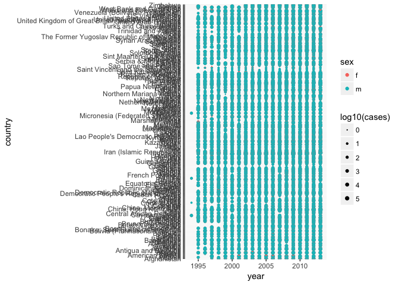

# June21
Julin N Maloof  
6/20/2017  


```r
library(tidyverse)
```

```
## Loading tidyverse: ggplot2
## Loading tidyverse: tibble
## Loading tidyverse: tidyr
## Loading tidyverse: readr
## Loading tidyverse: purrr
## Loading tidyverse: dplyr
```

```
## Conflicts with tidy packages ----------------------------------------------
```

```
## filter(): dplyr, stats
## lag():    dplyr, stats
```


```r
who1 <- who %>% 
  gather(new_sp_m014:newrel_f65,key="key",value="cases",na.rm=TRUE)
who1
```

```
## # A tibble: 76,046 × 6
##        country  iso2  iso3  year         key cases
## *        <chr> <chr> <chr> <int>       <chr> <int>
## 1  Afghanistan    AF   AFG  1997 new_sp_m014     0
## 2  Afghanistan    AF   AFG  1998 new_sp_m014    30
## 3  Afghanistan    AF   AFG  1999 new_sp_m014     8
## 4  Afghanistan    AF   AFG  2000 new_sp_m014    52
## 5  Afghanistan    AF   AFG  2001 new_sp_m014   129
## 6  Afghanistan    AF   AFG  2002 new_sp_m014    90
## 7  Afghanistan    AF   AFG  2003 new_sp_m014   127
## 8  Afghanistan    AF   AFG  2004 new_sp_m014   139
## 9  Afghanistan    AF   AFG  2005 new_sp_m014   151
## 10 Afghanistan    AF   AFG  2006 new_sp_m014   193
## # ... with 76,036 more rows
```


```r
who1 %>% count(key)
```

```
## # A tibble: 56 × 2
##             key     n
##           <chr> <int>
## 1   new_ep_f014  1032
## 2  new_ep_f1524  1021
## 3  new_ep_f2534  1021
## 4  new_ep_f3544  1021
## 5  new_ep_f4554  1017
## 6  new_ep_f5564  1017
## 7    new_ep_f65  1014
## 8   new_ep_m014  1038
## 9  new_ep_m1524  1026
## 10 new_ep_m2534  1020
## # ... with 46 more rows
```


```r
who2 <- who1 %>% 
  mutate(key = stringr::str_replace(key, "newrel", "new_rel"))
who2
```

```
## # A tibble: 76,046 × 6
##        country  iso2  iso3  year         key cases
##          <chr> <chr> <chr> <int>       <chr> <int>
## 1  Afghanistan    AF   AFG  1997 new_sp_m014     0
## 2  Afghanistan    AF   AFG  1998 new_sp_m014    30
## 3  Afghanistan    AF   AFG  1999 new_sp_m014     8
## 4  Afghanistan    AF   AFG  2000 new_sp_m014    52
## 5  Afghanistan    AF   AFG  2001 new_sp_m014   129
## 6  Afghanistan    AF   AFG  2002 new_sp_m014    90
## 7  Afghanistan    AF   AFG  2003 new_sp_m014   127
## 8  Afghanistan    AF   AFG  2004 new_sp_m014   139
## 9  Afghanistan    AF   AFG  2005 new_sp_m014   151
## 10 Afghanistan    AF   AFG  2006 new_sp_m014   193
## # ... with 76,036 more rows
```


```r
who3 <- who2 %>%
  separate(key,c("new","type","sexage"), sep ="_")
who3
```

```
## # A tibble: 76,046 × 8
##        country  iso2  iso3  year   new  type sexage cases
## *        <chr> <chr> <chr> <int> <chr> <chr>  <chr> <int>
## 1  Afghanistan    AF   AFG  1997   new    sp   m014     0
## 2  Afghanistan    AF   AFG  1998   new    sp   m014    30
## 3  Afghanistan    AF   AFG  1999   new    sp   m014     8
## 4  Afghanistan    AF   AFG  2000   new    sp   m014    52
## 5  Afghanistan    AF   AFG  2001   new    sp   m014   129
## 6  Afghanistan    AF   AFG  2002   new    sp   m014    90
## 7  Afghanistan    AF   AFG  2003   new    sp   m014   127
## 8  Afghanistan    AF   AFG  2004   new    sp   m014   139
## 9  Afghanistan    AF   AFG  2005   new    sp   m014   151
## 10 Afghanistan    AF   AFG  2006   new    sp   m014   193
## # ... with 76,036 more rows
```


```r
who4 <- who3 %>%
  select(-new,-iso2,-iso3)
who4
```

```
## # A tibble: 76,046 × 5
##        country  year  type sexage cases
## *        <chr> <int> <chr>  <chr> <int>
## 1  Afghanistan  1997    sp   m014     0
## 2  Afghanistan  1998    sp   m014    30
## 3  Afghanistan  1999    sp   m014     8
## 4  Afghanistan  2000    sp   m014    52
## 5  Afghanistan  2001    sp   m014   129
## 6  Afghanistan  2002    sp   m014    90
## 7  Afghanistan  2003    sp   m014   127
## 8  Afghanistan  2004    sp   m014   139
## 9  Afghanistan  2005    sp   m014   151
## 10 Afghanistan  2006    sp   m014   193
## # ... with 76,036 more rows
```


```r
who5 <- who4 %>%
  separate(sexage,c("sex","age"), sep=1)
who5
```

```
## # A tibble: 76,046 × 6
##        country  year  type   sex   age cases
## *        <chr> <int> <chr> <chr> <chr> <int>
## 1  Afghanistan  1997    sp     m   014     0
## 2  Afghanistan  1998    sp     m   014    30
## 3  Afghanistan  1999    sp     m   014     8
## 4  Afghanistan  2000    sp     m   014    52
## 5  Afghanistan  2001    sp     m   014   129
## 6  Afghanistan  2002    sp     m   014    90
## 7  Afghanistan  2003    sp     m   014   127
## 8  Afghanistan  2004    sp     m   014   139
## 9  Afghanistan  2005    sp     m   014   151
## 10 Afghanistan  2006    sp     m   014   193
## # ... with 76,036 more rows
```

## 12.6.1

### Q1

_In this case study I set `na.rm = TRUE` just to make it easier to check that we had the correct values. Is this reasonable? Think about how missing values are represented in this dataset. Are there implicit missing values? What’s the difference between an NA and zero?_

first, let's repeat this, but without `na.rm=TRUE`

```r
who.tidy.na <- who %>%    gather(code, value, new_sp_m014:newrel_f65) %>% 
  mutate(code = stringr::str_replace(code, "newrel", "new_rel")) %>%
  separate(code, c("new", "var", "sexage")) %>% 
  select(-new, -iso2, -iso3) %>% 
  separate(sexage, c("sex", "age"), sep = 1)
who.tidy.na
```

```
## # A tibble: 405,440 × 6
##        country  year   var   sex   age value
## *        <chr> <int> <chr> <chr> <chr> <int>
## 1  Afghanistan  1980    sp     m   014    NA
## 2  Afghanistan  1981    sp     m   014    NA
## 3  Afghanistan  1982    sp     m   014    NA
## 4  Afghanistan  1983    sp     m   014    NA
## 5  Afghanistan  1984    sp     m   014    NA
## 6  Afghanistan  1985    sp     m   014    NA
## 7  Afghanistan  1986    sp     m   014    NA
## 8  Afghanistan  1987    sp     m   014    NA
## 9  Afghanistan  1988    sp     m   014    NA
## 10 Afghanistan  1989    sp     m   014    NA
## # ... with 405,430 more rows
```

OK generally the NAs appear in early years for  given site.  So they probably represent areas/years where the study was not running.  In contrast, "0" means no cases recorded, but they would have been if presented.

Are there implicit missing values?  Compare length of data frame +/- complete


```r
nrow(who.tidy.na)
```

```
## [1] 405440
```

```r
who.tidy.na %>% complete(country,year,var,sex) %>% nrow()
```

```
## [1] 407088
```
So there must be some implicit NAs.  Which ones?


```r
who.tidy.na %>% mutate(missing=ifelse(is.na(value),"explicit.missing","observed")) %>%
  complete(country,year,var,sex,fill=list(missing="implicit.missing")) %>% # Needed because NAs get replaced with the new value
  filter(missing=="implicit.missing")
```

```
## # A tibble: 1,648 × 7
##                              country  year   var   sex   age value
##                                <chr> <int> <chr> <chr> <chr> <int>
## 1  Bonaire, Saint Eustatius and Saba  1980    ep     f  <NA>    NA
## 2  Bonaire, Saint Eustatius and Saba  1980    ep     m  <NA>    NA
## 3  Bonaire, Saint Eustatius and Saba  1980   rel     f  <NA>    NA
## 4  Bonaire, Saint Eustatius and Saba  1980   rel     m  <NA>    NA
## 5  Bonaire, Saint Eustatius and Saba  1980    sn     f  <NA>    NA
## 6  Bonaire, Saint Eustatius and Saba  1980    sn     m  <NA>    NA
## 7  Bonaire, Saint Eustatius and Saba  1980    sp     f  <NA>    NA
## 8  Bonaire, Saint Eustatius and Saba  1980    sp     m  <NA>    NA
## 9  Bonaire, Saint Eustatius and Saba  1981    ep     f  <NA>    NA
## 10 Bonaire, Saint Eustatius and Saba  1981    ep     m  <NA>    NA
## # ... with 1,638 more rows, and 1 more variables: missing <chr>
```


### Q2

_What happens if you neglect the mutate() step?_

In this case either we will get an error when we separate, or the data will not go into the columns appropriately.


```r
  who10 <- who %>% gather(code, value, new_sp_m014:newrel_f65, na.rm = TRUE) %>% 
  separate(code, c("new", "var", "sexage"))
```

```
## Warning: Too few values at 2580 locations: 73467, 73468, 73469, 73470,
## 73471, 73472, 73473, 73474, 73475, 73476, 73477, 73478, 73479, 73480,
## 73481, 73482, 73483, 73484, 73485, 73486, ...
```

```r
who10
```

```
## # A tibble: 76,046 × 8
##        country  iso2  iso3  year   new   var sexage value
## *        <chr> <chr> <chr> <int> <chr> <chr>  <chr> <int>
## 1  Afghanistan    AF   AFG  1997   new    sp   m014     0
## 2  Afghanistan    AF   AFG  1998   new    sp   m014    30
## 3  Afghanistan    AF   AFG  1999   new    sp   m014     8
## 4  Afghanistan    AF   AFG  2000   new    sp   m014    52
## 5  Afghanistan    AF   AFG  2001   new    sp   m014   129
## 6  Afghanistan    AF   AFG  2002   new    sp   m014    90
## 7  Afghanistan    AF   AFG  2003   new    sp   m014   127
## 8  Afghanistan    AF   AFG  2004   new    sp   m014   139
## 9  Afghanistan    AF   AFG  2005   new    sp   m014   151
## 10 Afghanistan    AF   AFG  2006   new    sp   m014   193
## # ... with 76,036 more rows
```

```r
who10[73465:73470,]
```

```
## # A tibble: 6 × 8
##       country  iso2  iso3  year    new   var sexage value
##         <chr> <chr> <chr> <int>  <chr> <chr>  <chr> <int>
## 1    Zimbabwe    ZW   ZWE  2011    new    ep    f65   129
## 2    Zimbabwe    ZW   ZWE  2012    new    ep    f65   143
## 3 Afghanistan    AF   AFG  2013 newrel  m014   <NA>  1705
## 4     Albania    AL   ALB  2013 newrel  m014   <NA>    14
## 5     Algeria    DZ   DZA  2013 newrel  m014   <NA>    25
## 6     Andorra    AD   AND  2013 newrel  m014   <NA>     0
```

yes.  warnings and then sexage ends up in var for these samples.

### Q3 
_I claimed that iso2 and iso3 were redundant with country. Confirm this claim._


```r
who %>% count(country,iso2,iso3)
```

```
## Source: local data frame [219 x 4]
## Groups: country, iso2 [?]
## 
##                country  iso2  iso3     n
##                  <chr> <chr> <chr> <int>
## 1          Afghanistan    AF   AFG    34
## 2              Albania    AL   ALB    34
## 3              Algeria    DZ   DZA    34
## 4       American Samoa    AS   ASM    34
## 5              Andorra    AD   AND    34
## 6               Angola    AO   AGO    34
## 7             Anguilla    AI   AIA    34
## 8  Antigua and Barbuda    AG   ATG    34
## 9            Argentina    AR   ARG    34
## 10             Armenia    AM   ARM    34
## # ... with 209 more rows
```

```r
who %>% group_by(country) %>% 
  summarize(iso2=n_distinct(iso2),iso3=n_distinct(iso3)) %>% # counts the number of distinct classes of iso2 and iso 3 per country
  summarise(max_iso2=max(iso2),max_iso3=max(iso3)) # look for maximum.  
```

```
## # A tibble: 1 × 2
##   max_iso2 max_iso3
##      <int>    <int>
## 1        1        1
```

### Q4
_For each country, year, and sex compute the total number of cases of TB. Make an informative visualisation of the data._


```r
who.tidy <- who %>%
  gather(code, value, new_sp_m014:newrel_f65, na.rm = TRUE) %>% 
  mutate(code = stringr::str_replace(code, "newrel", "new_rel")) %>%
  separate(code, c("new", "var", "sexage")) %>% 
  select(-new, -iso2, -iso3) %>% 
  separate(sexage, c("sex", "age"), sep = 1)
```


```r
case.summary <- who.tidy %>% 
  group_by(country, year, sex) %>%
  summarize(cases=sum(value))
case.summary
```

```
## Source: local data frame [6,921 x 4]
## Groups: country, year [?]
## 
##        country  year   sex cases
##          <chr> <int> <chr> <int>
## 1  Afghanistan  1997     f   102
## 2  Afghanistan  1997     m    26
## 3  Afghanistan  1998     f  1207
## 4  Afghanistan  1998     m   571
## 5  Afghanistan  1999     f   517
## 6  Afghanistan  1999     m   228
## 7  Afghanistan  2000     f  1751
## 8  Afghanistan  2000     m   915
## 9  Afghanistan  2001     f  3062
## 10 Afghanistan  2001     m  1577
## # ... with 6,911 more rows
```


```r
#how many countries?
length(unique(case.summary$country))
```

```
## [1] 219
```

How to make a useful plot with 219 countries?

first lest get rid of years without data from many countries

```r
case.summary.small <- case.summary %>% group_by(year) %>% filter(n_distinct(country) > 2)
ggplot(case.summary.small,aes(x=year,y=country,color=sex,size=log10(cases))) + 
  geom_point() +
  scale_size(range = c(0,2))
```

```
## Warning in sqrt(x): NaNs produced
```

```
## Warning: Removed 142 rows containing missing values (geom_point).
```

<!-- -->


```r
ggplot(case.summary.small,aes(x=year,y=country,fill=log10(cases))) + 
  geom_raster() +
  facet_wrap(~ sex) 
```

<!-- -->


```r
ggplot(case.summary.small,aes(x=year,y=cases+.1,group=country)) +
  geom_line(alpha=.3) +
  scale_y_log10() +
  facet_wrap(~sex)
```

<!-- -->

## Chapter 13


```r
library(nycflights13)
```

## 13.2.1

### 1

_Imagine you wanted to draw (approximately) the route each plane flies from its origin to its destination. What variables would you need? What tables would you need to combine?_

I don't get it.  I think I am missing some info here that is not in any table.

### 2

_I forgot to draw the relationship between weather and airports. What is the relationship and how should it appear in the diagram?_

A line from origin (weather) to faa (airports)

### 3

_weather only contains information for the origin (NYC) airports. If it contained weather records for all airports in the USA, what additional relation would it define with flights?_

dest

### 4

_We know that some days of the year are “special”, and fewer people than usual fly on them. How might you represent that data as a data frame? What would be the primary keys of that table? How would it connect to the existing tables?_

columns for holiday name with month, day, (and maybe year).  Maybe you'd have every day in the year in the table with a column for whether or not it was weekday, weekend, or holiday.

## 13.3.1

### 1

Add a surrogate key to flights.


```r
flights <- flights %>% mutate(ID=row_number())
flights %>% select(ID, everything())
```

```
## # A tibble: 336,776 × 20
##       ID  year month   day dep_time sched_dep_time dep_delay arr_time
##    <int> <int> <int> <int>    <int>          <int>     <dbl>    <int>
## 1      1  2013     1     1      517            515         2      830
## 2      2  2013     1     1      533            529         4      850
## 3      3  2013     1     1      542            540         2      923
## 4      4  2013     1     1      544            545        -1     1004
## 5      5  2013     1     1      554            600        -6      812
## 6      6  2013     1     1      554            558        -4      740
## 7      7  2013     1     1      555            600        -5      913
## 8      8  2013     1     1      557            600        -3      709
## 9      9  2013     1     1      557            600        -3      838
## 10    10  2013     1     1      558            600        -2      753
## # ... with 336,766 more rows, and 12 more variables: sched_arr_time <int>,
## #   arr_delay <dbl>, carrier <chr>, flight <int>, tailnum <chr>,
## #   origin <chr>, dest <chr>, air_time <dbl>, distance <dbl>, hour <dbl>,
## #   minute <dbl>, time_hour <dttm>
```

### 2

Identify the keys in the following datasets

Lahman::Batting,
babynames::babynames
nasaweather::atmos
fueleconomy::vehicles
ggplot2::diamonds


```r
?Lahman::Batting
Lahman::Batting %>% count(playerID,yearID,teamID) %>% filter(n>1)
```

```
## Source: local data frame [56 x 4]
## Groups: playerID, yearID [56]
## 
##     playerID yearID teamID     n
##        <chr>  <int> <fctr> <int>
## 1  anderjo01   1898    BRO     2
## 2  baldwja01   2005    BAL     2
## 3  behrmha01   1947    BRO     2
## 4  clarkje02   2003    TEX     2
## 5  clarkni01   1905    CLE     2
## 6  cranddo01   1913    NY1     2
## 7  cranesa01   1890    NY1     2
## 8  donahpa01   1910    PHA     2
## 9  drillle01   1902    WS1     2
## 10 duceyro01   2000    PHI     2
## # ... with 46 more rows
```

```r
Lahman::Batting %>% filter(playerID=="anderjo01" & yearID==1898)
```

```
##    playerID yearID stint teamID lgID   G  AB  R   H X2B X3B HR RBI SB CS
## 1 anderjo01   1898     1    BRO   NL  19  69 11  19   3   4  0   8  2 NA
## 2 anderjo01   1898     2    WAS   NL 110 430 70 131  28  18  9  71 18 NA
## 3 anderjo01   1898     3    BRO   NL   6  21  1   3   2   0  0   2  0  0
##   BB SO IBB HBP SH SF GIDP
## 1  5 NA  NA   1  0 NA   NA
## 2 23 NA  NA  12  6 NA   NA
## 3  1 NA   0   1  0 NA   NA
```

```r
Lahman::Batting %>% count(playerID,yearID,stint) %>% filter(n>1)
```

```
## Source: local data frame [0 x 4]
## Groups: playerID, yearID [0]
## 
## # ... with 4 variables: playerID <chr>, yearID <int>, stint <int>, n <int>
```

### 3

playerID connects `batting` to `Master` and connects `Salaries` to `master`

yearID,teamID,playerID connect `batting` to `Salaries`
