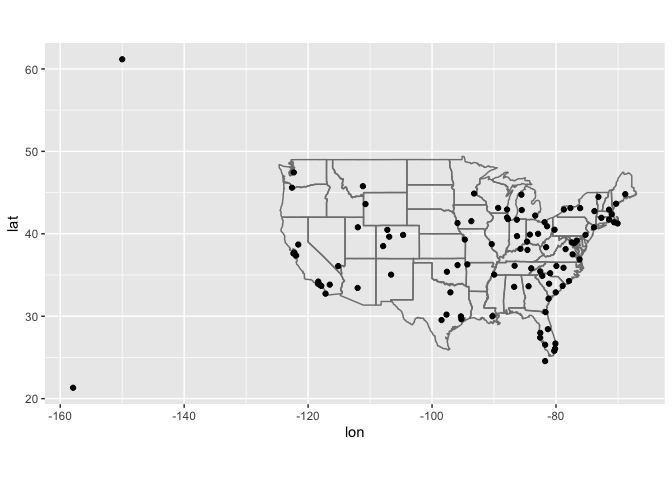
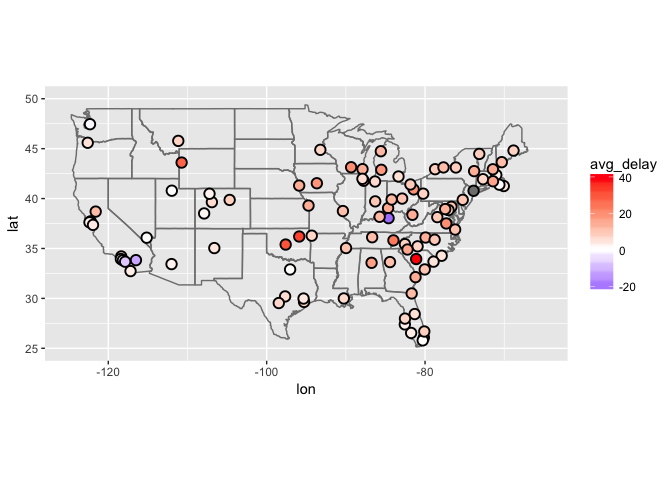
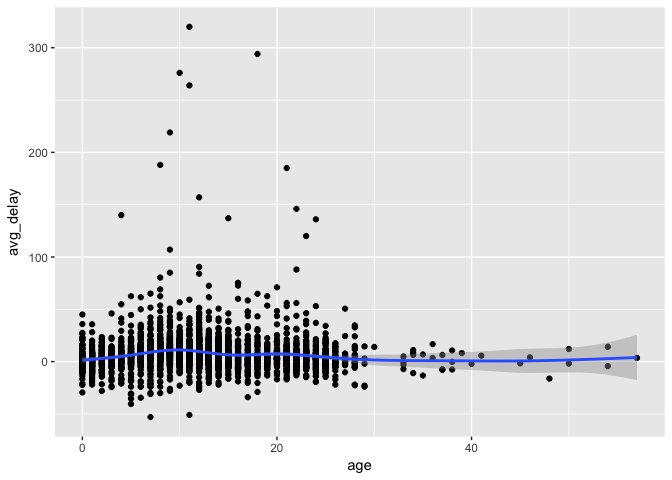
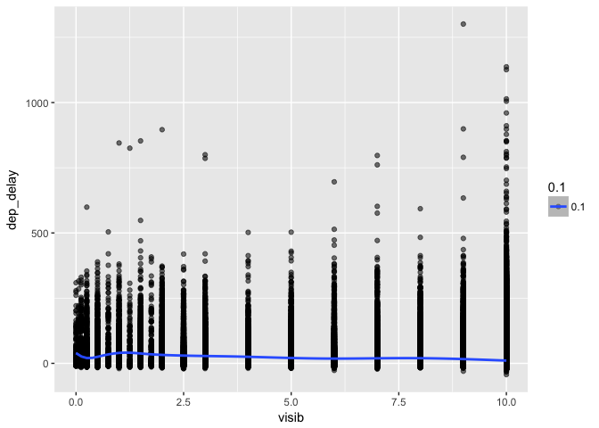
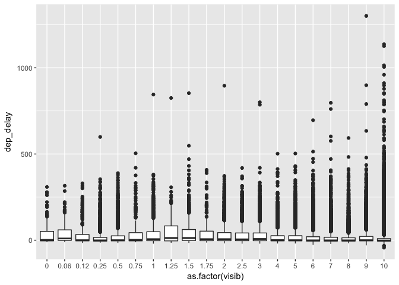

# June 28
Julin N Maloof  
6/27/2017  


```r
library(tidyverse)
```

```
## Loading tidyverse: ggplot2
## Loading tidyverse: tibble
## Loading tidyverse: tidyr
## Loading tidyverse: readr
## Loading tidyverse: purrr
## Loading tidyverse: dplyr
```

```
## Conflicts with tidy packages ----------------------------------------------
```

```
## filter(): dplyr, stats
## lag():    dplyr, stats
```

```r
library(nycflights13)
library(magrittr)
```

```
## 
## Attaching package: 'magrittr'
```

```
## The following object is masked from 'package:purrr':
## 
##     set_names
```

```
## The following object is masked from 'package:tidyr':
## 
##     extract
```


# Chapter 13

## 13.3.1 Exercises

### 1

_Add a surrogate key to flights._

Because there are no unique combination of columns that can be a key we just create a sequential ID key

```r
flights <- flights %>% mutate(ID=row_number())
flights %>% select(ID, everything()) #so that we can put ID as the first column
```

```
## # A tibble: 336,776 × 20
##       ID  year month   day dep_time sched_dep_time dep_delay arr_time
##    <int> <int> <int> <int>    <int>          <int>     <dbl>    <int>
## 1      1  2013     1     1      517            515         2      830
## 2      2  2013     1     1      533            529         4      850
## 3      3  2013     1     1      542            540         2      923
## 4      4  2013     1     1      544            545        -1     1004
## 5      5  2013     1     1      554            600        -6      812
## 6      6  2013     1     1      554            558        -4      740
## 7      7  2013     1     1      555            600        -5      913
## 8      8  2013     1     1      557            600        -3      709
## 9      9  2013     1     1      557            600        -3      838
## 10    10  2013     1     1      558            600        -2      753
## # ... with 336,766 more rows, and 12 more variables: sched_arr_time <int>,
## #   arr_delay <dbl>, carrier <chr>, flight <int>, tailnum <chr>,
## #   origin <chr>, dest <chr>, air_time <dbl>, distance <dbl>, hour <dbl>,
## #   minute <dbl>, time_hour <dttm>
```

### 2

_Identify the keys in the following datasets_

#### Lahman::Batting,


```r
?Lahman::Batting
Lahman::Batting %>% count(playerID,yearID,teamID) %>% filter(n>1) #nope
```

```
## Source: local data frame [56 x 4]
## Groups: playerID, yearID [56]
## 
##     playerID yearID teamID     n
##        <chr>  <int> <fctr> <int>
## 1  anderjo01   1898    BRO     2
## 2  baldwja01   2005    BAL     2
## 3  behrmha01   1947    BRO     2
## 4  clarkje02   2003    TEX     2
## 5  clarkni01   1905    CLE     2
## 6  cranddo01   1913    NY1     2
## 7  cranesa01   1890    NY1     2
## 8  donahpa01   1910    PHA     2
## 9  drillle01   1902    WS1     2
## 10 duceyro01   2000    PHI     2
## # ... with 46 more rows
```

No!

What is the problem? Look at an example

```r
Lahman::Batting %>% filter(playerID=="anderjo01" & yearID==1898)
```

```
##    playerID yearID stint teamID lgID   G  AB  R   H X2B X3B HR RBI SB CS
## 1 anderjo01   1898     1    BRO   NL  19  69 11  19   3   4  0   8  2 NA
## 2 anderjo01   1898     2    WAS   NL 110 430 70 131  28  18  9  71 18 NA
## 3 anderjo01   1898     3    BRO   NL   6  21  1   3   2   0  0   2  0  0
##   BB SO IBB HBP SH SF GIDP
## 1  5 NA  NA   1  0 NA   NA
## 2 23 NA  NA  12  6 NA   NA
## 3  1 NA   0   1  0 NA   NA
```
He played for two teams in the same season!

How about

```r
Lahman::Batting %>% count(playerID,yearID,stint) %>% filter(n>1)
```

```
## Source: local data frame [0 x 4]
## Groups: playerID, yearID [0]
## 
## # ... with 4 variables: playerID <chr>, yearID <int>, stint <int>, n <int>
```
Yes!

#### babynames::babynames


```r
library(babynames)
?babynames
head(babynames)
```

```
## # A tibble: 6 × 5
##    year   sex      name     n       prop
##   <dbl> <chr>     <chr> <int>      <dbl>
## 1  1880     F      Mary  7065 0.07238433
## 2  1880     F      Anna  2604 0.02667923
## 3  1880     F      Emma  2003 0.02052170
## 4  1880     F Elizabeth  1939 0.01986599
## 5  1880     F    Minnie  1746 0.01788861
## 6  1880     F  Margaret  1578 0.01616737
```

keys should be year, sex, and name


```r
babynames %>% count(year,sex,name) %>% arrange(desc(nn))
```

```
## Source: local data frame [1,858,689 x 4]
## Groups: year, sex [272]
## 
##     year   sex     name    nn
##    <dbl> <chr>    <chr> <int>
## 1   1880     F    Abbie     1
## 2   1880     F     Abby     1
## 3   1880     F  Abigail     1
## 4   1880     F      Ada     1
## 5   1880     F     Adah     1
## 6   1880     F  Adaline     1
## 7   1880     F     Adda     1
## 8   1880     F    Addie     1
## 9   1880     F    Adela     1
## 10  1880     F Adelaide     1
## # ... with 1,858,679 more rows
```

#### nasaweather::atmos


```r
library(nasaweather)
?atmos
head(atmos)
```

```
## # A tibble: 6 × 11
##        lat   long  year month surftemp  temp pressure ozone cloudlow
##      <dbl>  <dbl> <int> <int>    <dbl> <dbl>    <dbl> <dbl>    <dbl>
## 1 36.20000 -113.8  1995     1    272.7 272.1      835   304      7.5
## 2 33.70435 -113.8  1995     1    279.5 282.2      940   304     11.5
## 3 31.20870 -113.8  1995     1    284.7 285.2      960   298     16.5
## 4 28.71304 -113.8  1995     1    289.3 290.7      990   276     20.5
## 5 26.21739 -113.8  1995     1    292.2 292.7     1000   274     26.0
## 6 23.72174 -113.8  1995     1    294.1 293.6     1000   264     30.0
## # ... with 2 more variables: cloudmid <dbl>, cloudhigh <dbl>
```

should be lat,long,year,month


```r
atmos %>% count(lat,long,year,month) %>% arrange(desc(n))
```

```
## Source: local data frame [41,472 x 5]
## Groups: lat, long, year [3,456]
## 
##      lat   long  year month     n
##    <dbl>  <dbl> <int> <int> <int>
## 1  -21.2 -113.8  1995     1     1
## 2  -21.2 -113.8  1995     2     1
## 3  -21.2 -113.8  1995     3     1
## 4  -21.2 -113.8  1995     4     1
## 5  -21.2 -113.8  1995     5     1
## 6  -21.2 -113.8  1995     6     1
## 7  -21.2 -113.8  1995     7     1
## 8  -21.2 -113.8  1995     8     1
## 9  -21.2 -113.8  1995     9     1
## 10 -21.2 -113.8  1995    10     1
## # ... with 41,462 more rows
```

#### fueleconomy::vehicles


```r
library(fueleconomy)
head(vehicles)
```

```
## # A tibble: 6 × 12
##      id       make               model  year                       class
##   <int>      <chr>               <chr> <int>                       <chr>
## 1 27550 AM General   DJ Po Vehicle 2WD  1984 Special Purpose Vehicle 2WD
## 2 28426 AM General   DJ Po Vehicle 2WD  1984 Special Purpose Vehicle 2WD
## 3 27549 AM General    FJ8c Post Office  1984 Special Purpose Vehicle 2WD
## 4 28425 AM General    FJ8c Post Office  1984 Special Purpose Vehicle 2WD
## 5  1032 AM General Post Office DJ5 2WD  1985 Special Purpose Vehicle 2WD
## 6  1033 AM General Post Office DJ8 2WD  1985 Special Purpose Vehicle 2WD
## # ... with 7 more variables: trans <chr>, drive <chr>, cyl <int>,
## #   displ <dbl>, fuel <chr>, hwy <int>, cty <int>
```


```r
vehicles %>% count(id) %>% arrange(desc(n))
```

```
## # A tibble: 33,442 × 2
##       id     n
##    <int> <int>
## 1      1     1
## 2      2     1
## 3      3     1
## 4      4     1
## 5      5     1
## 6      6     1
## 7      7     1
## 8      8     1
## 9      9     1
## 10    10     1
## # ... with 33,432 more rows
```

#### ggplot2::diamonds

```r
?diamonds
head(diamonds)
```

```
## # A tibble: 6 × 10
##   carat       cut color clarity depth table price     x     y     z
##   <dbl>     <ord> <ord>   <ord> <dbl> <dbl> <int> <dbl> <dbl> <dbl>
## 1  0.23     Ideal     E     SI2  61.5    55   326  3.95  3.98  2.43
## 2  0.21   Premium     E     SI1  59.8    61   326  3.89  3.84  2.31
## 3  0.23      Good     E     VS1  56.9    65   327  4.05  4.07  2.31
## 4  0.29   Premium     I     VS2  62.4    58   334  4.20  4.23  2.63
## 5  0.31      Good     J     SI2  63.3    58   335  4.34  4.35  2.75
## 6  0.24 Very Good     J    VVS2  62.8    57   336  3.94  3.96  2.48
```

```r
diamonds <- diamonds %>% mutate(ID=row_number()) %>% select(ID,everything())
diamonds
```

```
## # A tibble: 53,940 × 11
##       ID carat       cut color clarity depth table price     x     y     z
##    <int> <dbl>     <ord> <ord>   <ord> <dbl> <dbl> <int> <dbl> <dbl> <dbl>
## 1      1  0.23     Ideal     E     SI2  61.5    55   326  3.95  3.98  2.43
## 2      2  0.21   Premium     E     SI1  59.8    61   326  3.89  3.84  2.31
## 3      3  0.23      Good     E     VS1  56.9    65   327  4.05  4.07  2.31
## 4      4  0.29   Premium     I     VS2  62.4    58   334  4.20  4.23  2.63
## 5      5  0.31      Good     J     SI2  63.3    58   335  4.34  4.35  2.75
## 6      6  0.24 Very Good     J    VVS2  62.8    57   336  3.94  3.96  2.48
## 7      7  0.24 Very Good     I    VVS1  62.3    57   336  3.95  3.98  2.47
## 8      8  0.26 Very Good     H     SI1  61.9    55   337  4.07  4.11  2.53
## 9      9  0.22      Fair     E     VS2  65.1    61   337  3.87  3.78  2.49
## 10    10  0.23 Very Good     H     VS1  59.4    61   338  4.00  4.05  2.39
## # ... with 53,930 more rows
```


### 3

_Draw a diagram illustrating the connections between the Batting, Master, and Salaries tables in the Lahman package. Draw another diagram that shows the relationship between Master, Managers, AwardsManagers._

playerID connects `batting` to `Master` and connects `Salaries` to `master`

yearID,teamID,playerID connect `batting` to `Salaries`

Try this with the datamodelr package


```r
library(datamodelr)
library(Lahman)
```

Create data model

```r
dm_lahman <- dm_from_data_frames(Batting,Master,Salaries)
```


```r
dm_lahman %>% dm_create_graph() %>% dm_render_graph()
```

<!--html_preserve--><div id="htmlwidget-645844ca60c423a41613" style="width:672px;height:480px;" class="grViz html-widget"></div>
<script type="application/json" data-for="htmlwidget-645844ca60c423a41613">{"x":{"diagram":"#data_model\ndigraph {\ngraph [rankdir=BT tooltip=\"Data Model\" ]\n\nnode [margin=0 fontcolor = \"#444444\" ]\n\nedge [color = \"#555555\", arrowsize = 1, ]\n\n\n  \"Batting\" [label = <<TABLE ALIGN=\"LEFT\" BORDER=\"1\" CELLBORDER=\"0\" CELLSPACING=\"0\" COLOR=\"#555555\">\n    <TR>\n      <TD COLSPAN=\"2\" BGCOLOR=\"#EFEBDD\" BORDER=\"0\"><FONT COLOR=\"#000000\">Batting<\/FONT>\n<\/TD>\n    <\/TR>\n    <TR>\n      <TD ALIGN=\"LEFT\" BGCOLOR=\"#FFFFFF\"><\/TD>\n      <TD ALIGN=\"LEFT\" BGCOLOR=\"#FFFFFF\">playerID<\/TD>\n    <\/TR>\n    <TR>\n      <TD ALIGN=\"LEFT\" BGCOLOR=\"#FFFFFF\"><\/TD>\n      <TD ALIGN=\"LEFT\" BGCOLOR=\"#FFFFFF\">yearID<\/TD>\n    <\/TR>\n    <TR>\n      <TD ALIGN=\"LEFT\" BGCOLOR=\"#FFFFFF\"><\/TD>\n      <TD ALIGN=\"LEFT\" BGCOLOR=\"#FFFFFF\">stint<\/TD>\n    <\/TR>\n    <TR>\n      <TD ALIGN=\"LEFT\" BGCOLOR=\"#FFFFFF\"><\/TD>\n      <TD ALIGN=\"LEFT\" BGCOLOR=\"#FFFFFF\">teamID<\/TD>\n    <\/TR>\n    <TR>\n      <TD ALIGN=\"LEFT\" BGCOLOR=\"#FFFFFF\"><\/TD>\n      <TD ALIGN=\"LEFT\" BGCOLOR=\"#FFFFFF\">lgID<\/TD>\n    <\/TR>\n    <TR>\n      <TD ALIGN=\"LEFT\" BGCOLOR=\"#FFFFFF\"><\/TD>\n      <TD ALIGN=\"LEFT\" BGCOLOR=\"#FFFFFF\">G<\/TD>\n    <\/TR>\n    <TR>\n      <TD ALIGN=\"LEFT\" BGCOLOR=\"#FFFFFF\"><\/TD>\n      <TD ALIGN=\"LEFT\" BGCOLOR=\"#FFFFFF\">AB<\/TD>\n    <\/TR>\n    <TR>\n      <TD ALIGN=\"LEFT\" BGCOLOR=\"#FFFFFF\"><\/TD>\n      <TD ALIGN=\"LEFT\" BGCOLOR=\"#FFFFFF\">R<\/TD>\n    <\/TR>\n    <TR>\n      <TD ALIGN=\"LEFT\" BGCOLOR=\"#FFFFFF\"><\/TD>\n      <TD ALIGN=\"LEFT\" BGCOLOR=\"#FFFFFF\">H<\/TD>\n    <\/TR>\n    <TR>\n      <TD ALIGN=\"LEFT\" BGCOLOR=\"#FFFFFF\"><\/TD>\n      <TD ALIGN=\"LEFT\" BGCOLOR=\"#FFFFFF\">X2B<\/TD>\n    <\/TR>\n    <TR>\n      <TD ALIGN=\"LEFT\" BGCOLOR=\"#FFFFFF\"><\/TD>\n      <TD ALIGN=\"LEFT\" BGCOLOR=\"#FFFFFF\">X3B<\/TD>\n    <\/TR>\n    <TR>\n      <TD ALIGN=\"LEFT\" BGCOLOR=\"#FFFFFF\"><\/TD>\n      <TD ALIGN=\"LEFT\" BGCOLOR=\"#FFFFFF\">HR<\/TD>\n    <\/TR>\n    <TR>\n      <TD ALIGN=\"LEFT\" BGCOLOR=\"#FFFFFF\"><\/TD>\n      <TD ALIGN=\"LEFT\" BGCOLOR=\"#FFFFFF\">RBI<\/TD>\n    <\/TR>\n    <TR>\n      <TD ALIGN=\"LEFT\" BGCOLOR=\"#FFFFFF\"><\/TD>\n      <TD ALIGN=\"LEFT\" BGCOLOR=\"#FFFFFF\">SB<\/TD>\n    <\/TR>\n    <TR>\n      <TD ALIGN=\"LEFT\" BGCOLOR=\"#FFFFFF\"><\/TD>\n      <TD ALIGN=\"LEFT\" BGCOLOR=\"#FFFFFF\">CS<\/TD>\n    <\/TR>\n    <TR>\n      <TD ALIGN=\"LEFT\" BGCOLOR=\"#FFFFFF\"><\/TD>\n      <TD ALIGN=\"LEFT\" BGCOLOR=\"#FFFFFF\">BB<\/TD>\n    <\/TR>\n    <TR>\n      <TD ALIGN=\"LEFT\" BGCOLOR=\"#FFFFFF\"><\/TD>\n      <TD ALIGN=\"LEFT\" BGCOLOR=\"#FFFFFF\">SO<\/TD>\n    <\/TR>\n    <TR>\n      <TD ALIGN=\"LEFT\" BGCOLOR=\"#FFFFFF\"><\/TD>\n      <TD ALIGN=\"LEFT\" BGCOLOR=\"#FFFFFF\">IBB<\/TD>\n    <\/TR>\n    <TR>\n      <TD ALIGN=\"LEFT\" BGCOLOR=\"#FFFFFF\"><\/TD>\n      <TD ALIGN=\"LEFT\" BGCOLOR=\"#FFFFFF\">HBP<\/TD>\n    <\/TR>\n    <TR>\n      <TD ALIGN=\"LEFT\" BGCOLOR=\"#FFFFFF\"><\/TD>\n      <TD ALIGN=\"LEFT\" BGCOLOR=\"#FFFFFF\">SH<\/TD>\n    <\/TR>\n    <TR>\n      <TD ALIGN=\"LEFT\" BGCOLOR=\"#FFFFFF\"><\/TD>\n      <TD ALIGN=\"LEFT\" BGCOLOR=\"#FFFFFF\">SF<\/TD>\n    <\/TR>\n    <TR>\n      <TD ALIGN=\"LEFT\" BGCOLOR=\"#FFFFFF\"><\/TD>\n      <TD ALIGN=\"LEFT\" BGCOLOR=\"#FFFFFF\">GIDP<\/TD>\n    <\/TR>\n  <\/TABLE>>, shape = \"plaintext\"] \n\n  \"Master\" [label = <<TABLE ALIGN=\"LEFT\" BORDER=\"1\" CELLBORDER=\"0\" CELLSPACING=\"0\" COLOR=\"#555555\">\n    <TR>\n      <TD COLSPAN=\"2\" BGCOLOR=\"#EFEBDD\" BORDER=\"0\"><FONT COLOR=\"#000000\">Master<\/FONT>\n<\/TD>\n    <\/TR>\n    <TR>\n      <TD ALIGN=\"LEFT\" BGCOLOR=\"#FFFFFF\"><\/TD>\n      <TD ALIGN=\"LEFT\" BGCOLOR=\"#FFFFFF\">playerID<\/TD>\n    <\/TR>\n    <TR>\n      <TD ALIGN=\"LEFT\" BGCOLOR=\"#FFFFFF\"><\/TD>\n      <TD ALIGN=\"LEFT\" BGCOLOR=\"#FFFFFF\">birthYear<\/TD>\n    <\/TR>\n    <TR>\n      <TD ALIGN=\"LEFT\" BGCOLOR=\"#FFFFFF\"><\/TD>\n      <TD ALIGN=\"LEFT\" BGCOLOR=\"#FFFFFF\">birthMonth<\/TD>\n    <\/TR>\n    <TR>\n      <TD ALIGN=\"LEFT\" BGCOLOR=\"#FFFFFF\"><\/TD>\n      <TD ALIGN=\"LEFT\" BGCOLOR=\"#FFFFFF\">birthDay<\/TD>\n    <\/TR>\n    <TR>\n      <TD ALIGN=\"LEFT\" BGCOLOR=\"#FFFFFF\"><\/TD>\n      <TD ALIGN=\"LEFT\" BGCOLOR=\"#FFFFFF\">birthCountry<\/TD>\n    <\/TR>\n    <TR>\n      <TD ALIGN=\"LEFT\" BGCOLOR=\"#FFFFFF\"><\/TD>\n      <TD ALIGN=\"LEFT\" BGCOLOR=\"#FFFFFF\">birthState<\/TD>\n    <\/TR>\n    <TR>\n      <TD ALIGN=\"LEFT\" BGCOLOR=\"#FFFFFF\"><\/TD>\n      <TD ALIGN=\"LEFT\" BGCOLOR=\"#FFFFFF\">birthCity<\/TD>\n    <\/TR>\n    <TR>\n      <TD ALIGN=\"LEFT\" BGCOLOR=\"#FFFFFF\"><\/TD>\n      <TD ALIGN=\"LEFT\" BGCOLOR=\"#FFFFFF\">deathYear<\/TD>\n    <\/TR>\n    <TR>\n      <TD ALIGN=\"LEFT\" BGCOLOR=\"#FFFFFF\"><\/TD>\n      <TD ALIGN=\"LEFT\" BGCOLOR=\"#FFFFFF\">deathMonth<\/TD>\n    <\/TR>\n    <TR>\n      <TD ALIGN=\"LEFT\" BGCOLOR=\"#FFFFFF\"><\/TD>\n      <TD ALIGN=\"LEFT\" BGCOLOR=\"#FFFFFF\">deathDay<\/TD>\n    <\/TR>\n    <TR>\n      <TD ALIGN=\"LEFT\" BGCOLOR=\"#FFFFFF\"><\/TD>\n      <TD ALIGN=\"LEFT\" BGCOLOR=\"#FFFFFF\">deathCountry<\/TD>\n    <\/TR>\n    <TR>\n      <TD ALIGN=\"LEFT\" BGCOLOR=\"#FFFFFF\"><\/TD>\n      <TD ALIGN=\"LEFT\" BGCOLOR=\"#FFFFFF\">deathState<\/TD>\n    <\/TR>\n    <TR>\n      <TD ALIGN=\"LEFT\" BGCOLOR=\"#FFFFFF\"><\/TD>\n      <TD ALIGN=\"LEFT\" BGCOLOR=\"#FFFFFF\">deathCity<\/TD>\n    <\/TR>\n    <TR>\n      <TD ALIGN=\"LEFT\" BGCOLOR=\"#FFFFFF\"><\/TD>\n      <TD ALIGN=\"LEFT\" BGCOLOR=\"#FFFFFF\">nameFirst<\/TD>\n    <\/TR>\n    <TR>\n      <TD ALIGN=\"LEFT\" BGCOLOR=\"#FFFFFF\"><\/TD>\n      <TD ALIGN=\"LEFT\" BGCOLOR=\"#FFFFFF\">nameLast<\/TD>\n    <\/TR>\n    <TR>\n      <TD ALIGN=\"LEFT\" BGCOLOR=\"#FFFFFF\"><\/TD>\n      <TD ALIGN=\"LEFT\" BGCOLOR=\"#FFFFFF\">nameGiven<\/TD>\n    <\/TR>\n    <TR>\n      <TD ALIGN=\"LEFT\" BGCOLOR=\"#FFFFFF\"><\/TD>\n      <TD ALIGN=\"LEFT\" BGCOLOR=\"#FFFFFF\">weight<\/TD>\n    <\/TR>\n    <TR>\n      <TD ALIGN=\"LEFT\" BGCOLOR=\"#FFFFFF\"><\/TD>\n      <TD ALIGN=\"LEFT\" BGCOLOR=\"#FFFFFF\">height<\/TD>\n    <\/TR>\n    <TR>\n      <TD ALIGN=\"LEFT\" BGCOLOR=\"#FFFFFF\"><\/TD>\n      <TD ALIGN=\"LEFT\" BGCOLOR=\"#FFFFFF\">bats<\/TD>\n    <\/TR>\n    <TR>\n      <TD ALIGN=\"LEFT\" BGCOLOR=\"#FFFFFF\"><\/TD>\n      <TD ALIGN=\"LEFT\" BGCOLOR=\"#FFFFFF\">throws<\/TD>\n    <\/TR>\n    <TR>\n      <TD ALIGN=\"LEFT\" BGCOLOR=\"#FFFFFF\"><\/TD>\n      <TD ALIGN=\"LEFT\" BGCOLOR=\"#FFFFFF\">debut<\/TD>\n    <\/TR>\n    <TR>\n      <TD ALIGN=\"LEFT\" BGCOLOR=\"#FFFFFF\"><\/TD>\n      <TD ALIGN=\"LEFT\" BGCOLOR=\"#FFFFFF\">finalGame<\/TD>\n    <\/TR>\n    <TR>\n      <TD ALIGN=\"LEFT\" BGCOLOR=\"#FFFFFF\"><\/TD>\n      <TD ALIGN=\"LEFT\" BGCOLOR=\"#FFFFFF\">retroID<\/TD>\n    <\/TR>\n    <TR>\n      <TD ALIGN=\"LEFT\" BGCOLOR=\"#FFFFFF\"><\/TD>\n      <TD ALIGN=\"LEFT\" BGCOLOR=\"#FFFFFF\">bbrefID<\/TD>\n    <\/TR>\n    <TR>\n      <TD ALIGN=\"LEFT\" BGCOLOR=\"#FFFFFF\"><\/TD>\n      <TD ALIGN=\"LEFT\" BGCOLOR=\"#FFFFFF\">deathDate<\/TD>\n    <\/TR>\n    <TR>\n      <TD ALIGN=\"LEFT\" BGCOLOR=\"#FFFFFF\"><\/TD>\n      <TD ALIGN=\"LEFT\" BGCOLOR=\"#FFFFFF\">birthDate<\/TD>\n    <\/TR>\n  <\/TABLE>>, shape = \"plaintext\"] \n\n  \"Salaries\" [label = <<TABLE ALIGN=\"LEFT\" BORDER=\"1\" CELLBORDER=\"0\" CELLSPACING=\"0\" COLOR=\"#555555\">\n    <TR>\n      <TD COLSPAN=\"2\" BGCOLOR=\"#EFEBDD\" BORDER=\"0\"><FONT COLOR=\"#000000\">Salaries<\/FONT>\n<\/TD>\n    <\/TR>\n    <TR>\n      <TD ALIGN=\"LEFT\" BGCOLOR=\"#FFFFFF\"><\/TD>\n      <TD ALIGN=\"LEFT\" BGCOLOR=\"#FFFFFF\">yearID<\/TD>\n    <\/TR>\n    <TR>\n      <TD ALIGN=\"LEFT\" BGCOLOR=\"#FFFFFF\"><\/TD>\n      <TD ALIGN=\"LEFT\" BGCOLOR=\"#FFFFFF\">teamID<\/TD>\n    <\/TR>\n    <TR>\n      <TD ALIGN=\"LEFT\" BGCOLOR=\"#FFFFFF\"><\/TD>\n      <TD ALIGN=\"LEFT\" BGCOLOR=\"#FFFFFF\">lgID<\/TD>\n    <\/TR>\n    <TR>\n      <TD ALIGN=\"LEFT\" BGCOLOR=\"#FFFFFF\"><\/TD>\n      <TD ALIGN=\"LEFT\" BGCOLOR=\"#FFFFFF\">playerID<\/TD>\n    <\/TR>\n    <TR>\n      <TD ALIGN=\"LEFT\" BGCOLOR=\"#FFFFFF\"><\/TD>\n      <TD ALIGN=\"LEFT\" BGCOLOR=\"#FFFFFF\">salary<\/TD>\n    <\/TR>\n  <\/TABLE>>, shape = \"plaintext\"] \n\n\n}","config":{"engine":null,"options":null}},"evals":[],"jsHooks":[]}</script><!--/html_preserve-->

add references


```r
dm_lahman %<>% dm_add_references(Master$playerID==Batting$playerID,
                                 Batting$yearID==Salaries$yearID,
                                 Batting$playerID==Salaries$playerID,
                                 Batting$teamID==Salaries$teamID)
```


```r
dm_lahman %>% dm_create_graph(rankdir="LR") %>% dm_render_graph()
```

<!--html_preserve--><div id="htmlwidget-6f485a374cf7bdc40e7e" style="width:672px;height:480px;" class="grViz html-widget"></div>
<script type="application/json" data-for="htmlwidget-6f485a374cf7bdc40e7e">{"x":{"diagram":"#data_model\ndigraph {\ngraph [rankdir=LR tooltip=\"Data Model\" ]\n\nnode [margin=0 fontcolor = \"#444444\" ]\n\nedge [color = \"#555555\", arrowsize = 1, ]\n\n\n  \"Batting\" [label = <<TABLE ALIGN=\"LEFT\" BORDER=\"1\" CELLBORDER=\"0\" CELLSPACING=\"0\" COLOR=\"#555555\">\n    <TR>\n      <TD COLSPAN=\"2\" BGCOLOR=\"#EFEBDD\" BORDER=\"0\"><FONT COLOR=\"#000000\">Batting<\/FONT>\n<\/TD>\n    <\/TR>\n    <TR>\n      <TD ALIGN=\"LEFT\" BGCOLOR=\"#FFFFFF\">~<\/TD>\n      <TD ALIGN=\"LEFT\" BGCOLOR=\"#FFFFFF\"><U>playerID<\/U><\/TD>\n    <\/TR>\n    <TR>\n      <TD ALIGN=\"LEFT\" BGCOLOR=\"#FFFFFF\">~<\/TD>\n      <TD ALIGN=\"LEFT\" BGCOLOR=\"#FFFFFF\">yearID<\/TD>\n    <\/TR>\n    <TR>\n      <TD ALIGN=\"LEFT\" BGCOLOR=\"#FFFFFF\"><\/TD>\n      <TD ALIGN=\"LEFT\" BGCOLOR=\"#FFFFFF\">stint<\/TD>\n    <\/TR>\n    <TR>\n      <TD ALIGN=\"LEFT\" BGCOLOR=\"#FFFFFF\">~<\/TD>\n      <TD ALIGN=\"LEFT\" BGCOLOR=\"#FFFFFF\">teamID<\/TD>\n    <\/TR>\n    <TR>\n      <TD ALIGN=\"LEFT\" BGCOLOR=\"#FFFFFF\"><\/TD>\n      <TD ALIGN=\"LEFT\" BGCOLOR=\"#FFFFFF\">lgID<\/TD>\n    <\/TR>\n    <TR>\n      <TD ALIGN=\"LEFT\" BGCOLOR=\"#FFFFFF\"><\/TD>\n      <TD ALIGN=\"LEFT\" BGCOLOR=\"#FFFFFF\">G<\/TD>\n    <\/TR>\n    <TR>\n      <TD ALIGN=\"LEFT\" BGCOLOR=\"#FFFFFF\"><\/TD>\n      <TD ALIGN=\"LEFT\" BGCOLOR=\"#FFFFFF\">AB<\/TD>\n    <\/TR>\n    <TR>\n      <TD ALIGN=\"LEFT\" BGCOLOR=\"#FFFFFF\"><\/TD>\n      <TD ALIGN=\"LEFT\" BGCOLOR=\"#FFFFFF\">R<\/TD>\n    <\/TR>\n    <TR>\n      <TD ALIGN=\"LEFT\" BGCOLOR=\"#FFFFFF\"><\/TD>\n      <TD ALIGN=\"LEFT\" BGCOLOR=\"#FFFFFF\">H<\/TD>\n    <\/TR>\n    <TR>\n      <TD ALIGN=\"LEFT\" BGCOLOR=\"#FFFFFF\"><\/TD>\n      <TD ALIGN=\"LEFT\" BGCOLOR=\"#FFFFFF\">X2B<\/TD>\n    <\/TR>\n    <TR>\n      <TD ALIGN=\"LEFT\" BGCOLOR=\"#FFFFFF\"><\/TD>\n      <TD ALIGN=\"LEFT\" BGCOLOR=\"#FFFFFF\">X3B<\/TD>\n    <\/TR>\n    <TR>\n      <TD ALIGN=\"LEFT\" BGCOLOR=\"#FFFFFF\"><\/TD>\n      <TD ALIGN=\"LEFT\" BGCOLOR=\"#FFFFFF\">HR<\/TD>\n    <\/TR>\n    <TR>\n      <TD ALIGN=\"LEFT\" BGCOLOR=\"#FFFFFF\"><\/TD>\n      <TD ALIGN=\"LEFT\" BGCOLOR=\"#FFFFFF\">RBI<\/TD>\n    <\/TR>\n    <TR>\n      <TD ALIGN=\"LEFT\" BGCOLOR=\"#FFFFFF\"><\/TD>\n      <TD ALIGN=\"LEFT\" BGCOLOR=\"#FFFFFF\">SB<\/TD>\n    <\/TR>\n    <TR>\n      <TD ALIGN=\"LEFT\" BGCOLOR=\"#FFFFFF\"><\/TD>\n      <TD ALIGN=\"LEFT\" BGCOLOR=\"#FFFFFF\">CS<\/TD>\n    <\/TR>\n    <TR>\n      <TD ALIGN=\"LEFT\" BGCOLOR=\"#FFFFFF\"><\/TD>\n      <TD ALIGN=\"LEFT\" BGCOLOR=\"#FFFFFF\">BB<\/TD>\n    <\/TR>\n    <TR>\n      <TD ALIGN=\"LEFT\" BGCOLOR=\"#FFFFFF\"><\/TD>\n      <TD ALIGN=\"LEFT\" BGCOLOR=\"#FFFFFF\">SO<\/TD>\n    <\/TR>\n    <TR>\n      <TD ALIGN=\"LEFT\" BGCOLOR=\"#FFFFFF\"><\/TD>\n      <TD ALIGN=\"LEFT\" BGCOLOR=\"#FFFFFF\">IBB<\/TD>\n    <\/TR>\n    <TR>\n      <TD ALIGN=\"LEFT\" BGCOLOR=\"#FFFFFF\"><\/TD>\n      <TD ALIGN=\"LEFT\" BGCOLOR=\"#FFFFFF\">HBP<\/TD>\n    <\/TR>\n    <TR>\n      <TD ALIGN=\"LEFT\" BGCOLOR=\"#FFFFFF\"><\/TD>\n      <TD ALIGN=\"LEFT\" BGCOLOR=\"#FFFFFF\">SH<\/TD>\n    <\/TR>\n    <TR>\n      <TD ALIGN=\"LEFT\" BGCOLOR=\"#FFFFFF\"><\/TD>\n      <TD ALIGN=\"LEFT\" BGCOLOR=\"#FFFFFF\">SF<\/TD>\n    <\/TR>\n    <TR>\n      <TD ALIGN=\"LEFT\" BGCOLOR=\"#FFFFFF\"><\/TD>\n      <TD ALIGN=\"LEFT\" BGCOLOR=\"#FFFFFF\">GIDP<\/TD>\n    <\/TR>\n  <\/TABLE>>, shape = \"plaintext\"] \n\n  \"Master\" [label = <<TABLE ALIGN=\"LEFT\" BORDER=\"1\" CELLBORDER=\"0\" CELLSPACING=\"0\" COLOR=\"#555555\">\n    <TR>\n      <TD COLSPAN=\"2\" BGCOLOR=\"#EFEBDD\" BORDER=\"0\"><FONT COLOR=\"#000000\">Master<\/FONT>\n<\/TD>\n    <\/TR>\n    <TR>\n      <TD ALIGN=\"LEFT\" BGCOLOR=\"#FFFFFF\">~<\/TD>\n      <TD ALIGN=\"LEFT\" BGCOLOR=\"#FFFFFF\">playerID<\/TD>\n    <\/TR>\n    <TR>\n      <TD ALIGN=\"LEFT\" BGCOLOR=\"#FFFFFF\"><\/TD>\n      <TD ALIGN=\"LEFT\" BGCOLOR=\"#FFFFFF\">birthYear<\/TD>\n    <\/TR>\n    <TR>\n      <TD ALIGN=\"LEFT\" BGCOLOR=\"#FFFFFF\"><\/TD>\n      <TD ALIGN=\"LEFT\" BGCOLOR=\"#FFFFFF\">birthMonth<\/TD>\n    <\/TR>\n    <TR>\n      <TD ALIGN=\"LEFT\" BGCOLOR=\"#FFFFFF\"><\/TD>\n      <TD ALIGN=\"LEFT\" BGCOLOR=\"#FFFFFF\">birthDay<\/TD>\n    <\/TR>\n    <TR>\n      <TD ALIGN=\"LEFT\" BGCOLOR=\"#FFFFFF\"><\/TD>\n      <TD ALIGN=\"LEFT\" BGCOLOR=\"#FFFFFF\">birthCountry<\/TD>\n    <\/TR>\n    <TR>\n      <TD ALIGN=\"LEFT\" BGCOLOR=\"#FFFFFF\"><\/TD>\n      <TD ALIGN=\"LEFT\" BGCOLOR=\"#FFFFFF\">birthState<\/TD>\n    <\/TR>\n    <TR>\n      <TD ALIGN=\"LEFT\" BGCOLOR=\"#FFFFFF\"><\/TD>\n      <TD ALIGN=\"LEFT\" BGCOLOR=\"#FFFFFF\">birthCity<\/TD>\n    <\/TR>\n    <TR>\n      <TD ALIGN=\"LEFT\" BGCOLOR=\"#FFFFFF\"><\/TD>\n      <TD ALIGN=\"LEFT\" BGCOLOR=\"#FFFFFF\">deathYear<\/TD>\n    <\/TR>\n    <TR>\n      <TD ALIGN=\"LEFT\" BGCOLOR=\"#FFFFFF\"><\/TD>\n      <TD ALIGN=\"LEFT\" BGCOLOR=\"#FFFFFF\">deathMonth<\/TD>\n    <\/TR>\n    <TR>\n      <TD ALIGN=\"LEFT\" BGCOLOR=\"#FFFFFF\"><\/TD>\n      <TD ALIGN=\"LEFT\" BGCOLOR=\"#FFFFFF\">deathDay<\/TD>\n    <\/TR>\n    <TR>\n      <TD ALIGN=\"LEFT\" BGCOLOR=\"#FFFFFF\"><\/TD>\n      <TD ALIGN=\"LEFT\" BGCOLOR=\"#FFFFFF\">deathCountry<\/TD>\n    <\/TR>\n    <TR>\n      <TD ALIGN=\"LEFT\" BGCOLOR=\"#FFFFFF\"><\/TD>\n      <TD ALIGN=\"LEFT\" BGCOLOR=\"#FFFFFF\">deathState<\/TD>\n    <\/TR>\n    <TR>\n      <TD ALIGN=\"LEFT\" BGCOLOR=\"#FFFFFF\"><\/TD>\n      <TD ALIGN=\"LEFT\" BGCOLOR=\"#FFFFFF\">deathCity<\/TD>\n    <\/TR>\n    <TR>\n      <TD ALIGN=\"LEFT\" BGCOLOR=\"#FFFFFF\"><\/TD>\n      <TD ALIGN=\"LEFT\" BGCOLOR=\"#FFFFFF\">nameFirst<\/TD>\n    <\/TR>\n    <TR>\n      <TD ALIGN=\"LEFT\" BGCOLOR=\"#FFFFFF\"><\/TD>\n      <TD ALIGN=\"LEFT\" BGCOLOR=\"#FFFFFF\">nameLast<\/TD>\n    <\/TR>\n    <TR>\n      <TD ALIGN=\"LEFT\" BGCOLOR=\"#FFFFFF\"><\/TD>\n      <TD ALIGN=\"LEFT\" BGCOLOR=\"#FFFFFF\">nameGiven<\/TD>\n    <\/TR>\n    <TR>\n      <TD ALIGN=\"LEFT\" BGCOLOR=\"#FFFFFF\"><\/TD>\n      <TD ALIGN=\"LEFT\" BGCOLOR=\"#FFFFFF\">weight<\/TD>\n    <\/TR>\n    <TR>\n      <TD ALIGN=\"LEFT\" BGCOLOR=\"#FFFFFF\"><\/TD>\n      <TD ALIGN=\"LEFT\" BGCOLOR=\"#FFFFFF\">height<\/TD>\n    <\/TR>\n    <TR>\n      <TD ALIGN=\"LEFT\" BGCOLOR=\"#FFFFFF\"><\/TD>\n      <TD ALIGN=\"LEFT\" BGCOLOR=\"#FFFFFF\">bats<\/TD>\n    <\/TR>\n    <TR>\n      <TD ALIGN=\"LEFT\" BGCOLOR=\"#FFFFFF\"><\/TD>\n      <TD ALIGN=\"LEFT\" BGCOLOR=\"#FFFFFF\">throws<\/TD>\n    <\/TR>\n    <TR>\n      <TD ALIGN=\"LEFT\" BGCOLOR=\"#FFFFFF\"><\/TD>\n      <TD ALIGN=\"LEFT\" BGCOLOR=\"#FFFFFF\">debut<\/TD>\n    <\/TR>\n    <TR>\n      <TD ALIGN=\"LEFT\" BGCOLOR=\"#FFFFFF\"><\/TD>\n      <TD ALIGN=\"LEFT\" BGCOLOR=\"#FFFFFF\">finalGame<\/TD>\n    <\/TR>\n    <TR>\n      <TD ALIGN=\"LEFT\" BGCOLOR=\"#FFFFFF\"><\/TD>\n      <TD ALIGN=\"LEFT\" BGCOLOR=\"#FFFFFF\">retroID<\/TD>\n    <\/TR>\n    <TR>\n      <TD ALIGN=\"LEFT\" BGCOLOR=\"#FFFFFF\"><\/TD>\n      <TD ALIGN=\"LEFT\" BGCOLOR=\"#FFFFFF\">bbrefID<\/TD>\n    <\/TR>\n    <TR>\n      <TD ALIGN=\"LEFT\" BGCOLOR=\"#FFFFFF\"><\/TD>\n      <TD ALIGN=\"LEFT\" BGCOLOR=\"#FFFFFF\">deathDate<\/TD>\n    <\/TR>\n    <TR>\n      <TD ALIGN=\"LEFT\" BGCOLOR=\"#FFFFFF\"><\/TD>\n      <TD ALIGN=\"LEFT\" BGCOLOR=\"#FFFFFF\">birthDate<\/TD>\n    <\/TR>\n  <\/TABLE>>, shape = \"plaintext\"] \n\n  \"Salaries\" [label = <<TABLE ALIGN=\"LEFT\" BORDER=\"1\" CELLBORDER=\"0\" CELLSPACING=\"0\" COLOR=\"#555555\">\n    <TR>\n      <TD COLSPAN=\"2\" BGCOLOR=\"#EFEBDD\" BORDER=\"0\"><FONT COLOR=\"#000000\">Salaries<\/FONT>\n<\/TD>\n    <\/TR>\n    <TR>\n      <TD ALIGN=\"LEFT\" BGCOLOR=\"#FFFFFF\"><\/TD>\n      <TD ALIGN=\"LEFT\" BGCOLOR=\"#FFFFFF\"><U>yearID<\/U><\/TD>\n    <\/TR>\n    <TR>\n      <TD ALIGN=\"LEFT\" BGCOLOR=\"#FFFFFF\"><\/TD>\n      <TD ALIGN=\"LEFT\" BGCOLOR=\"#FFFFFF\"><U>teamID<\/U><\/TD>\n    <\/TR>\n    <TR>\n      <TD ALIGN=\"LEFT\" BGCOLOR=\"#FFFFFF\"><\/TD>\n      <TD ALIGN=\"LEFT\" BGCOLOR=\"#FFFFFF\">lgID<\/TD>\n    <\/TR>\n    <TR>\n      <TD ALIGN=\"LEFT\" BGCOLOR=\"#FFFFFF\"><\/TD>\n      <TD ALIGN=\"LEFT\" BGCOLOR=\"#FFFFFF\"><U>playerID<\/U><\/TD>\n    <\/TR>\n    <TR>\n      <TD ALIGN=\"LEFT\" BGCOLOR=\"#FFFFFF\"><\/TD>\n      <TD ALIGN=\"LEFT\" BGCOLOR=\"#FFFFFF\">salary<\/TD>\n    <\/TR>\n  <\/TABLE>>, shape = \"plaintext\"] \n\n\"Batting\"->\"Salaries\"\n\"Master\"->\"Batting\"\n}","config":{"engine":null,"options":null}},"evals":[],"jsHooks":[]}</script><!--/html_preserve-->


```r
dm_lahman %>% dm_create_graph(rankdir="LR",view_type="keys_only") %>% dm_render_graph()
```

<!--html_preserve--><div id="htmlwidget-613ddb56a128ecfc195a" style="width:672px;height:480px;" class="grViz html-widget"></div>
<script type="application/json" data-for="htmlwidget-613ddb56a128ecfc195a">{"x":{"diagram":"#data_model\ndigraph {\ngraph [rankdir=LR tooltip=\"Data Model\" ]\n\nnode [margin=0 fontcolor = \"#444444\" ]\n\nedge [color = \"#555555\", arrowsize = 1, ]\n\n\n  \"Batting\" [label = <<TABLE ALIGN=\"LEFT\" BORDER=\"1\" CELLBORDER=\"0\" CELLSPACING=\"0\" COLOR=\"#555555\">\n    <TR>\n      <TD COLSPAN=\"2\" BGCOLOR=\"#EFEBDD\" BORDER=\"0\"><FONT COLOR=\"#000000\">Batting<\/FONT>\n<\/TD>\n    <\/TR>\n    <TR>\n      <TD ALIGN=\"LEFT\" BGCOLOR=\"#FFFFFF\">~<\/TD>\n      <TD ALIGN=\"LEFT\" BGCOLOR=\"#FFFFFF\"><U>playerID<\/U><\/TD>\n    <\/TR>\n    <TR>\n      <TD ALIGN=\"LEFT\" BGCOLOR=\"#FFFFFF\">~<\/TD>\n      <TD ALIGN=\"LEFT\" BGCOLOR=\"#FFFFFF\">yearID<\/TD>\n    <\/TR>\n    <TR>\n      <TD ALIGN=\"LEFT\" BGCOLOR=\"#FFFFFF\">~<\/TD>\n      <TD ALIGN=\"LEFT\" BGCOLOR=\"#FFFFFF\">teamID<\/TD>\n    <\/TR>\n  <\/TABLE>>, shape = \"plaintext\"] \n\n  \"Master\" [label = <<TABLE ALIGN=\"LEFT\" BORDER=\"1\" CELLBORDER=\"0\" CELLSPACING=\"0\" COLOR=\"#555555\">\n    <TR>\n      <TD COLSPAN=\"2\" BGCOLOR=\"#EFEBDD\" BORDER=\"0\"><FONT COLOR=\"#000000\">Master<\/FONT>\n<\/TD>\n    <\/TR>\n    <TR>\n      <TD ALIGN=\"LEFT\" BGCOLOR=\"#FFFFFF\">~<\/TD>\n      <TD ALIGN=\"LEFT\" BGCOLOR=\"#FFFFFF\">playerID<\/TD>\n    <\/TR>\n  <\/TABLE>>, shape = \"plaintext\"] \n\n  \"Salaries\" [label = <<TABLE ALIGN=\"LEFT\" BORDER=\"1\" CELLBORDER=\"0\" CELLSPACING=\"0\" COLOR=\"#555555\">\n    <TR>\n      <TD COLSPAN=\"2\" BGCOLOR=\"#EFEBDD\" BORDER=\"0\"><FONT COLOR=\"#000000\">Salaries<\/FONT>\n<\/TD>\n    <\/TR>\n    <TR>\n      <TD ALIGN=\"LEFT\" BGCOLOR=\"#FFFFFF\"><\/TD>\n      <TD ALIGN=\"LEFT\" BGCOLOR=\"#FFFFFF\"><U>yearID<\/U><\/TD>\n    <\/TR>\n    <TR>\n      <TD ALIGN=\"LEFT\" BGCOLOR=\"#FFFFFF\"><\/TD>\n      <TD ALIGN=\"LEFT\" BGCOLOR=\"#FFFFFF\"><U>teamID<\/U><\/TD>\n    <\/TR>\n    <TR>\n      <TD ALIGN=\"LEFT\" BGCOLOR=\"#FFFFFF\"><\/TD>\n      <TD ALIGN=\"LEFT\" BGCOLOR=\"#FFFFFF\"><U>playerID<\/U><\/TD>\n    <\/TR>\n  <\/TABLE>>, shape = \"plaintext\"] \n\n\"Batting\"->\"Salaries\"\n\"Master\"->\"Batting\"\n}","config":{"engine":null,"options":null}},"evals":[],"jsHooks":[]}</script><!--/html_preserve-->
Unfortunately the arrows do not go directly from key to key, but the "~" and underlines help sort it out...


```r
dm_lahman2 <- dm_from_data_frames(Master,Managers,AwardsManagers)
dm_lahman2 %>% dm_create_graph() %>% dm_render_graph()
```

<!--html_preserve--><div id="htmlwidget-719dcf48f9a67791a680" style="width:672px;height:480px;" class="grViz html-widget"></div>
<script type="application/json" data-for="htmlwidget-719dcf48f9a67791a680">{"x":{"diagram":"#data_model\ndigraph {\ngraph [rankdir=BT tooltip=\"Data Model\" ]\n\nnode [margin=0 fontcolor = \"#444444\" ]\n\nedge [color = \"#555555\", arrowsize = 1, ]\n\n\n  \"AwardsManagers\" [label = <<TABLE ALIGN=\"LEFT\" BORDER=\"1\" CELLBORDER=\"0\" CELLSPACING=\"0\" COLOR=\"#555555\">\n    <TR>\n      <TD COLSPAN=\"2\" BGCOLOR=\"#EFEBDD\" BORDER=\"0\"><FONT COLOR=\"#000000\">AwardsManagers<\/FONT>\n<\/TD>\n    <\/TR>\n    <TR>\n      <TD ALIGN=\"LEFT\" BGCOLOR=\"#FFFFFF\"><\/TD>\n      <TD ALIGN=\"LEFT\" BGCOLOR=\"#FFFFFF\">playerID<\/TD>\n    <\/TR>\n    <TR>\n      <TD ALIGN=\"LEFT\" BGCOLOR=\"#FFFFFF\"><\/TD>\n      <TD ALIGN=\"LEFT\" BGCOLOR=\"#FFFFFF\">awardID<\/TD>\n    <\/TR>\n    <TR>\n      <TD ALIGN=\"LEFT\" BGCOLOR=\"#FFFFFF\"><\/TD>\n      <TD ALIGN=\"LEFT\" BGCOLOR=\"#FFFFFF\">yearID<\/TD>\n    <\/TR>\n    <TR>\n      <TD ALIGN=\"LEFT\" BGCOLOR=\"#FFFFFF\"><\/TD>\n      <TD ALIGN=\"LEFT\" BGCOLOR=\"#FFFFFF\">lgID<\/TD>\n    <\/TR>\n    <TR>\n      <TD ALIGN=\"LEFT\" BGCOLOR=\"#FFFFFF\"><\/TD>\n      <TD ALIGN=\"LEFT\" BGCOLOR=\"#FFFFFF\">tie<\/TD>\n    <\/TR>\n    <TR>\n      <TD ALIGN=\"LEFT\" BGCOLOR=\"#FFFFFF\"><\/TD>\n      <TD ALIGN=\"LEFT\" BGCOLOR=\"#FFFFFF\">notes<\/TD>\n    <\/TR>\n  <\/TABLE>>, shape = \"plaintext\"] \n\n  \"Managers\" [label = <<TABLE ALIGN=\"LEFT\" BORDER=\"1\" CELLBORDER=\"0\" CELLSPACING=\"0\" COLOR=\"#555555\">\n    <TR>\n      <TD COLSPAN=\"2\" BGCOLOR=\"#EFEBDD\" BORDER=\"0\"><FONT COLOR=\"#000000\">Managers<\/FONT>\n<\/TD>\n    <\/TR>\n    <TR>\n      <TD ALIGN=\"LEFT\" BGCOLOR=\"#FFFFFF\"><\/TD>\n      <TD ALIGN=\"LEFT\" BGCOLOR=\"#FFFFFF\">playerID<\/TD>\n    <\/TR>\n    <TR>\n      <TD ALIGN=\"LEFT\" BGCOLOR=\"#FFFFFF\"><\/TD>\n      <TD ALIGN=\"LEFT\" BGCOLOR=\"#FFFFFF\">yearID<\/TD>\n    <\/TR>\n    <TR>\n      <TD ALIGN=\"LEFT\" BGCOLOR=\"#FFFFFF\"><\/TD>\n      <TD ALIGN=\"LEFT\" BGCOLOR=\"#FFFFFF\">teamID<\/TD>\n    <\/TR>\n    <TR>\n      <TD ALIGN=\"LEFT\" BGCOLOR=\"#FFFFFF\"><\/TD>\n      <TD ALIGN=\"LEFT\" BGCOLOR=\"#FFFFFF\">lgID<\/TD>\n    <\/TR>\n    <TR>\n      <TD ALIGN=\"LEFT\" BGCOLOR=\"#FFFFFF\"><\/TD>\n      <TD ALIGN=\"LEFT\" BGCOLOR=\"#FFFFFF\">inseason<\/TD>\n    <\/TR>\n    <TR>\n      <TD ALIGN=\"LEFT\" BGCOLOR=\"#FFFFFF\"><\/TD>\n      <TD ALIGN=\"LEFT\" BGCOLOR=\"#FFFFFF\">G<\/TD>\n    <\/TR>\n    <TR>\n      <TD ALIGN=\"LEFT\" BGCOLOR=\"#FFFFFF\"><\/TD>\n      <TD ALIGN=\"LEFT\" BGCOLOR=\"#FFFFFF\">W<\/TD>\n    <\/TR>\n    <TR>\n      <TD ALIGN=\"LEFT\" BGCOLOR=\"#FFFFFF\"><\/TD>\n      <TD ALIGN=\"LEFT\" BGCOLOR=\"#FFFFFF\">L<\/TD>\n    <\/TR>\n    <TR>\n      <TD ALIGN=\"LEFT\" BGCOLOR=\"#FFFFFF\"><\/TD>\n      <TD ALIGN=\"LEFT\" BGCOLOR=\"#FFFFFF\">rank<\/TD>\n    <\/TR>\n    <TR>\n      <TD ALIGN=\"LEFT\" BGCOLOR=\"#FFFFFF\"><\/TD>\n      <TD ALIGN=\"LEFT\" BGCOLOR=\"#FFFFFF\">plyrMgr<\/TD>\n    <\/TR>\n  <\/TABLE>>, shape = \"plaintext\"] \n\n  \"Master\" [label = <<TABLE ALIGN=\"LEFT\" BORDER=\"1\" CELLBORDER=\"0\" CELLSPACING=\"0\" COLOR=\"#555555\">\n    <TR>\n      <TD COLSPAN=\"2\" BGCOLOR=\"#EFEBDD\" BORDER=\"0\"><FONT COLOR=\"#000000\">Master<\/FONT>\n<\/TD>\n    <\/TR>\n    <TR>\n      <TD ALIGN=\"LEFT\" BGCOLOR=\"#FFFFFF\"><\/TD>\n      <TD ALIGN=\"LEFT\" BGCOLOR=\"#FFFFFF\">playerID<\/TD>\n    <\/TR>\n    <TR>\n      <TD ALIGN=\"LEFT\" BGCOLOR=\"#FFFFFF\"><\/TD>\n      <TD ALIGN=\"LEFT\" BGCOLOR=\"#FFFFFF\">birthYear<\/TD>\n    <\/TR>\n    <TR>\n      <TD ALIGN=\"LEFT\" BGCOLOR=\"#FFFFFF\"><\/TD>\n      <TD ALIGN=\"LEFT\" BGCOLOR=\"#FFFFFF\">birthMonth<\/TD>\n    <\/TR>\n    <TR>\n      <TD ALIGN=\"LEFT\" BGCOLOR=\"#FFFFFF\"><\/TD>\n      <TD ALIGN=\"LEFT\" BGCOLOR=\"#FFFFFF\">birthDay<\/TD>\n    <\/TR>\n    <TR>\n      <TD ALIGN=\"LEFT\" BGCOLOR=\"#FFFFFF\"><\/TD>\n      <TD ALIGN=\"LEFT\" BGCOLOR=\"#FFFFFF\">birthCountry<\/TD>\n    <\/TR>\n    <TR>\n      <TD ALIGN=\"LEFT\" BGCOLOR=\"#FFFFFF\"><\/TD>\n      <TD ALIGN=\"LEFT\" BGCOLOR=\"#FFFFFF\">birthState<\/TD>\n    <\/TR>\n    <TR>\n      <TD ALIGN=\"LEFT\" BGCOLOR=\"#FFFFFF\"><\/TD>\n      <TD ALIGN=\"LEFT\" BGCOLOR=\"#FFFFFF\">birthCity<\/TD>\n    <\/TR>\n    <TR>\n      <TD ALIGN=\"LEFT\" BGCOLOR=\"#FFFFFF\"><\/TD>\n      <TD ALIGN=\"LEFT\" BGCOLOR=\"#FFFFFF\">deathYear<\/TD>\n    <\/TR>\n    <TR>\n      <TD ALIGN=\"LEFT\" BGCOLOR=\"#FFFFFF\"><\/TD>\n      <TD ALIGN=\"LEFT\" BGCOLOR=\"#FFFFFF\">deathMonth<\/TD>\n    <\/TR>\n    <TR>\n      <TD ALIGN=\"LEFT\" BGCOLOR=\"#FFFFFF\"><\/TD>\n      <TD ALIGN=\"LEFT\" BGCOLOR=\"#FFFFFF\">deathDay<\/TD>\n    <\/TR>\n    <TR>\n      <TD ALIGN=\"LEFT\" BGCOLOR=\"#FFFFFF\"><\/TD>\n      <TD ALIGN=\"LEFT\" BGCOLOR=\"#FFFFFF\">deathCountry<\/TD>\n    <\/TR>\n    <TR>\n      <TD ALIGN=\"LEFT\" BGCOLOR=\"#FFFFFF\"><\/TD>\n      <TD ALIGN=\"LEFT\" BGCOLOR=\"#FFFFFF\">deathState<\/TD>\n    <\/TR>\n    <TR>\n      <TD ALIGN=\"LEFT\" BGCOLOR=\"#FFFFFF\"><\/TD>\n      <TD ALIGN=\"LEFT\" BGCOLOR=\"#FFFFFF\">deathCity<\/TD>\n    <\/TR>\n    <TR>\n      <TD ALIGN=\"LEFT\" BGCOLOR=\"#FFFFFF\"><\/TD>\n      <TD ALIGN=\"LEFT\" BGCOLOR=\"#FFFFFF\">nameFirst<\/TD>\n    <\/TR>\n    <TR>\n      <TD ALIGN=\"LEFT\" BGCOLOR=\"#FFFFFF\"><\/TD>\n      <TD ALIGN=\"LEFT\" BGCOLOR=\"#FFFFFF\">nameLast<\/TD>\n    <\/TR>\n    <TR>\n      <TD ALIGN=\"LEFT\" BGCOLOR=\"#FFFFFF\"><\/TD>\n      <TD ALIGN=\"LEFT\" BGCOLOR=\"#FFFFFF\">nameGiven<\/TD>\n    <\/TR>\n    <TR>\n      <TD ALIGN=\"LEFT\" BGCOLOR=\"#FFFFFF\"><\/TD>\n      <TD ALIGN=\"LEFT\" BGCOLOR=\"#FFFFFF\">weight<\/TD>\n    <\/TR>\n    <TR>\n      <TD ALIGN=\"LEFT\" BGCOLOR=\"#FFFFFF\"><\/TD>\n      <TD ALIGN=\"LEFT\" BGCOLOR=\"#FFFFFF\">height<\/TD>\n    <\/TR>\n    <TR>\n      <TD ALIGN=\"LEFT\" BGCOLOR=\"#FFFFFF\"><\/TD>\n      <TD ALIGN=\"LEFT\" BGCOLOR=\"#FFFFFF\">bats<\/TD>\n    <\/TR>\n    <TR>\n      <TD ALIGN=\"LEFT\" BGCOLOR=\"#FFFFFF\"><\/TD>\n      <TD ALIGN=\"LEFT\" BGCOLOR=\"#FFFFFF\">throws<\/TD>\n    <\/TR>\n    <TR>\n      <TD ALIGN=\"LEFT\" BGCOLOR=\"#FFFFFF\"><\/TD>\n      <TD ALIGN=\"LEFT\" BGCOLOR=\"#FFFFFF\">debut<\/TD>\n    <\/TR>\n    <TR>\n      <TD ALIGN=\"LEFT\" BGCOLOR=\"#FFFFFF\"><\/TD>\n      <TD ALIGN=\"LEFT\" BGCOLOR=\"#FFFFFF\">finalGame<\/TD>\n    <\/TR>\n    <TR>\n      <TD ALIGN=\"LEFT\" BGCOLOR=\"#FFFFFF\"><\/TD>\n      <TD ALIGN=\"LEFT\" BGCOLOR=\"#FFFFFF\">retroID<\/TD>\n    <\/TR>\n    <TR>\n      <TD ALIGN=\"LEFT\" BGCOLOR=\"#FFFFFF\"><\/TD>\n      <TD ALIGN=\"LEFT\" BGCOLOR=\"#FFFFFF\">bbrefID<\/TD>\n    <\/TR>\n    <TR>\n      <TD ALIGN=\"LEFT\" BGCOLOR=\"#FFFFFF\"><\/TD>\n      <TD ALIGN=\"LEFT\" BGCOLOR=\"#FFFFFF\">deathDate<\/TD>\n    <\/TR>\n    <TR>\n      <TD ALIGN=\"LEFT\" BGCOLOR=\"#FFFFFF\"><\/TD>\n      <TD ALIGN=\"LEFT\" BGCOLOR=\"#FFFFFF\">birthDate<\/TD>\n    <\/TR>\n  <\/TABLE>>, shape = \"plaintext\"] \n\n\n}","config":{"engine":null,"options":null}},"evals":[],"jsHooks":[]}</script><!--/html_preserve-->

set references

```r
dm_lahman2 %<>% dm_add_references(Managers$lgID==AwardsManagers$lgID,
                                  Managers$playerID==Master$playerID,
                                  Master$playerID==AwardsManagers$playerID,
                                  Managers$playerID==AwardsManagers$playerID,
                                  Managers$yearID==AwardsManagers$yearID)
```


```r
dm_lahman2 %>% dm_create_graph() %>% dm_render_graph()
```

<!--html_preserve--><div id="htmlwidget-c7d43d184770ab9a73a1" style="width:672px;height:480px;" class="grViz html-widget"></div>
<script type="application/json" data-for="htmlwidget-c7d43d184770ab9a73a1">{"x":{"diagram":"#data_model\ndigraph {\ngraph [rankdir=BT tooltip=\"Data Model\" ]\n\nnode [margin=0 fontcolor = \"#444444\" ]\n\nedge [color = \"#555555\", arrowsize = 1, ]\n\n\n  \"AwardsManagers\" [label = <<TABLE ALIGN=\"LEFT\" BORDER=\"1\" CELLBORDER=\"0\" CELLSPACING=\"0\" COLOR=\"#555555\">\n    <TR>\n      <TD COLSPAN=\"2\" BGCOLOR=\"#EFEBDD\" BORDER=\"0\"><FONT COLOR=\"#000000\">AwardsManagers<\/FONT>\n<\/TD>\n    <\/TR>\n    <TR>\n      <TD ALIGN=\"LEFT\" BGCOLOR=\"#FFFFFF\"><\/TD>\n      <TD ALIGN=\"LEFT\" BGCOLOR=\"#FFFFFF\"><U>playerID<\/U><\/TD>\n    <\/TR>\n    <TR>\n      <TD ALIGN=\"LEFT\" BGCOLOR=\"#FFFFFF\"><\/TD>\n      <TD ALIGN=\"LEFT\" BGCOLOR=\"#FFFFFF\">awardID<\/TD>\n    <\/TR>\n    <TR>\n      <TD ALIGN=\"LEFT\" BGCOLOR=\"#FFFFFF\"><\/TD>\n      <TD ALIGN=\"LEFT\" BGCOLOR=\"#FFFFFF\"><U>yearID<\/U><\/TD>\n    <\/TR>\n    <TR>\n      <TD ALIGN=\"LEFT\" BGCOLOR=\"#FFFFFF\"><\/TD>\n      <TD ALIGN=\"LEFT\" BGCOLOR=\"#FFFFFF\"><U>lgID<\/U><\/TD>\n    <\/TR>\n    <TR>\n      <TD ALIGN=\"LEFT\" BGCOLOR=\"#FFFFFF\"><\/TD>\n      <TD ALIGN=\"LEFT\" BGCOLOR=\"#FFFFFF\">tie<\/TD>\n    <\/TR>\n    <TR>\n      <TD ALIGN=\"LEFT\" BGCOLOR=\"#FFFFFF\"><\/TD>\n      <TD ALIGN=\"LEFT\" BGCOLOR=\"#FFFFFF\">notes<\/TD>\n    <\/TR>\n  <\/TABLE>>, shape = \"plaintext\"] \n\n  \"Managers\" [label = <<TABLE ALIGN=\"LEFT\" BORDER=\"1\" CELLBORDER=\"0\" CELLSPACING=\"0\" COLOR=\"#555555\">\n    <TR>\n      <TD COLSPAN=\"2\" BGCOLOR=\"#EFEBDD\" BORDER=\"0\"><FONT COLOR=\"#000000\">Managers<\/FONT>\n<\/TD>\n    <\/TR>\n    <TR>\n      <TD ALIGN=\"LEFT\" BGCOLOR=\"#FFFFFF\">~<\/TD>\n      <TD ALIGN=\"LEFT\" BGCOLOR=\"#FFFFFF\">playerID<\/TD>\n    <\/TR>\n    <TR>\n      <TD ALIGN=\"LEFT\" BGCOLOR=\"#FFFFFF\">~<\/TD>\n      <TD ALIGN=\"LEFT\" BGCOLOR=\"#FFFFFF\">yearID<\/TD>\n    <\/TR>\n    <TR>\n      <TD ALIGN=\"LEFT\" BGCOLOR=\"#FFFFFF\"><\/TD>\n      <TD ALIGN=\"LEFT\" BGCOLOR=\"#FFFFFF\">teamID<\/TD>\n    <\/TR>\n    <TR>\n      <TD ALIGN=\"LEFT\" BGCOLOR=\"#FFFFFF\">~<\/TD>\n      <TD ALIGN=\"LEFT\" BGCOLOR=\"#FFFFFF\">lgID<\/TD>\n    <\/TR>\n    <TR>\n      <TD ALIGN=\"LEFT\" BGCOLOR=\"#FFFFFF\"><\/TD>\n      <TD ALIGN=\"LEFT\" BGCOLOR=\"#FFFFFF\">inseason<\/TD>\n    <\/TR>\n    <TR>\n      <TD ALIGN=\"LEFT\" BGCOLOR=\"#FFFFFF\"><\/TD>\n      <TD ALIGN=\"LEFT\" BGCOLOR=\"#FFFFFF\">G<\/TD>\n    <\/TR>\n    <TR>\n      <TD ALIGN=\"LEFT\" BGCOLOR=\"#FFFFFF\"><\/TD>\n      <TD ALIGN=\"LEFT\" BGCOLOR=\"#FFFFFF\">W<\/TD>\n    <\/TR>\n    <TR>\n      <TD ALIGN=\"LEFT\" BGCOLOR=\"#FFFFFF\"><\/TD>\n      <TD ALIGN=\"LEFT\" BGCOLOR=\"#FFFFFF\">L<\/TD>\n    <\/TR>\n    <TR>\n      <TD ALIGN=\"LEFT\" BGCOLOR=\"#FFFFFF\"><\/TD>\n      <TD ALIGN=\"LEFT\" BGCOLOR=\"#FFFFFF\">rank<\/TD>\n    <\/TR>\n    <TR>\n      <TD ALIGN=\"LEFT\" BGCOLOR=\"#FFFFFF\"><\/TD>\n      <TD ALIGN=\"LEFT\" BGCOLOR=\"#FFFFFF\">plyrMgr<\/TD>\n    <\/TR>\n  <\/TABLE>>, shape = \"plaintext\"] \n\n  \"Master\" [label = <<TABLE ALIGN=\"LEFT\" BORDER=\"1\" CELLBORDER=\"0\" CELLSPACING=\"0\" COLOR=\"#555555\">\n    <TR>\n      <TD COLSPAN=\"2\" BGCOLOR=\"#EFEBDD\" BORDER=\"0\"><FONT COLOR=\"#000000\">Master<\/FONT>\n<\/TD>\n    <\/TR>\n    <TR>\n      <TD ALIGN=\"LEFT\" BGCOLOR=\"#FFFFFF\">~<\/TD>\n      <TD ALIGN=\"LEFT\" BGCOLOR=\"#FFFFFF\"><U>playerID<\/U><\/TD>\n    <\/TR>\n    <TR>\n      <TD ALIGN=\"LEFT\" BGCOLOR=\"#FFFFFF\"><\/TD>\n      <TD ALIGN=\"LEFT\" BGCOLOR=\"#FFFFFF\">birthYear<\/TD>\n    <\/TR>\n    <TR>\n      <TD ALIGN=\"LEFT\" BGCOLOR=\"#FFFFFF\"><\/TD>\n      <TD ALIGN=\"LEFT\" BGCOLOR=\"#FFFFFF\">birthMonth<\/TD>\n    <\/TR>\n    <TR>\n      <TD ALIGN=\"LEFT\" BGCOLOR=\"#FFFFFF\"><\/TD>\n      <TD ALIGN=\"LEFT\" BGCOLOR=\"#FFFFFF\">birthDay<\/TD>\n    <\/TR>\n    <TR>\n      <TD ALIGN=\"LEFT\" BGCOLOR=\"#FFFFFF\"><\/TD>\n      <TD ALIGN=\"LEFT\" BGCOLOR=\"#FFFFFF\">birthCountry<\/TD>\n    <\/TR>\n    <TR>\n      <TD ALIGN=\"LEFT\" BGCOLOR=\"#FFFFFF\"><\/TD>\n      <TD ALIGN=\"LEFT\" BGCOLOR=\"#FFFFFF\">birthState<\/TD>\n    <\/TR>\n    <TR>\n      <TD ALIGN=\"LEFT\" BGCOLOR=\"#FFFFFF\"><\/TD>\n      <TD ALIGN=\"LEFT\" BGCOLOR=\"#FFFFFF\">birthCity<\/TD>\n    <\/TR>\n    <TR>\n      <TD ALIGN=\"LEFT\" BGCOLOR=\"#FFFFFF\"><\/TD>\n      <TD ALIGN=\"LEFT\" BGCOLOR=\"#FFFFFF\">deathYear<\/TD>\n    <\/TR>\n    <TR>\n      <TD ALIGN=\"LEFT\" BGCOLOR=\"#FFFFFF\"><\/TD>\n      <TD ALIGN=\"LEFT\" BGCOLOR=\"#FFFFFF\">deathMonth<\/TD>\n    <\/TR>\n    <TR>\n      <TD ALIGN=\"LEFT\" BGCOLOR=\"#FFFFFF\"><\/TD>\n      <TD ALIGN=\"LEFT\" BGCOLOR=\"#FFFFFF\">deathDay<\/TD>\n    <\/TR>\n    <TR>\n      <TD ALIGN=\"LEFT\" BGCOLOR=\"#FFFFFF\"><\/TD>\n      <TD ALIGN=\"LEFT\" BGCOLOR=\"#FFFFFF\">deathCountry<\/TD>\n    <\/TR>\n    <TR>\n      <TD ALIGN=\"LEFT\" BGCOLOR=\"#FFFFFF\"><\/TD>\n      <TD ALIGN=\"LEFT\" BGCOLOR=\"#FFFFFF\">deathState<\/TD>\n    <\/TR>\n    <TR>\n      <TD ALIGN=\"LEFT\" BGCOLOR=\"#FFFFFF\"><\/TD>\n      <TD ALIGN=\"LEFT\" BGCOLOR=\"#FFFFFF\">deathCity<\/TD>\n    <\/TR>\n    <TR>\n      <TD ALIGN=\"LEFT\" BGCOLOR=\"#FFFFFF\"><\/TD>\n      <TD ALIGN=\"LEFT\" BGCOLOR=\"#FFFFFF\">nameFirst<\/TD>\n    <\/TR>\n    <TR>\n      <TD ALIGN=\"LEFT\" BGCOLOR=\"#FFFFFF\"><\/TD>\n      <TD ALIGN=\"LEFT\" BGCOLOR=\"#FFFFFF\">nameLast<\/TD>\n    <\/TR>\n    <TR>\n      <TD ALIGN=\"LEFT\" BGCOLOR=\"#FFFFFF\"><\/TD>\n      <TD ALIGN=\"LEFT\" BGCOLOR=\"#FFFFFF\">nameGiven<\/TD>\n    <\/TR>\n    <TR>\n      <TD ALIGN=\"LEFT\" BGCOLOR=\"#FFFFFF\"><\/TD>\n      <TD ALIGN=\"LEFT\" BGCOLOR=\"#FFFFFF\">weight<\/TD>\n    <\/TR>\n    <TR>\n      <TD ALIGN=\"LEFT\" BGCOLOR=\"#FFFFFF\"><\/TD>\n      <TD ALIGN=\"LEFT\" BGCOLOR=\"#FFFFFF\">height<\/TD>\n    <\/TR>\n    <TR>\n      <TD ALIGN=\"LEFT\" BGCOLOR=\"#FFFFFF\"><\/TD>\n      <TD ALIGN=\"LEFT\" BGCOLOR=\"#FFFFFF\">bats<\/TD>\n    <\/TR>\n    <TR>\n      <TD ALIGN=\"LEFT\" BGCOLOR=\"#FFFFFF\"><\/TD>\n      <TD ALIGN=\"LEFT\" BGCOLOR=\"#FFFFFF\">throws<\/TD>\n    <\/TR>\n    <TR>\n      <TD ALIGN=\"LEFT\" BGCOLOR=\"#FFFFFF\"><\/TD>\n      <TD ALIGN=\"LEFT\" BGCOLOR=\"#FFFFFF\">debut<\/TD>\n    <\/TR>\n    <TR>\n      <TD ALIGN=\"LEFT\" BGCOLOR=\"#FFFFFF\"><\/TD>\n      <TD ALIGN=\"LEFT\" BGCOLOR=\"#FFFFFF\">finalGame<\/TD>\n    <\/TR>\n    <TR>\n      <TD ALIGN=\"LEFT\" BGCOLOR=\"#FFFFFF\"><\/TD>\n      <TD ALIGN=\"LEFT\" BGCOLOR=\"#FFFFFF\">retroID<\/TD>\n    <\/TR>\n    <TR>\n      <TD ALIGN=\"LEFT\" BGCOLOR=\"#FFFFFF\"><\/TD>\n      <TD ALIGN=\"LEFT\" BGCOLOR=\"#FFFFFF\">bbrefID<\/TD>\n    <\/TR>\n    <TR>\n      <TD ALIGN=\"LEFT\" BGCOLOR=\"#FFFFFF\"><\/TD>\n      <TD ALIGN=\"LEFT\" BGCOLOR=\"#FFFFFF\">deathDate<\/TD>\n    <\/TR>\n    <TR>\n      <TD ALIGN=\"LEFT\" BGCOLOR=\"#FFFFFF\"><\/TD>\n      <TD ALIGN=\"LEFT\" BGCOLOR=\"#FFFFFF\">birthDate<\/TD>\n    <\/TR>\n  <\/TABLE>>, shape = \"plaintext\"] \n\n\"Master\"->\"AwardsManagers\"\n\"Managers\"->\"AwardsManagers\"\n\"Managers\"->\"AwardsManagers\"\n\"Managers\"->\"AwardsManagers\"\n}","config":{"engine":null,"options":null}},"evals":[],"jsHooks":[]}</script><!--/html_preserve-->


```r
dm_lahman2 %>% dm_create_graph(view_type = "keys_only",rankdir="LR") %>% dm_render_graph()
```

<!--html_preserve--><div id="htmlwidget-878368e0c090144946de" style="width:672px;height:480px;" class="grViz html-widget"></div>
<script type="application/json" data-for="htmlwidget-878368e0c090144946de">{"x":{"diagram":"#data_model\ndigraph {\ngraph [rankdir=LR tooltip=\"Data Model\" ]\n\nnode [margin=0 fontcolor = \"#444444\" ]\n\nedge [color = \"#555555\", arrowsize = 1, ]\n\n\n  \"AwardsManagers\" [label = <<TABLE ALIGN=\"LEFT\" BORDER=\"1\" CELLBORDER=\"0\" CELLSPACING=\"0\" COLOR=\"#555555\">\n    <TR>\n      <TD COLSPAN=\"2\" BGCOLOR=\"#EFEBDD\" BORDER=\"0\"><FONT COLOR=\"#000000\">AwardsManagers<\/FONT>\n<\/TD>\n    <\/TR>\n    <TR>\n      <TD ALIGN=\"LEFT\" BGCOLOR=\"#FFFFFF\"><\/TD>\n      <TD ALIGN=\"LEFT\" BGCOLOR=\"#FFFFFF\"><U>playerID<\/U><\/TD>\n    <\/TR>\n    <TR>\n      <TD ALIGN=\"LEFT\" BGCOLOR=\"#FFFFFF\"><\/TD>\n      <TD ALIGN=\"LEFT\" BGCOLOR=\"#FFFFFF\"><U>yearID<\/U><\/TD>\n    <\/TR>\n    <TR>\n      <TD ALIGN=\"LEFT\" BGCOLOR=\"#FFFFFF\"><\/TD>\n      <TD ALIGN=\"LEFT\" BGCOLOR=\"#FFFFFF\"><U>lgID<\/U><\/TD>\n    <\/TR>\n  <\/TABLE>>, shape = \"plaintext\"] \n\n  \"Managers\" [label = <<TABLE ALIGN=\"LEFT\" BORDER=\"1\" CELLBORDER=\"0\" CELLSPACING=\"0\" COLOR=\"#555555\">\n    <TR>\n      <TD COLSPAN=\"2\" BGCOLOR=\"#EFEBDD\" BORDER=\"0\"><FONT COLOR=\"#000000\">Managers<\/FONT>\n<\/TD>\n    <\/TR>\n    <TR>\n      <TD ALIGN=\"LEFT\" BGCOLOR=\"#FFFFFF\">~<\/TD>\n      <TD ALIGN=\"LEFT\" BGCOLOR=\"#FFFFFF\">playerID<\/TD>\n    <\/TR>\n    <TR>\n      <TD ALIGN=\"LEFT\" BGCOLOR=\"#FFFFFF\">~<\/TD>\n      <TD ALIGN=\"LEFT\" BGCOLOR=\"#FFFFFF\">yearID<\/TD>\n    <\/TR>\n    <TR>\n      <TD ALIGN=\"LEFT\" BGCOLOR=\"#FFFFFF\">~<\/TD>\n      <TD ALIGN=\"LEFT\" BGCOLOR=\"#FFFFFF\">lgID<\/TD>\n    <\/TR>\n  <\/TABLE>>, shape = \"plaintext\"] \n\n  \"Master\" [label = <<TABLE ALIGN=\"LEFT\" BORDER=\"1\" CELLBORDER=\"0\" CELLSPACING=\"0\" COLOR=\"#555555\">\n    <TR>\n      <TD COLSPAN=\"2\" BGCOLOR=\"#EFEBDD\" BORDER=\"0\"><FONT COLOR=\"#000000\">Master<\/FONT>\n<\/TD>\n    <\/TR>\n    <TR>\n      <TD ALIGN=\"LEFT\" BGCOLOR=\"#FFFFFF\">~<\/TD>\n      <TD ALIGN=\"LEFT\" BGCOLOR=\"#FFFFFF\"><U>playerID<\/U><\/TD>\n    <\/TR>\n  <\/TABLE>>, shape = \"plaintext\"] \n\n\"Master\"->\"AwardsManagers\"\n\"Managers\"->\"AwardsManagers\"\n\"Managers\"->\"AwardsManagers\"\n\"Managers\"->\"AwardsManagers\"\n}","config":{"engine":null,"options":null}},"evals":[],"jsHooks":[]}</script><!--/html_preserve-->

Not perfect...can only have key going somewhere once, etc.


## 13.4


```r
flights2 <- flights %>% 
  select(year:day, hour, origin, dest, tailnum, carrier)
flights2
```

```
## # A tibble: 336,776 × 8
##     year month   day  hour origin  dest tailnum carrier
##    <int> <int> <int> <dbl>  <chr> <chr>   <chr>   <chr>
## 1   2013     1     1     5    EWR   IAH  N14228      UA
## 2   2013     1     1     5    LGA   IAH  N24211      UA
## 3   2013     1     1     5    JFK   MIA  N619AA      AA
## 4   2013     1     1     5    JFK   BQN  N804JB      B6
## 5   2013     1     1     6    LGA   ATL  N668DN      DL
## 6   2013     1     1     5    EWR   ORD  N39463      UA
## 7   2013     1     1     6    EWR   FLL  N516JB      B6
## 8   2013     1     1     6    LGA   IAD  N829AS      EV
## 9   2013     1     1     6    JFK   MCO  N593JB      B6
## 10  2013     1     1     6    LGA   ORD  N3ALAA      AA
## # ... with 336,766 more rows
```

inner_join joins based on matching key and only retains those oberservations where the key matches.  __Unmatched rows are not included__

outer_joins keep additional unmatched observations.  left join keeps all observations in the left object, right join keeps all in the right object, and full join keeps both.

what about duplicate keys?

if one table has duplicate keys and the other doesn't then it is easy, the info from the non-duplicated table is added to each of the duplicated key table.

if both table has duplicate keys then you get all possible combinations. This is probably not what you want.

if you omit "by" then all column names present in both tables are used.

"by" can be a named character vector that specifys the relationships between the x and y columns

## 13.4.6 Exercises

### 1

_Compute the average delay by destination, then join on the airports data frame so you can show the spatial distribution of delays. Here’s an easy way to draw a map of the United States:_


```r
airports %>%
  semi_join(flights, c("faa" = "dest")) %>%
  ggplot(aes(lon, lat)) +
    borders("state") +
    geom_point() +
    coord_quickmap()
```

```
## 
## Attaching package: 'maps'
```

```
## The following object is masked from 'package:purrr':
## 
##     map
```

<!-- -->

_You might want to use the size or colour of the points to display the average delay for each airport._


```r
flights %>% 
  group_by(dest) %>% 
  summarize(avg_delay = mean(arr_delay,na.rm=T)) %>%
  inner_join(airports, c("dest" = "faa")) %>%
  ggplot(aes(x=lon,y=lat,fill=avg_delay)) +
  borders("state") +
  geom_point(stroke=1,shape=21,size=3) +
  coord_quickmap() +
  scale_fill_gradient2(low="blue",mid="white",high="red") +
  xlim(c(-125,-65)) + ylim(c(25,50))
```

```
## Warning: Removed 3 rows containing missing values (geom_point).
```

<!-- -->

#### 2

_Add the location of the origin and destination (i.e. the lat and lon) to flights._


```r
airports %>% select(faa,lat,lon) %>%
  right_join(flights,by=c("faa" = "origin")) %>%
  rename(lat.origin=lat, lon.origin=lon) %>%
  left_join(airports, by=c("dest" = "faa")) %>%
  rename(lat.dest=lat, lon.dest=lon) %>%
  select(-faa, -name, -alt, starts_with("lat"), starts_with("lon"))
```

```
## # A tibble: 336,776 × 26
##    lat.origin lon.origin  year month   day dep_time sched_dep_time
##         <dbl>      <dbl> <int> <int> <int>    <int>          <int>
## 1    40.69250  -74.16867  2013     1     1      517            515
## 2    40.77725  -73.87261  2013     1     1      533            529
## 3    40.63975  -73.77893  2013     1     1      542            540
## 4    40.63975  -73.77893  2013     1     1      544            545
## 5    40.77725  -73.87261  2013     1     1      554            600
## 6    40.69250  -74.16867  2013     1     1      554            558
## 7    40.69250  -74.16867  2013     1     1      555            600
## 8    40.77725  -73.87261  2013     1     1      557            600
## 9    40.63975  -73.77893  2013     1     1      557            600
## 10   40.77725  -73.87261  2013     1     1      558            600
## # ... with 336,766 more rows, and 19 more variables: dep_delay <dbl>,
## #   arr_time <int>, sched_arr_time <int>, arr_delay <dbl>, carrier <chr>,
## #   flight <int>, tailnum <chr>, dest <chr>, air_time <dbl>,
## #   distance <dbl>, hour <dbl>, minute <dbl>, time_hour <dttm>, ID <int>,
## #   lat.dest <dbl>, lon.dest <dbl>, tz <dbl>, dst <chr>, tzone <chr>
```

### 3

_Is there a relationship between the age of a plane and its delays?_


```r
head(planes)
```

```
## # A tibble: 6 × 9
##   tailnum  year                    type     manufacturer     model engines
##     <chr> <int>                   <chr>            <chr>     <chr>   <int>
## 1  N10156  2004 Fixed wing multi engine          EMBRAER EMB-145XR       2
## 2  N102UW  1998 Fixed wing multi engine AIRBUS INDUSTRIE  A320-214       2
## 3  N103US  1999 Fixed wing multi engine AIRBUS INDUSTRIE  A320-214       2
## 4  N104UW  1999 Fixed wing multi engine AIRBUS INDUSTRIE  A320-214       2
## 5  N10575  2002 Fixed wing multi engine          EMBRAER EMB-145LR       2
## 6  N105UW  1999 Fixed wing multi engine AIRBUS INDUSTRIE  A320-214       2
## # ... with 3 more variables: seats <int>, speed <int>, engine <chr>
```

```r
by_tail <- flights %>% group_by(tailnum) %>%
  summarize(avg_delay=mean(arr_delay,na.rm=TRUE))
planes %>% mutate(age=2013-year) %>% select(tailnum,age) %>%
  inner_join(by_tail,by="tailnum") %>%
  ggplot(aes(x=age,y=avg_delay)) + geom_point() + geom_smooth()
```

```
## `geom_smooth()` using method = 'gam'
```

```
## Warning: Removed 76 rows containing non-finite values (stat_smooth).
```

```
## Warning: Removed 76 rows containing missing values (geom_point).
```

<!-- -->

No relationship between age and delay

### 4

_What weather conditions make it more likely to see a delay?_


```r
head(weather)
```

```
## # A tibble: 6 × 15
##   origin  year month   day  hour  temp  dewp humid wind_dir wind_speed
##    <chr> <dbl> <dbl> <int> <int> <dbl> <dbl> <dbl>    <dbl>      <dbl>
## 1    EWR  2013     1     1     0 37.04 21.92 53.97      230   10.35702
## 2    EWR  2013     1     1     1 37.04 21.92 53.97      230   13.80936
## 3    EWR  2013     1     1     2 37.94 21.92 52.09      230   12.65858
## 4    EWR  2013     1     1     3 37.94 23.00 54.51      230   13.80936
## 5    EWR  2013     1     1     4 37.94 24.08 57.04      240   14.96014
## 6    EWR  2013     1     1     6 39.02 26.06 59.37      270   10.35702
## # ... with 5 more variables: wind_gust <dbl>, precip <dbl>,
## #   pressure <dbl>, visib <dbl>, time_hour <dttm>
```

```r
head(flights)
```

```
## # A tibble: 6 × 20
##    year month   day dep_time sched_dep_time dep_delay arr_time
##   <int> <int> <int>    <int>          <int>     <dbl>    <int>
## 1  2013     1     1      517            515         2      830
## 2  2013     1     1      533            529         4      850
## 3  2013     1     1      542            540         2      923
## 4  2013     1     1      544            545        -1     1004
## 5  2013     1     1      554            600        -6      812
## 6  2013     1     1      554            558        -4      740
## # ... with 13 more variables: sched_arr_time <int>, arr_delay <dbl>,
## #   carrier <chr>, flight <int>, tailnum <chr>, origin <chr>, dest <chr>,
## #   air_time <dbl>, distance <dbl>, hour <dbl>, minute <dbl>,
## #   time_hour <dttm>, ID <int>
```

Need to create an "hour" column in flights.  should be rounded to the nearest hour...


```r
flight_weather <- flights %>% mutate(sched_dep_hour=round(sched_dep_time%/%100 + # get the hour
                     (sched_dep_time %% 100) / 60,#get the minuted, convert to fraction
                     0)) %>% # round to 0 decimals 
  inner_join(weather,
             by=c("origin"="origin",
                  "year"="year",
                  "month"="month",
                  "day"="day",
                  "sched_dep_hour"="hour")) %>%
  select(ID, dep_delay, temp, dewp, humid, starts_with("wind"), precip, pressure, visib)
flight_weather
```

```
## # A tibble: 334,610 × 11
##       ID dep_delay  temp  dewp humid wind_dir wind_speed wind_gust precip
##    <int>     <dbl> <dbl> <dbl> <dbl>    <dbl>      <dbl>     <dbl>  <dbl>
## 1      3         2 39.02 26.06 59.37      260   12.65858  14.56724      0
## 2      4        -1 39.02 26.06 59.37      260   12.65858  14.56724      0
## 3      5        -6 39.92 26.06 57.33      260   13.80936  15.89154      0
## 4      6        -4 39.02 26.06 59.37      270   10.35702  11.91865      0
## 5      7        -5 39.02 26.06 59.37      270   10.35702  11.91865      0
## 6      8        -3 39.92 26.06 57.33      260   13.80936  15.89154      0
## 7      9        -3 39.02 26.06 59.37      260   12.65858  14.56724      0
## 8     10        -2 39.92 26.06 57.33      260   13.80936  15.89154      0
## 9     11        -2 39.02 26.06 59.37      260   12.65858  14.56724      0
## 10    12        -2 39.02 26.06 59.37      260   12.65858  14.56724      0
## # ... with 334,600 more rows, and 2 more variables: pressure <dbl>,
## #   visib <dbl>
```


```r
flight_weather %>% select(-ID,dep_delay) %>%
  cor(flight_weather$dep_delay,use="pairwise.complete.obs")
```

```
##                   [,1]
## dep_delay   1.00000000
## temp        0.08857340
## dewp        0.10124984
## humid       0.06016105
## wind_dir   -0.02853284
## wind_speed  0.03686711
## wind_gust   0.03686711
## precip      0.06310734
## pressure   -0.09791730
## visib      -0.12292234
```


```r
flight_weather %>% select(-ID,-dep_delay) %>%
  apply(2,function(x) {cor.test(x,flight_weather$dep_delay)$p.value})
```

```
##          temp          dewp         humid      wind_dir    wind_speed 
##  0.000000e+00  0.000000e+00 2.535438e-259  1.427371e-58  1.578563e-98 
##     wind_gust        precip      pressure         visib 
##  1.578563e-98 3.345001e-285  0.000000e+00  0.000000e+00
```

everything is significant.  The largest correlations for delays are:

* high dewpoint (= fog)
* low pressure (= storm)
* low visibility

let's plot one of these


```r
qplot(visib,dep_delay,data=flight_weather,alpha=.1) + geom_smooth()
```

```
## `geom_smooth()` using method = 'gam'
```

```
## Warning: Removed 8223 rows containing non-finite values (stat_smooth).
```

```
## Warning: Removed 8223 rows containing missing values (geom_point).
```

<!-- -->

```r
flight_weather %>% ggplot(aes(x=as.factor(visib),y=dep_delay)) + geom_boxplot()
```

```
## Warning: Removed 8223 rows containing non-finite values (stat_boxplot).
```

<!-- -->


## Exercises 13.5.1

### 1 
_What does it mean for a flight to have a missing tailnum? What do the tail numbers that don’t have a matching record in planes have in common? (Hint: one variable explains ~90% of the problems.)_


```r
flights %>% anti_join(planes,by = "tailnum")
```

```
## # A tibble: 52,606 × 20
##     year month   day dep_time sched_dep_time dep_delay arr_time
##    <int> <int> <int>    <int>          <int>     <dbl>    <int>
## 1   2013     9    17     1457           1455         2     1650
## 2   2013     8    24     1638           1640        -2     1747
## 3   2013     9     7     1830           1829         1     1934
## 4   2013     9    18     1620           1510        70     1845
## 5   2013     8    15     2019           1915        64     2307
## 6   2013     8    12     1245           1245         0     1532
## 7   2013     7    18     1247           1250        -3     1419
## 8   2013     7    20      859            829        30     1035
## 9   2013     7    20     1307           1250        17     1446
## 10  2013     7    22     1538           1455        43     1756
## # ... with 52,596 more rows, and 13 more variables: sched_arr_time <int>,
## #   arr_delay <dbl>, carrier <chr>, flight <int>, tailnum <chr>,
## #   origin <chr>, dest <chr>, air_time <dbl>, distance <dbl>, hour <dbl>,
## #   minute <dbl>, time_hour <dttm>, ID <int>
```

```r
flights %>% anti_join(planes,by = "tailnum") %>% 
  count(carrier)
```

```
## # A tibble: 10 × 2
##    carrier     n
##      <chr> <int>
## 1       9E  1044
## 2       AA 22558
## 3       B6   830
## 4       DL   110
## 5       F9    50
## 6       FL   187
## 7       MQ 25397
## 8       UA  1693
## 9       US   699
## 10      WN    38
```


### 2
_Filter flights to only show flights with planes that have flown at least 100 flights._


```r
flights %>% group_by(tailnum) %>% filter(n()>100)
```

```
## Source: local data frame [229,202 x 20]
## Groups: tailnum [1,201]
## 
##     year month   day dep_time sched_dep_time dep_delay arr_time
##    <int> <int> <int>    <int>          <int>     <dbl>    <int>
## 1   2013     1     1      517            515         2      830
## 2   2013     1     1      533            529         4      850
## 3   2013     1     1      544            545        -1     1004
## 4   2013     1     1      554            558        -4      740
## 5   2013     1     1      555            600        -5      913
## 6   2013     1     1      557            600        -3      709
## 7   2013     1     1      557            600        -3      838
## 8   2013     1     1      558            600        -2      849
## 9   2013     1     1      558            600        -2      853
## 10  2013     1     1      558            600        -2      923
## # ... with 229,192 more rows, and 13 more variables: sched_arr_time <int>,
## #   arr_delay <dbl>, carrier <chr>, flight <int>, tailnum <chr>,
## #   origin <chr>, dest <chr>, air_time <dbl>, distance <dbl>, hour <dbl>,
## #   minute <dbl>, time_hour <dttm>, ID <int>
```

### 3
_Combine fueleconomy::vehicles and fueleconomy::common to find only the records for the most common models._


```r
head(fueleconomy::common)
```

```
## Source: local data frame [6 x 4]
## Groups: make [2]
## 
##    make   model     n years
##   <chr>   <chr> <int> <int>
## 1 Acura Integra    42    16
## 2 Acura  Legend    28    10
## 3 Acura MDX 4WD    12    12
## 4 Acura     NSX    28    14
## 5 Acura     TSX    27    11
## 6  Audi      A4    49    19
```

```r
head(fueleconomy::vehicles)
```

```
## # A tibble: 6 × 12
##      id       make               model  year                       class
##   <int>      <chr>               <chr> <int>                       <chr>
## 1 27550 AM General   DJ Po Vehicle 2WD  1984 Special Purpose Vehicle 2WD
## 2 28426 AM General   DJ Po Vehicle 2WD  1984 Special Purpose Vehicle 2WD
## 3 27549 AM General    FJ8c Post Office  1984 Special Purpose Vehicle 2WD
## 4 28425 AM General    FJ8c Post Office  1984 Special Purpose Vehicle 2WD
## 5  1032 AM General Post Office DJ5 2WD  1985 Special Purpose Vehicle 2WD
## 6  1033 AM General Post Office DJ8 2WD  1985 Special Purpose Vehicle 2WD
## # ... with 7 more variables: trans <chr>, drive <chr>, cyl <int>,
## #   displ <dbl>, fuel <chr>, hwy <int>, cty <int>
```

```r
fueleconomy::vehicles %>% semi_join(fueleconomy::common)
```

```
## Joining, by = c("make", "model")
```

```
## # A tibble: 14,531 × 12
##       id  make   model  year           class           trans
##    <int> <chr>   <chr> <int>           <chr>           <chr>
## 1   1833 Acura Integra  1986 Subcompact Cars Automatic 4-spd
## 2   1834 Acura Integra  1986 Subcompact Cars    Manual 5-spd
## 3   3037 Acura Integra  1987 Subcompact Cars Automatic 4-spd
## 4   3038 Acura Integra  1987 Subcompact Cars    Manual 5-spd
## 5   4183 Acura Integra  1988 Subcompact Cars Automatic 4-spd
## 6   4184 Acura Integra  1988 Subcompact Cars    Manual 5-spd
## 7   5303 Acura Integra  1989 Subcompact Cars Automatic 4-spd
## 8   5304 Acura Integra  1989 Subcompact Cars    Manual 5-spd
## 9   6442 Acura Integra  1990 Subcompact Cars Automatic 4-spd
## 10  6443 Acura Integra  1990 Subcompact Cars    Manual 5-spd
## # ... with 14,521 more rows, and 6 more variables: drive <chr>, cyl <int>,
## #   displ <dbl>, fuel <chr>, hwy <int>, cty <int>
```

### 4
_Find the 48 hours (over the course of the whole year) that have the worst delays. Cross-reference it with the weather data. Can you see any patterns?_


```r
library(RcppRoll)
flights %>% group_by(year,month,day,hour) %>% 
  summarize(mean_dep_delay_hour=mean(dep_delay,na.rm=TRUE)) %>%
  ungroup() %>%
  mutate(mean_delay48=roll_mean(mean_dep_delay_hour,n=48,fill=NA)) %>%
  filter(mean_delay48==max(mean_delay48,na.rm=TRUE)) %>%
  semi_join(weather,.,by=c("month","day")) %>% summary() # but really we should look at this whole period...
```

```
##     origin               year          month        day    
##  Length:72          Min.   :2013   Min.   :6   Min.   :27  
##  Class :character   1st Qu.:2013   1st Qu.:6   1st Qu.:27  
##  Mode  :character   Median :2013   Median :6   Median :27  
##                     Mean   :2013   Mean   :6   Mean   :27  
##                     3rd Qu.:2013   3rd Qu.:6   3rd Qu.:27  
##                     Max.   :2013   Max.   :6   Max.   :27  
##                                                            
##       hour            temp            dewp           humid      
##  Min.   : 0.00   Min.   :71.96   Min.   :66.02   Min.   :51.40  
##  1st Qu.: 5.75   1st Qu.:75.02   1st Qu.:68.00   1st Qu.:66.70  
##  Median :11.50   Median :77.00   Median :69.08   Median :75.93  
##  Mean   :11.50   Mean   :77.88   Mean   :69.18   Mean   :75.42  
##  3rd Qu.:17.25   3rd Qu.:80.19   3rd Qu.:69.98   3rd Qu.:84.58  
##  Max.   :23.00   Max.   :86.00   Max.   :71.96   Max.   :93.52  
##                                                                 
##     wind_dir       wind_speed       wind_gust          precip 
##  Min.   :  0.0   Min.   : 0.000   Min.   : 0.000   Min.   :0  
##  1st Qu.: 50.0   1st Qu.: 3.452   1st Qu.: 3.973   1st Qu.:0  
##  Median :140.0   Median : 5.754   Median : 6.621   Median :0  
##  Mean   :118.8   Mean   : 6.681   Mean   : 7.688   Mean   :0  
##  3rd Qu.:170.0   3rd Qu.:10.357   3rd Qu.:11.919   3rd Qu.:0  
##  Max.   :310.0   Max.   :17.262   Max.   :19.864   Max.   :0  
##  NA's   :4                                                    
##     pressure        visib          time_hour                  
##  Min.   :1004   Min.   : 5.000   Min.   :2013-06-26 16:00:00  
##  1st Qu.:1008   1st Qu.: 8.750   1st Qu.:2013-06-26 21:45:00  
##  Median :1008   Median :10.000   Median :2013-06-27 03:30:00  
##  Mean   :1008   Mean   : 9.181   Mean   :2013-06-27 03:30:00  
##  3rd Qu.:1009   3rd Qu.:10.000   3rd Qu.:2013-06-27 09:15:00  
##  Max.   :1010   Max.   :10.000   Max.   :2013-06-27 15:00:00  
##  NA's   :5
```

### 5
_What does anti_join(flights, airports, by = c("dest" = "faa")) tell you? What does anti_join(airports, flights, by = c("faa" = "dest")) tell you?_


```r
anti_join(flights, airports, by = c("dest" = "faa"))
```

```
## # A tibble: 7,602 × 20
##     year month   day dep_time sched_dep_time dep_delay arr_time
##    <int> <int> <int>    <int>          <int>     <dbl>    <int>
## 1   2013     1     1     2353           2359        -6      425
## 2   2013     1     2     2351           2359        -8      427
## 3   2013     1     3     2349           2359       -10      434
## 4   2013     1     4     2358           2359        -1      436
## 5   2013     1     5       14           2359        15      503
## 6   2013     1     6     2353           2359        -6      441
## 7   2013     1     7       49           2359        50      531
## 8   2013     1     8     2351           2359        -8      417
## 9   2013     1     9        2           2359         3      432
## 10  2013     1    10       16           2359        17      447
## # ... with 7,592 more rows, and 13 more variables: sched_arr_time <int>,
## #   arr_delay <dbl>, carrier <chr>, flight <int>, tailnum <chr>,
## #   origin <chr>, dest <chr>, air_time <dbl>, distance <dbl>, hour <dbl>,
## #   minute <dbl>, time_hour <dttm>, ID <int>
```
These are flights where the destination airport is not listed in the airports table


```r
anti_join(airports, flights, by = c("faa" = "dest"))
```

```
## # A tibble: 1,357 × 8
##      faa                        name      lat        lon   alt    tz   dst
##    <chr>                       <chr>    <dbl>      <dbl> <int> <dbl> <chr>
## 1    ZYP                Penn Station 40.75050  -73.99350    35    -5     A
## 2    ZWU    Washington Union Station 38.89746  -77.00643    76    -5     A
## 3    ZWI   Wilmington Amtrak Station 39.73667  -75.55167     0    -5     A
## 4    ZVE      New Haven Rail Station 41.29867  -72.92599     7    -5     A
## 5    ZUN                  Black Rock 35.08323 -108.79178  6454    -7     A
## 6    ZTY     Boston Back Bay Station 42.34780  -71.07500    20    -5     A
## 7    ZTF     Stamford Amtrak Station 41.04694  -73.54149     0    -5     A
## 8    ZSY          Scottsdale Airport 33.62289 -111.91053  1519    -7     A
## 9    ZSF  Springfield Amtrak Station 42.10600  -72.59305    65    -5     A
## 10   ZRZ New Carrollton Rail Station 38.94800  -76.87190    39    -5     A
## # ... with 1,347 more rows, and 1 more variables: tzone <chr>
```
These are airports that were not a destination for any flights.  (or not airports in many cases)

### 6
_You might expect that there’s an implicit relationship between plane and airline, because each plane is flown by a single airline. Confirm or reject this hypothesis using the tools you’ve learned above._

Is each plane flown by a single airline?  I don't see why I need a join function for this...

```r
flights %>% group_by(tailnum) %>% summarize(n_carriers = n_distinct(carrier)) %>% filter(n_carriers>1)
```

```
## # A tibble: 18 × 2
##    tailnum n_carriers
##      <chr>      <int>
## 1   N146PQ          2
## 2   N153PQ          2
## 3   N176PQ          2
## 4   N181PQ          2
## 5   N197PQ          2
## 6   N200PQ          2
## 7   N228PQ          2
## 8   N232PQ          2
## 9   N933AT          2
## 10  N935AT          2
## 11  N977AT          2
## 12  N978AT          2
## 13  N979AT          2
## 14  N981AT          2
## 15  N989AT          2
## 16  N990AT          2
## 17  N994AT          2
## 18    <NA>          7
```
No: 18 planes were flown by two airlines

which airlines?

```r
flights %>% group_by(tailnum) %>% summarize(n_carriers = n_distinct(carrier)) %>% filter(n_carriers>1) %>%
  filter(!is.na(tailnum)) %>%
  semi_join(flights,.) %>%
  group_by(tailnum) %>%
  filter(!duplicated(carrier)) %>%
  select(tailnum, carrier) %>%
  left_join(airlines)
```

```
## Joining, by = "tailnum"
```

```
## Joining, by = "carrier"
```

```
## Source: local data frame [34 x 3]
## Groups: tailnum [?]
## 
##    tailnum carrier                     name
##      <chr>   <chr>                    <chr>
## 1   N146PQ      9E        Endeavor Air Inc.
## 2   N146PQ      EV ExpressJet Airlines Inc.
## 3   N153PQ      9E        Endeavor Air Inc.
## 4   N153PQ      EV ExpressJet Airlines Inc.
## 5   N176PQ      9E        Endeavor Air Inc.
## 6   N176PQ      EV ExpressJet Airlines Inc.
## 7   N181PQ      9E        Endeavor Air Inc.
## 8   N181PQ      EV ExpressJet Airlines Inc.
## 9   N197PQ      9E        Endeavor Air Inc.
## 10  N197PQ      EV ExpressJet Airlines Inc.
## # ... with 24 more rows
```

