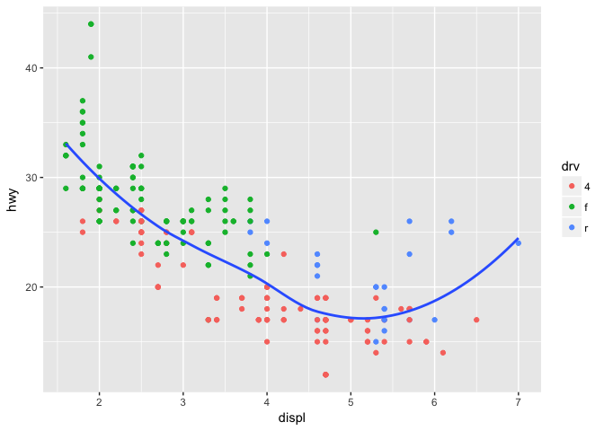

# May 03
Julin N Maloof  
5/3/2017  


## 3.6.1 Exercises

1.


```r
library(ggplot2)
library(tidyverse)
```

```
## Loading tidyverse: tibble
## Loading tidyverse: tidyr
## Loading tidyverse: readr
## Loading tidyverse: purrr
## Loading tidyverse: dplyr
```

```
## Conflicts with tidy packages ----------------------------------------------
```

```
## filter(): dplyr, stats
## lag():    dplyr, stats
```

```r
?geom_line
?geom_boxplot
?geom_histogram
?geom_area
```

2.

points and line colored by drv, showing relationship between displacement and highway MPG


```r
ggplot(data = mpg, mapping = aes(x = displ, y = hwy, color = drv)) + 
  geom_point() + 
  geom_smooth(se = FALSE)
```

```
## `geom_smooth()` using method = 'loess'
```

<!-- -->

3. it prevents the legend from being made:


```r
ggplot(data = mpg, mapping = aes(x = displ, y = hwy, color = drv)) + 
  geom_point(show.legend = FALSE) + 
  geom_smooth(se = FALSE,show.legend = FALSE)
```

```
## `geom_smooth()` using method = 'loess'
```

<!-- -->

4.
shows the standard error of the estimate via shading.

5.
will look the same.  Same aesthetics to both.

6.

```r
pl <- ggplot(mpg,aes(x=displ,y=hwy))
pl <- pl + geom_point()
pl <- pl + geom_smooth(se=FALSE)
pl
```

```
## `geom_smooth()` using method = 'loess'
```

<!-- -->


```r
pl <- ggplot(mpg,aes(x=displ,y=hwy,group=drv))
pl <- pl + geom_point()
pl <- pl + geom_smooth(se=FALSE)
pl
```

```
## `geom_smooth()` using method = 'loess'
```

<!-- -->


```r
pl <- ggplot(mpg,aes(x=displ,y=hwy,color=drv))
pl <- pl + geom_point()
pl <- pl + geom_smooth(se=FALSE)
pl
```

```
## `geom_smooth()` using method = 'loess'
```

<!-- -->


```r
pl <- ggplot(mpg,aes(x=displ,y=hwy))
pl <- pl + geom_point(aes(color=drv))
pl <- pl + geom_smooth(se=FALSE)
pl
```

```
## `geom_smooth()` using method = 'loess'
```

<!-- -->


```r
pl <- ggplot(mpg,aes(x=displ,y=hwy))
pl <- pl + geom_point(aes(color=drv))
pl <- pl + geom_smooth(aes(lty=drv),se=FALSE)
pl
```

```
## `geom_smooth()` using method = 'loess'
```

<!-- -->


```r
pl <- ggplot(mpg,aes(x=displ,y=hwy))
pl <- pl + geom_point(aes(fill=drv),color="white",stroke=1,shape=21,size=2)
pl
```

<!-- -->

## 3.7.1 exercises

1. `geom_pointrange()`

2. geom_col is like geom_bar but it uses stat_identity as default.  The code below produces the same plots:


```r
demo <- tribble(
  ~cut,         ~freq,
  "Fair",       1610,
  "Good",       4906,
  "Very Good",  12082,
  "Premium",    13791,
  "Ideal",      21551
)

ggplot(data = demo) +
  geom_bar(mapping = aes(x = cut, y = freq), stat = "identity")
```

<!-- -->


```r
ggplot(data = demo) +
  geom_col(mapping = aes(x = cut, y = freq))
```

<!-- -->


4.

stat_smooth computes y, ymin, ymax, and se.  It's behaviour is controlled by method, se, formula, n, span, level

5.


```r
ggplot(data = diamonds) + 
  geom_bar(mapping = aes(x = cut, y = ..prop..))
```

<!-- -->


```r
ggplot(data = diamonds) + 
  geom_bar(mapping = aes(x = cut, fill = color, y = ..prop..))
```

<!-- -->

every category is its own group and proportions are calcualted relative to that.
