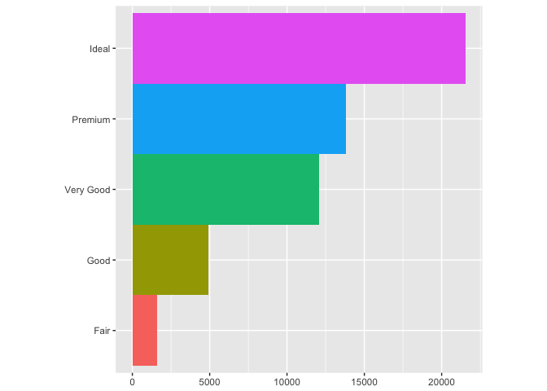

# May 03
Julin N Maloof  
5/3/2017  


## 3.6.1 Exercises

1.


```r
library(ggplot2)
library(tidyverse)
```

```
## Loading tidyverse: tibble
## Loading tidyverse: tidyr
## Loading tidyverse: readr
## Loading tidyverse: purrr
## Loading tidyverse: dplyr
```

```
## Conflicts with tidy packages ----------------------------------------------
```

```
## filter(): dplyr, stats
## lag():    dplyr, stats
```

```r
?geom_line
?geom_boxplot
?geom_histogram
?geom_area
```

2.

points and line colored by drv, showing relationship between displacement and highway MPG


```r
ggplot(data = mpg, mapping = aes(x = displ, y = hwy, color = drv)) + 
  geom_point() + 
  geom_smooth(se = FALSE)
```

```
## `geom_smooth()` using method = 'loess'
```

<!-- -->

3. it prevents the legend from being made:


```r
ggplot(data = mpg, mapping = aes(x = displ, y = hwy, color = drv)) + 
  geom_point(show.legend = FALSE) + 
  geom_smooth(se = FALSE,show.legend = FALSE)
```

```
## `geom_smooth()` using method = 'loess'
```

<!-- -->

4.
shows the standard error of the estimate via shading.

5.
will look the same.  Same aesthetics to both.

6.

```r
pl <- ggplot(mpg,aes(x=displ,y=hwy))
pl <- pl + geom_point()
pl <- pl + geom_smooth(se=FALSE)
pl
```

```
## `geom_smooth()` using method = 'loess'
```

<!-- -->


```r
pl <- ggplot(mpg,aes(x=displ,y=hwy,group=drv))
pl <- pl + geom_point()
pl <- pl + geom_smooth(se=FALSE)
pl
```

```
## `geom_smooth()` using method = 'loess'
```

<!-- -->


```r
pl <- ggplot(mpg,aes(x=displ,y=hwy,color=drv))
pl <- pl + geom_point()
pl <- pl + geom_smooth(se=FALSE)
pl
```

```
## `geom_smooth()` using method = 'loess'
```

<!-- -->


```r
pl <- ggplot(mpg,aes(x=displ,y=hwy))
pl <- pl + geom_point(aes(color=drv))
pl <- pl + geom_smooth(se=FALSE)
pl
```

```
## `geom_smooth()` using method = 'loess'
```

<!-- -->


```r
pl <- ggplot(mpg,aes(x=displ,y=hwy))
pl <- pl + geom_point(aes(color=drv))
pl <- pl + geom_smooth(aes(lty=drv),se=FALSE)
pl
```

```
## `geom_smooth()` using method = 'loess'
```

<!-- -->


```r
pl <- ggplot(mpg,aes(x=displ,y=hwy))
pl <- pl + geom_point(aes(fill=drv),color="white",stroke=1,shape=21,size=2)
pl
```

<!-- -->

## 3.7.1 exercises

1. `geom_pointrange()`

2. geom_col is like geom_bar but it uses stat_identity as default.  The code below produces the same plots:


```r
demo <- tribble(
  ~cut,         ~freq,
  "Fair",       1610,
  "Good",       4906,
  "Very Good",  12082,
  "Premium",    13791,
  "Ideal",      21551
)

ggplot(data = demo) +
  geom_bar(mapping = aes(x = cut, y = freq), stat = "identity")
```

<!-- -->


```r
ggplot(data = demo) +
  geom_col(mapping = aes(x = cut, y = freq))
```

<!-- -->


4.

stat_smooth computes y, ymin, ymax, and se.  It's behaviour is controlled by method, se, formula, n, span, level

5.


```r
ggplot(data = diamonds) + 
  geom_bar(mapping = aes(x = cut, y = ..prop..))
```

<!-- -->


```r
ggplot(data = diamonds) + 
  geom_bar(mapping = aes(x = cut, fill = color, y = ..prop..))
```

<!-- -->

every category is its own group and proportions are calcualted relative to that.

## 3.8.1 Exercises

1.


```r
ggplot(data = mpg, mapping = aes(x = cty, y = hwy)) + 
  geom_point()
```

<!-- -->

Points are overlapped.

Fix with


```r
ggplot(data = mpg, mapping = aes(x = cty, y = hwy)) + 
  geom_point(position = "jitter")
```

<!-- -->

2. Jitter is controlled with the `width` and `height` arguments?geom

3,


```r
ggplot(data = mpg, mapping = aes(x = cty, y = hwy)) + 
  geom_count()
```

<!-- -->

Count deals with overlapped data by binning them and adjusting point size.

4.

The default adjustment for box-plot is dodge:


```r
ggplot(mpg,aes(x=class,y=hwy,fill=drv)) + geom_boxplot()
```

<!-- -->

## 3.9.1 Exercises


```r
bar <- ggplot(data = diamonds) + 
  geom_bar(
    mapping = aes(x = cut, fill = cut), 
    show.legend = FALSE,
    width = 1
  ) + 
  theme(aspect.ratio = 1) +
  labs(x = NULL, y = NULL)

bar + coord_flip()
```

<!-- -->

```r
bar + coord_polar()
```

<!-- -->

1. Turn a stacked bar chart into a polar chart


```r
pl <- ggplot(mpg,aes(x=as.factor(cyl), y = hwy, fill = drv))
pl + geom_col()
```

<!-- -->

```r
pl + geom_col() + coord_polar() + labs(x=NULL,y=NULL)
```

<!-- -->
 
Not very sensical because mileage is getting summed...but the coverted graph looks cool

2. `labs()` sets the x and y axis labels (and also title and subtitle)

3. `coord_quickmap()` and `coord_map()` have the same goal, but `quickmap` is a fast approximation and works best for small areas near the equator

4. 


```r
pl <- ggplot(data = mpg, mapping = aes(x = cty, y = hwy)) +
  geom_point() + 
  geom_abline()
pl +  ggtitle("standard")
```

<!-- -->

```r
pl + coord_fixed() + ggtitle("coord_fixed")
```

<!-- -->

```r
pl + coord_fixed() + ggtitle("coord_fixed") + geom_smooth(method = "lm", se=FALSE)
```

<!-- -->

There is a ~ linear relationship but it is offset from the diagonal and perhaps has a slope a bit higher than one.  

coord_fix insures that there is a 1:1 relationshp between the scales on the x and y axis.

geom_abline() adds a lins from point a to point b.  By default it is the diagonal.

## 4.4 Exercises

1.  There is a typo, "1" instead of "i" in "var1able"

2. 


```r
library(tidyverse)

ggplot(data = mpg) + 
  geom_point(mapping = aes(x = displ, y = hwy))
```

<!-- -->

```r
filter(mpg, cyl == 8)
```

```
## # A tibble: 70 × 11
##    manufacturer              model displ  year   cyl      trans   drv
##           <chr>              <chr> <dbl> <int> <int>      <chr> <chr>
## 1          audi         a6 quattro   4.2  2008     8   auto(s6)     4
## 2     chevrolet c1500 suburban 2wd   5.3  2008     8   auto(l4)     r
## 3     chevrolet c1500 suburban 2wd   5.3  2008     8   auto(l4)     r
## 4     chevrolet c1500 suburban 2wd   5.3  2008     8   auto(l4)     r
## 5     chevrolet c1500 suburban 2wd   5.7  1999     8   auto(l4)     r
## 6     chevrolet c1500 suburban 2wd   6.0  2008     8   auto(l4)     r
## 7     chevrolet           corvette   5.7  1999     8 manual(m6)     r
## 8     chevrolet           corvette   5.7  1999     8   auto(l4)     r
## 9     chevrolet           corvette   6.2  2008     8 manual(m6)     r
## 10    chevrolet           corvette   6.2  2008     8   auto(s6)     r
## # ... with 60 more rows, and 4 more variables: cty <int>, hwy <int>,
## #   fl <chr>, class <chr>
```

```r
filter(diamonds, carat > 3)
```

```
## # A tibble: 32 × 10
##    carat     cut color clarity depth table price     x     y     z
##    <dbl>   <ord> <ord>   <ord> <dbl> <dbl> <int> <dbl> <dbl> <dbl>
## 1   3.01 Premium     I      I1  62.7    58  8040  9.10  8.97  5.67
## 2   3.11    Fair     J      I1  65.9    57  9823  9.15  9.02  5.98
## 3   3.01 Premium     F      I1  62.2    56  9925  9.24  9.13  5.73
## 4   3.05 Premium     E      I1  60.9    58 10453  9.26  9.25  5.66
## 5   3.02    Fair     I      I1  65.2    56 10577  9.11  9.02  5.91
## 6   3.01    Fair     H      I1  56.1    62 10761  9.54  9.38  5.31
## 7   3.65    Fair     H      I1  67.1    53 11668  9.53  9.48  6.38
## 8   3.24 Premium     H      I1  62.1    58 12300  9.44  9.40  5.85
## 9   3.22   Ideal     I      I1  62.6    55 12545  9.49  9.42  5.92
## 10  3.50   Ideal     H      I1  62.8    57 12587  9.65  9.59  6.03
## # ... with 22 more rows
```


3. keyboard shortcuts.  also found under help menu.
