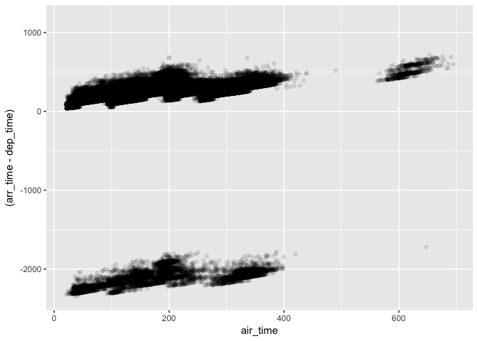
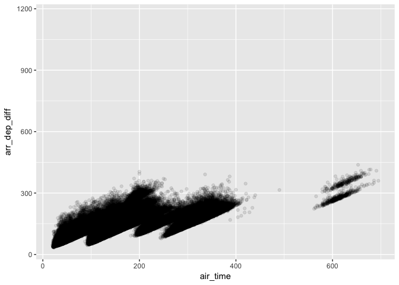
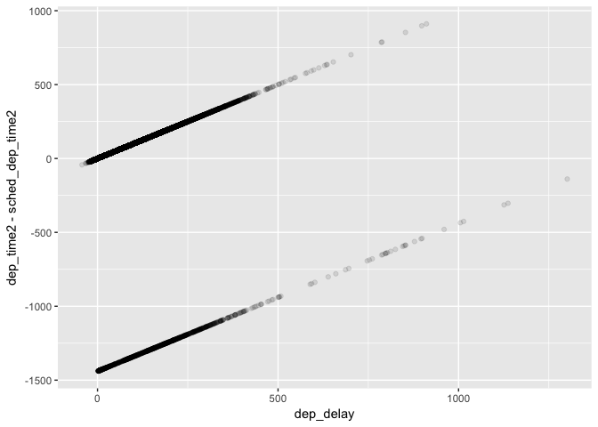
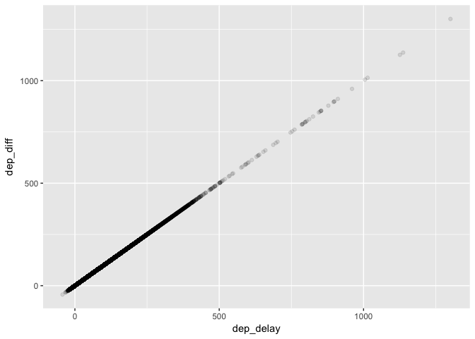

# R Club May 10
Julin N Maloof  
5/7/2017  


```r
library(nycflights13)
library(tidyverse)
```

```
## Loading tidyverse: ggplot2
## Loading tidyverse: tibble
## Loading tidyverse: tidyr
## Loading tidyverse: readr
## Loading tidyverse: purrr
## Loading tidyverse: dplyr
```

```
## Conflicts with tidy packages ----------------------------------------------
```

```
## filter(): dplyr, stats
## lag():    dplyr, stats
```

```r
flights
```

```
## # A tibble: 336,776 × 19
##     year month   day dep_time sched_dep_time dep_delay arr_time
##    <int> <int> <int>    <int>          <int>     <dbl>    <int>
## 1   2013     1     1      517            515         2      830
## 2   2013     1     1      533            529         4      850
## 3   2013     1     1      542            540         2      923
## 4   2013     1     1      544            545        -1     1004
## 5   2013     1     1      554            600        -6      812
## 6   2013     1     1      554            558        -4      740
## 7   2013     1     1      555            600        -5      913
## 8   2013     1     1      557            600        -3      709
## 9   2013     1     1      557            600        -3      838
## 10  2013     1     1      558            600        -2      753
## # ... with 336,766 more rows, and 12 more variables: sched_arr_time <int>,
## #   arr_delay <dbl>, carrier <chr>, flight <int>, tailnum <chr>,
## #   origin <chr>, dest <chr>, air_time <dbl>, distance <dbl>, hour <dbl>,
## #   minute <dbl>, time_hour <dttm>
```


```r
filter(flights,month==1, day==1)
```

```
## # A tibble: 842 × 19
##     year month   day dep_time sched_dep_time dep_delay arr_time
##    <int> <int> <int>    <int>          <int>     <dbl>    <int>
## 1   2013     1     1      517            515         2      830
## 2   2013     1     1      533            529         4      850
## 3   2013     1     1      542            540         2      923
## 4   2013     1     1      544            545        -1     1004
## 5   2013     1     1      554            600        -6      812
## 6   2013     1     1      554            558        -4      740
## 7   2013     1     1      555            600        -5      913
## 8   2013     1     1      557            600        -3      709
## 9   2013     1     1      557            600        -3      838
## 10  2013     1     1      558            600        -2      753
## # ... with 832 more rows, and 12 more variables: sched_arr_time <int>,
## #   arr_delay <dbl>, carrier <chr>, flight <int>, tailnum <chr>,
## #   origin <chr>, dest <chr>, air_time <dbl>, distance <dbl>, hour <dbl>,
## #   minute <dbl>, time_hour <dttm>
```

```r
jan1 <- filter(flights,month==1, day==1)
```

## 5.2.4 Exercises

### 1


```r
filter(flights,arr_delay > 120)
```

```
## # A tibble: 10,034 × 19
##     year month   day dep_time sched_dep_time dep_delay arr_time
##    <int> <int> <int>    <int>          <int>     <dbl>    <int>
## 1   2013     1     1      811            630       101     1047
## 2   2013     1     1      848           1835       853     1001
## 3   2013     1     1      957            733       144     1056
## 4   2013     1     1     1114            900       134     1447
## 5   2013     1     1     1505           1310       115     1638
## 6   2013     1     1     1525           1340       105     1831
## 7   2013     1     1     1549           1445        64     1912
## 8   2013     1     1     1558           1359       119     1718
## 9   2013     1     1     1732           1630        62     2028
## 10  2013     1     1     1803           1620       103     2008
## # ... with 10,024 more rows, and 12 more variables: sched_arr_time <int>,
## #   arr_delay <dbl>, carrier <chr>, flight <int>, tailnum <chr>,
## #   origin <chr>, dest <chr>, air_time <dbl>, distance <dbl>, hour <dbl>,
## #   minute <dbl>, time_hour <dttm>
```


```r
filter(flights,dest == "IAH" | dest == "HOU")
```

```
## # A tibble: 9,313 × 19
##     year month   day dep_time sched_dep_time dep_delay arr_time
##    <int> <int> <int>    <int>          <int>     <dbl>    <int>
## 1   2013     1     1      517            515         2      830
## 2   2013     1     1      533            529         4      850
## 3   2013     1     1      623            627        -4      933
## 4   2013     1     1      728            732        -4     1041
## 5   2013     1     1      739            739         0     1104
## 6   2013     1     1      908            908         0     1228
## 7   2013     1     1     1028           1026         2     1350
## 8   2013     1     1     1044           1045        -1     1352
## 9   2013     1     1     1114            900       134     1447
## 10  2013     1     1     1205           1200         5     1503
## # ... with 9,303 more rows, and 12 more variables: sched_arr_time <int>,
## #   arr_delay <dbl>, carrier <chr>, flight <int>, tailnum <chr>,
## #   origin <chr>, dest <chr>, air_time <dbl>, distance <dbl>, hour <dbl>,
## #   minute <dbl>, time_hour <dttm>
```


```r
filter(flights,carrier %in% c("UA","AA","DL"))
```

```
## # A tibble: 139,504 × 19
##     year month   day dep_time sched_dep_time dep_delay arr_time
##    <int> <int> <int>    <int>          <int>     <dbl>    <int>
## 1   2013     1     1      517            515         2      830
## 2   2013     1     1      533            529         4      850
## 3   2013     1     1      542            540         2      923
## 4   2013     1     1      554            600        -6      812
## 5   2013     1     1      554            558        -4      740
## 6   2013     1     1      558            600        -2      753
## 7   2013     1     1      558            600        -2      924
## 8   2013     1     1      558            600        -2      923
## 9   2013     1     1      559            600        -1      941
## 10  2013     1     1      559            600        -1      854
## # ... with 139,494 more rows, and 12 more variables: sched_arr_time <int>,
## #   arr_delay <dbl>, carrier <chr>, flight <int>, tailnum <chr>,
## #   origin <chr>, dest <chr>, air_time <dbl>, distance <dbl>, hour <dbl>,
## #   minute <dbl>, time_hour <dttm>
```


```r
filter(flights,month > 6 & month < 10)
```

```
## # A tibble: 86,326 × 19
##     year month   day dep_time sched_dep_time dep_delay arr_time
##    <int> <int> <int>    <int>          <int>     <dbl>    <int>
## 1   2013     7     1        1           2029       212      236
## 2   2013     7     1        2           2359         3      344
## 3   2013     7     1       29           2245       104      151
## 4   2013     7     1       43           2130       193      322
## 5   2013     7     1       44           2150       174      300
## 6   2013     7     1       46           2051       235      304
## 7   2013     7     1       48           2001       287      308
## 8   2013     7     1       58           2155       183      335
## 9   2013     7     1      100           2146       194      327
## 10  2013     7     1      100           2245       135      337
## # ... with 86,316 more rows, and 12 more variables: sched_arr_time <int>,
## #   arr_delay <dbl>, carrier <chr>, flight <int>, tailnum <chr>,
## #   origin <chr>, dest <chr>, air_time <dbl>, distance <dbl>, hour <dbl>,
## #   minute <dbl>, time_hour <dttm>
```


```r
filter(flights,arr_delay > 120 & dep_delay <=0)
```

```
## # A tibble: 29 × 19
##     year month   day dep_time sched_dep_time dep_delay arr_time
##    <int> <int> <int>    <int>          <int>     <dbl>    <int>
## 1   2013     1    27     1419           1420        -1     1754
## 2   2013    10     7     1350           1350         0     1736
## 3   2013    10     7     1357           1359        -2     1858
## 4   2013    10    16      657            700        -3     1258
## 5   2013    11     1      658            700        -2     1329
## 6   2013     3    18     1844           1847        -3       39
## 7   2013     4    17     1635           1640        -5     2049
## 8   2013     4    18      558            600        -2     1149
## 9   2013     4    18      655            700        -5     1213
## 10  2013     5    22     1827           1830        -3     2217
## # ... with 19 more rows, and 12 more variables: sched_arr_time <int>,
## #   arr_delay <dbl>, carrier <chr>, flight <int>, tailnum <chr>,
## #   origin <chr>, dest <chr>, air_time <dbl>, distance <dbl>, hour <dbl>,
## #   minute <dbl>, time_hour <dttm>
```


```r
filter(flights, dep_delay >= 60 & ((dep_delay - arr_delay) >=29))
```

```
## # A tibble: 2,318 × 19
##     year month   day dep_time sched_dep_time dep_delay arr_time
##    <int> <int> <int>    <int>          <int>     <dbl>    <int>
## 1   2013     1     1     1716           1545        91     2140
## 2   2013     1     1     2205           1720       285       46
## 3   2013     1     1     2326           2130       116      131
## 4   2013     1     3     1503           1221       162     1803
## 5   2013     1     3     1821           1530       171     2131
## 6   2013     1     3     1839           1700        99     2056
## 7   2013     1     3     1850           1745        65     2148
## 8   2013     1     3     1923           1815        68     2036
## 9   2013     1     3     1941           1759       102     2246
## 10  2013     1     3     1950           1845        65     2228
## # ... with 2,308 more rows, and 12 more variables: sched_arr_time <int>,
## #   arr_delay <dbl>, carrier <chr>, flight <int>, tailnum <chr>,
## #   origin <chr>, dest <chr>, air_time <dbl>, distance <dbl>, hour <dbl>,
## #   minute <dbl>, time_hour <dttm>
```


```r
filter(flights, dep_time <= 0600 | dep_time == 2400)
```

```
## # A tibble: 9,373 × 19
##     year month   day dep_time sched_dep_time dep_delay arr_time
##    <int> <int> <int>    <int>          <int>     <dbl>    <int>
## 1   2013     1     1      517            515         2      830
## 2   2013     1     1      533            529         4      850
## 3   2013     1     1      542            540         2      923
## 4   2013     1     1      544            545        -1     1004
## 5   2013     1     1      554            600        -6      812
## 6   2013     1     1      554            558        -4      740
## 7   2013     1     1      555            600        -5      913
## 8   2013     1     1      557            600        -3      709
## 9   2013     1     1      557            600        -3      838
## 10  2013     1     1      558            600        -2      753
## # ... with 9,363 more rows, and 12 more variables: sched_arr_time <int>,
## #   arr_delay <dbl>, carrier <chr>, flight <int>, tailnum <chr>,
## #   origin <chr>, dest <chr>, air_time <dbl>, distance <dbl>, hour <dbl>,
## #   minute <dbl>, time_hour <dttm>
```

### 2 


```r
?between
filter(flights, between(dep_delay, 0, 120))
```

```
## # A tibble: 135,223 × 19
##     year month   day dep_time sched_dep_time dep_delay arr_time
##    <int> <int> <int>    <int>          <int>     <dbl>    <int>
## 1   2013     1     1      517            515         2      830
## 2   2013     1     1      533            529         4      850
## 3   2013     1     1      542            540         2      923
## 4   2013     1     1      559            559         0      702
## 5   2013     1     1      600            600         0      851
## 6   2013     1     1      600            600         0      837
## 7   2013     1     1      601            600         1      844
## 8   2013     1     1      607            607         0      858
## 9   2013     1     1      608            600         8      807
## 10  2013     1     1      611            600        11      945
## # ... with 135,213 more rows, and 12 more variables: sched_arr_time <int>,
## #   arr_delay <dbl>, carrier <chr>, flight <int>, tailnum <chr>,
## #   origin <chr>, dest <chr>, air_time <dbl>, distance <dbl>, hour <dbl>,
## #   minute <dbl>, time_hour <dttm>
```

```r
filter(flights, between(month,7,9))
```

```
## # A tibble: 86,326 × 19
##     year month   day dep_time sched_dep_time dep_delay arr_time
##    <int> <int> <int>    <int>          <int>     <dbl>    <int>
## 1   2013     7     1        1           2029       212      236
## 2   2013     7     1        2           2359         3      344
## 3   2013     7     1       29           2245       104      151
## 4   2013     7     1       43           2130       193      322
## 5   2013     7     1       44           2150       174      300
## 6   2013     7     1       46           2051       235      304
## 7   2013     7     1       48           2001       287      308
## 8   2013     7     1       58           2155       183      335
## 9   2013     7     1      100           2146       194      327
## 10  2013     7     1      100           2245       135      337
## # ... with 86,316 more rows, and 12 more variables: sched_arr_time <int>,
## #   arr_delay <dbl>, carrier <chr>, flight <int>, tailnum <chr>,
## #   origin <chr>, dest <chr>, air_time <dbl>, distance <dbl>, hour <dbl>,
## #   minute <dbl>, time_hour <dttm>
```

### 3

```r
filter(flights, is.na(dep_time))
```

```
## # A tibble: 8,255 × 19
##     year month   day dep_time sched_dep_time dep_delay arr_time
##    <int> <int> <int>    <int>          <int>     <dbl>    <int>
## 1   2013     1     1       NA           1630        NA       NA
## 2   2013     1     1       NA           1935        NA       NA
## 3   2013     1     1       NA           1500        NA       NA
## 4   2013     1     1       NA            600        NA       NA
## 5   2013     1     2       NA           1540        NA       NA
## 6   2013     1     2       NA           1620        NA       NA
## 7   2013     1     2       NA           1355        NA       NA
## 8   2013     1     2       NA           1420        NA       NA
## 9   2013     1     2       NA           1321        NA       NA
## 10  2013     1     2       NA           1545        NA       NA
## # ... with 8,245 more rows, and 12 more variables: sched_arr_time <int>,
## #   arr_delay <dbl>, carrier <chr>, flight <int>, tailnum <chr>,
## #   origin <chr>, dest <chr>, air_time <dbl>, distance <dbl>, hour <dbl>,
## #   minute <dbl>, time_hour <dttm>
```
probably these flights got cancelled

### 4


```r
NA ^ 0
```

```
## [1] 1
```

```r
NA | TRUE
```

```
## [1] TRUE
```

```r
FALSE & NA
```

```
## [1] FALSE
```

```r
NA * 0
```

```
## [1] NA
```

If the xpression can be evaluated even with the missing value then it is not NA.  Anything raised to 0 is 1.

## 5.3.1 Exercises

_1. How could you use arrange() to sort all missing values to the start? (Hint: use is.na())._


```r
df <- tibble(x = c(5, 2, NA))
arrange(df,x)
```

```
## # A tibble: 3 × 1
##       x
##   <dbl>
## 1     2
## 2     5
## 3    NA
```

```r
arrange(df,desc(is.na(x)))
```

```
## # A tibble: 3 × 1
##       x
##   <dbl>
## 1    NA
## 2     5
## 3     2
```

```r
arrange(df,desc(is.na(x)),x) #NA first and then numeric order
```

```
## # A tibble: 3 × 1
##       x
##   <dbl>
## 1    NA
## 2     2
## 3     5
```


_2. Sort flights to find the most delayed flights. Find the flights that left earliest._


```r
arrange(flights,desc(arr_delay))
```

```
## # A tibble: 336,776 × 19
##     year month   day dep_time sched_dep_time dep_delay arr_time
##    <int> <int> <int>    <int>          <int>     <dbl>    <int>
## 1   2013     1     9      641            900      1301     1242
## 2   2013     6    15     1432           1935      1137     1607
## 3   2013     1    10     1121           1635      1126     1239
## 4   2013     9    20     1139           1845      1014     1457
## 5   2013     7    22      845           1600      1005     1044
## 6   2013     4    10     1100           1900       960     1342
## 7   2013     3    17     2321            810       911      135
## 8   2013     7    22     2257            759       898      121
## 9   2013    12     5      756           1700       896     1058
## 10  2013     5     3     1133           2055       878     1250
## # ... with 336,766 more rows, and 12 more variables: sched_arr_time <int>,
## #   arr_delay <dbl>, carrier <chr>, flight <int>, tailnum <chr>,
## #   origin <chr>, dest <chr>, air_time <dbl>, distance <dbl>, hour <dbl>,
## #   minute <dbl>, time_hour <dttm>
```

```r
arrange(flights,dep_time)
```

```
## # A tibble: 336,776 × 19
##     year month   day dep_time sched_dep_time dep_delay arr_time
##    <int> <int> <int>    <int>          <int>     <dbl>    <int>
## 1   2013     1    13        1           2249        72      108
## 2   2013     1    31        1           2100       181      124
## 3   2013    11    13        1           2359         2      442
## 4   2013    12    16        1           2359         2      447
## 5   2013    12    20        1           2359         2      430
## 6   2013    12    26        1           2359         2      437
## 7   2013    12    30        1           2359         2      441
## 8   2013     2    11        1           2100       181      111
## 9   2013     2    24        1           2245        76      121
## 10  2013     3     8        1           2355         6      431
## # ... with 336,766 more rows, and 12 more variables: sched_arr_time <int>,
## #   arr_delay <dbl>, carrier <chr>, flight <int>, tailnum <chr>,
## #   origin <chr>, dest <chr>, air_time <dbl>, distance <dbl>, hour <dbl>,
## #   minute <dbl>, time_hour <dttm>
```


_3. Sort flights to find the fastest flights._


```r
arrange(flights,air_time)
```

```
## # A tibble: 336,776 × 19
##     year month   day dep_time sched_dep_time dep_delay arr_time
##    <int> <int> <int>    <int>          <int>     <dbl>    <int>
## 1   2013     1    16     1355           1315        40     1442
## 2   2013     4    13      537            527        10      622
## 3   2013    12     6      922            851        31     1021
## 4   2013     2     3     2153           2129        24     2247
## 5   2013     2     5     1303           1315       -12     1342
## 6   2013     2    12     2123           2130        -7     2211
## 7   2013     3     2     1450           1500       -10     1547
## 8   2013     3     8     2026           1935        51     2131
## 9   2013     3    18     1456           1329        87     1533
## 10  2013     3    19     2226           2145        41     2305
## # ... with 336,766 more rows, and 12 more variables: sched_arr_time <int>,
## #   arr_delay <dbl>, carrier <chr>, flight <int>, tailnum <chr>,
## #   origin <chr>, dest <chr>, air_time <dbl>, distance <dbl>, hour <dbl>,
## #   minute <dbl>, time_hour <dttm>
```


_4. Which flights travelled the longest? Which travelled the shortest?_


```r
arrange(flights,desc(distance))
```

```
## # A tibble: 336,776 × 19
##     year month   day dep_time sched_dep_time dep_delay arr_time
##    <int> <int> <int>    <int>          <int>     <dbl>    <int>
## 1   2013     1     1      857            900        -3     1516
## 2   2013     1     2      909            900         9     1525
## 3   2013     1     3      914            900        14     1504
## 4   2013     1     4      900            900         0     1516
## 5   2013     1     5      858            900        -2     1519
## 6   2013     1     6     1019            900        79     1558
## 7   2013     1     7     1042            900       102     1620
## 8   2013     1     8      901            900         1     1504
## 9   2013     1     9      641            900      1301     1242
## 10  2013     1    10      859            900        -1     1449
## # ... with 336,766 more rows, and 12 more variables: sched_arr_time <int>,
## #   arr_delay <dbl>, carrier <chr>, flight <int>, tailnum <chr>,
## #   origin <chr>, dest <chr>, air_time <dbl>, distance <dbl>, hour <dbl>,
## #   minute <dbl>, time_hour <dttm>
```

```r
arrange(flights,distance)
```

```
## # A tibble: 336,776 × 19
##     year month   day dep_time sched_dep_time dep_delay arr_time
##    <int> <int> <int>    <int>          <int>     <dbl>    <int>
## 1   2013     7    27       NA            106        NA       NA
## 2   2013     1     3     2127           2129        -2     2222
## 3   2013     1     4     1240           1200        40     1333
## 4   2013     1     4     1829           1615       134     1937
## 5   2013     1     4     2128           2129        -1     2218
## 6   2013     1     5     1155           1200        -5     1241
## 7   2013     1     6     2125           2129        -4     2224
## 8   2013     1     7     2124           2129        -5     2212
## 9   2013     1     8     2127           2130        -3     2304
## 10  2013     1     9     2126           2129        -3     2217
## # ... with 336,766 more rows, and 12 more variables: sched_arr_time <int>,
## #   arr_delay <dbl>, carrier <chr>, flight <int>, tailnum <chr>,
## #   origin <chr>, dest <chr>, air_time <dbl>, distance <dbl>, hour <dbl>,
## #   minute <dbl>, time_hour <dttm>
```


```r
select(flights, year, month, day)
```

```
## # A tibble: 336,776 × 3
##     year month   day
##    <int> <int> <int>
## 1   2013     1     1
## 2   2013     1     1
## 3   2013     1     1
## 4   2013     1     1
## 5   2013     1     1
## 6   2013     1     1
## 7   2013     1     1
## 8   2013     1     1
## 9   2013     1     1
## 10  2013     1     1
## # ... with 336,766 more rows
```

## 5.4.1 Exercises

1. Brainstorm as many ways as possible to select dep_time, dep_delay, arr_time, and arr_delay from flights.


```r
select(flights, dep_time, dep_delay, arr_time, arr_delay)
```

```
## # A tibble: 336,776 × 4
##    dep_time dep_delay arr_time arr_delay
##       <int>     <dbl>    <int>     <dbl>
## 1       517         2      830        11
## 2       533         4      850        20
## 3       542         2      923        33
## 4       544        -1     1004       -18
## 5       554        -6      812       -25
## 6       554        -4      740        12
## 7       555        -5      913        19
## 8       557        -3      709       -14
## 9       557        -3      838        -8
## 10      558        -2      753         8
## # ... with 336,766 more rows
```

```r
select(flights, starts_with("dep"), starts_with("arr"))
```

```
## # A tibble: 336,776 × 4
##    dep_time dep_delay arr_time arr_delay
##       <int>     <dbl>    <int>     <dbl>
## 1       517         2      830        11
## 2       533         4      850        20
## 3       542         2      923        33
## 4       544        -1     1004       -18
## 5       554        -6      812       -25
## 6       554        -4      740        12
## 7       555        -5      913        19
## 8       557        -3      709       -14
## 9       557        -3      838        -8
## 10      558        -2      753         8
## # ... with 336,766 more rows
```

```r
select(flights, matches("^(dep|arr)"))
```

```
## # A tibble: 336,776 × 4
##    dep_time dep_delay arr_time arr_delay
##       <int>     <dbl>    <int>     <dbl>
## 1       517         2      830        11
## 2       533         4      850        20
## 3       542         2      923        33
## 4       544        -1     1004       -18
## 5       554        -6      812       -25
## 6       554        -4      740        12
## 7       555        -5      913        19
## 8       557        -3      709       -14
## 9       557        -3      838        -8
## 10      558        -2      753         8
## # ... with 336,766 more rows
```

```r
# we could also exclude everything else, but that would be a pain
```


2. What happens if you include the name of a variable multiple times in a select() call?


```r
select(flights, dep_time, dep_time)
```

```
## # A tibble: 336,776 × 1
##    dep_time
##       <int>
## 1       517
## 2       533
## 3       542
## 4       544
## 5       554
## 6       554
## 7       555
## 8       557
## 9       557
## 10      558
## # ... with 336,766 more rows
```
only shows once

3. What does the one_of() function do? Why might it be helpful in conjunction with this vector?


```r
vars <- c("year", "month", "day", "dep_delay", "arr_delay")
?one_of
```


```r
select(flights, one_of(vars))
```

```
## # A tibble: 336,776 × 5
##     year month   day dep_delay arr_delay
##    <int> <int> <int>     <dbl>     <dbl>
## 1   2013     1     1         2        11
## 2   2013     1     1         4        20
## 3   2013     1     1         2        33
## 4   2013     1     1        -1       -18
## 5   2013     1     1        -6       -25
## 6   2013     1     1        -4        12
## 7   2013     1     1        -5        19
## 8   2013     1     1        -3       -14
## 9   2013     1     1        -3        -8
## 10  2013     1     1        -2         8
## # ... with 336,766 more rows
```

```r
#select(flights, vars)
```

`one_of()` seems strangely named, but apparently it allows us to feed in a character vector of column names.


4. Does the result of running the following code surprise you? How do the select helpers deal with case by default? How can you change that default?


```r
select(flights, contains("TIME"))
```

```
## # A tibble: 336,776 × 6
##    dep_time sched_dep_time arr_time sched_arr_time air_time
##       <int>          <int>    <int>          <int>    <dbl>
## 1       517            515      830            819      227
## 2       533            529      850            830      227
## 3       542            540      923            850      160
## 4       544            545     1004           1022      183
## 5       554            600      812            837      116
## 6       554            558      740            728      150
## 7       555            600      913            854      158
## 8       557            600      709            723       53
## 9       557            600      838            846      140
## 10      558            600      753            745      138
## # ... with 336,766 more rows, and 1 more variables: time_hour <dttm>
```
I am suprised.  


```r
select(flights, contains("TIME", ignore.case = FALSE))
```

```
## # A tibble: 336,776 × 0
```

## 5.5.2

*1. Currently dep_time and sched_dep_time are convenient to look at, but hard to compute with because they’re not really continuous numbers. Convert them to a more convenient representation of number of minutes since midnight.*


```r
transmute(flights,
          dep_time, dep_time2 = dep_time %/% 100 * 60 + dep_time %% 100, 
          sched_dep_time, sched_dep_time2 = sched_dep_time %/% 100 * 60 + sched_dep_time %% 100)
```

```
## # A tibble: 336,776 × 4
##    dep_time dep_time2 sched_dep_time sched_dep_time2
##       <int>     <dbl>          <int>           <dbl>
## 1       517       317            515             315
## 2       533       333            529             329
## 3       542       342            540             340
## 4       544       344            545             345
## 5       554       354            600             360
## 6       554       354            558             358
## 7       555       355            600             360
## 8       557       357            600             360
## 9       557       357            600             360
## 10      558       358            600             360
## # ... with 336,766 more rows
```


*2. Compare air_time with arr_time - dep_time. What do you expect to see? What do you see? What do you need to do to fix it?*


```r
ggplot(flights, aes(x=air_time, y = (arr_time-dep_time))) + geom_point(alpha=.1)
```

```
## Warning: Removed 9430 rows containing missing values (geom_point).
```

<!-- -->

The problem is that if the plane arrives the next day then those hours are not taken into account.  We need to add the extra day to arrival time when necessary.  In addition, we have to deal with the 60 minute problem.  Time zones are also a problem.


```r
flights2 <- transmute(flights, arr_time, dep_time, air_time, 
                      arr_time2 = arr_time %/% 100 * 60 + arr_time %% 100,
                      dep_time2 = dep_time %/% 100 * 60 + dep_time %% 100,
          arr_dep_diff = ifelse(arr_time2 < dep_time2, arr_time2-dep_time2 + 1440, arr_time2-dep_time2))
flights2
```

```
## # A tibble: 336,776 × 6
##    arr_time dep_time air_time arr_time2 dep_time2 arr_dep_diff
##       <int>    <int>    <dbl>     <dbl>     <dbl>        <dbl>
## 1       830      517      227       510       317          193
## 2       850      533      227       530       333          197
## 3       923      542      160       563       342          221
## 4      1004      544      183       604       344          260
## 5       812      554      116       492       354          138
## 6       740      554      150       460       354          106
## 7       913      555      158       553       355          198
## 8       709      557       53       429       357           72
## 9       838      557      140       518       357          161
## 10      753      558      138       473       358          115
## # ... with 336,766 more rows
```


```r
ggplot(flights2, aes(x=air_time, y = arr_dep_diff)) + geom_point(alpha=0.1)
```

```
## Warning: Removed 9430 rows containing missing values (geom_point).
```

<!-- -->

*3. Compare dep_time, sched_dep_time, and dep_delay. How would you expect those three numbers to be related?*

I expect dep_delay = dep_time - sched_dep_time

```r
flights3 <- transmute(flights,
          dep_time, dep_time2 = dep_time %/% 100 * 60 + dep_time %% 100, 
          sched_dep_time, sched_dep_time2 = sched_dep_time %/% 100 * 60 + sched_dep_time %% 100, dep_delay, 
          dep_diff = ifelse(dep_time2+120 < sched_dep_time2, 
                            dep_time2-sched_dep_time2 + 1440,
                            dep_time2-sched_dep_time2
                            ))
flights3
```

```
## # A tibble: 336,776 × 6
##    dep_time dep_time2 sched_dep_time sched_dep_time2 dep_delay dep_diff
##       <int>     <dbl>          <int>           <dbl>     <dbl>    <dbl>
## 1       517       317            515             315         2        2
## 2       533       333            529             329         4        4
## 3       542       342            540             340         2        2
## 4       544       344            545             345        -1       -1
## 5       554       354            600             360        -6       -6
## 6       554       354            558             358        -4       -4
## 7       555       355            600             360        -5       -5
## 8       557       357            600             360        -3       -3
## 9       557       357            600             360        -3       -3
## 10      558       358            600             360        -2       -2
## # ... with 336,766 more rows
```

```r
ggplot(flights3, aes(x=dep_delay, y = dep_time2 - sched_dep_time2)) + geom_point(alpha=0.1)
```

```
## Warning: Removed 8255 rows containing missing values (geom_point).
```

<!-- -->

```r
ggplot(flights3, aes(x=dep_delay, y = dep_diff)) + geom_point(alpha=0.1)
```

```
## Warning: Removed 8255 rows containing missing values (geom_point).
```

<!-- -->


*4. Find the 10 most delayed flights using a ranking function. How do you want to handle ties? Carefully read the documentation for min_rank().*


```r
flights %>% mutate(rank = min_rank(arr_delay)) %>% arrange(desc(rank)) %>% head(10)
```

```
## # A tibble: 10 × 20
##     year month   day dep_time sched_dep_time dep_delay arr_time
##    <int> <int> <int>    <int>          <int>     <dbl>    <int>
## 1   2013     1     9      641            900      1301     1242
## 2   2013     6    15     1432           1935      1137     1607
## 3   2013     1    10     1121           1635      1126     1239
## 4   2013     9    20     1139           1845      1014     1457
## 5   2013     7    22      845           1600      1005     1044
## 6   2013     4    10     1100           1900       960     1342
## 7   2013     3    17     2321            810       911      135
## 8   2013     7    22     2257            759       898      121
## 9   2013    12     5      756           1700       896     1058
## 10  2013     5     3     1133           2055       878     1250
## # ... with 13 more variables: sched_arr_time <int>, arr_delay <dbl>,
## #   carrier <chr>, flight <int>, tailnum <chr>, origin <chr>, dest <chr>,
## #   air_time <dbl>, distance <dbl>, hour <dbl>, minute <dbl>,
## #   time_hour <dttm>, rank <int>
```


_5. What does 1:3 + 1:10 return? Why?_


```r
1:3 + 1:10
```
This returns a warning because one vector is shorter than the other and it is unclear what to do.

_6. What trigonometric functions does R provide?_


```r
help("Trig")
```

cos(x)  
sin(x)  
tan(x)  

acos(x)  
asin(x)  
atan(x)  
atan2(y, x)

cospi(x)  
sinpi(x)  
tanpi(x)

