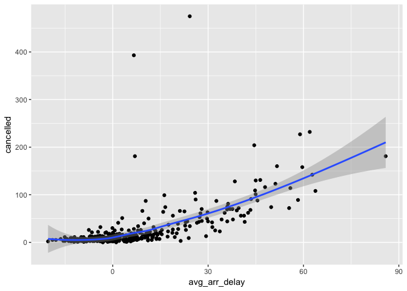

# Untitled
Julin N Maloof  
5/16/2017  


```r
library(nycflights13)
library(tidyverse)
```

```
## Loading tidyverse: ggplot2
## Loading tidyverse: tibble
## Loading tidyverse: tidyr
## Loading tidyverse: readr
## Loading tidyverse: purrr
## Loading tidyverse: dplyr
```

```
## Conflicts with tidy packages ----------------------------------------------
```

```
## filter(): dplyr, stats
## lag():    dplyr, stats
```

## Scratchpad


```r
summarise(flights, delay = mean(dep_delay, na.rm = TRUE))
```

```
## # A tibble: 1 × 1
##      delay
##      <dbl>
## 1 12.63907
```


```r
by_day <- group_by(flights, year, month, day)
summarise(by_day, delay = mean(dep_delay, na.rm = TRUE))
```

```
## Source: local data frame [365 x 4]
## Groups: year, month [?]
## 
##     year month   day     delay
##    <int> <int> <int>     <dbl>
## 1   2013     1     1 11.548926
## 2   2013     1     2 13.858824
## 3   2013     1     3 10.987832
## 4   2013     1     4  8.951595
## 5   2013     1     5  5.732218
## 6   2013     1     6  7.148014
## 7   2013     1     7  5.417204
## 8   2013     1     8  2.553073
## 9   2013     1     9  2.276477
## 10  2013     1    10  2.844995
## # ... with 355 more rows
```


```r
by_dest <- group_by(flights, dest)
delay <- summarise(by_dest,
  count = n(),
  dist = mean(distance, na.rm = TRUE),
  delay = mean(arr_delay, na.rm = TRUE)
)

by_dest
```

```
## Source: local data frame [336,776 x 19]
## Groups: dest [105]
## 
##     year month   day dep_time sched_dep_time dep_delay arr_time
##    <int> <int> <int>    <int>          <int>     <dbl>    <int>
## 1   2013     1     1      517            515         2      830
## 2   2013     1     1      533            529         4      850
## 3   2013     1     1      542            540         2      923
## 4   2013     1     1      544            545        -1     1004
## 5   2013     1     1      554            600        -6      812
## 6   2013     1     1      554            558        -4      740
## 7   2013     1     1      555            600        -5      913
## 8   2013     1     1      557            600        -3      709
## 9   2013     1     1      557            600        -3      838
## 10  2013     1     1      558            600        -2      753
## # ... with 336,766 more rows, and 12 more variables: sched_arr_time <int>,
## #   arr_delay <dbl>, carrier <chr>, flight <int>, tailnum <chr>,
## #   origin <chr>, dest <chr>, air_time <dbl>, distance <dbl>, hour <dbl>,
## #   minute <dbl>, time_hour <dttm>
```

```r
delay <- filter(delay, count > 20, dest != "HNL")

delay
```

```
## # A tibble: 96 × 4
##     dest count      dist     delay
##    <chr> <int>     <dbl>     <dbl>
## 1    ABQ   254 1826.0000  4.381890
## 2    ACK   265  199.0000  4.852273
## 3    ALB   439  143.0000 14.397129
## 4    ATL 17215  757.1082 11.300113
## 5    AUS  2439 1514.2530  6.019909
## 6    AVL   275  583.5818  8.003831
## 7    BDL   443  116.0000  7.048544
## 8    BGR   375  378.0000  8.027933
## 9    BHM   297  865.9966 16.877323
## 10   BNA  6333  758.2135 11.812459
## # ... with 86 more rows
```


```r
delays <- flights %>% 
  group_by(dest) %>% 
  summarise(
    count = n(),
    dist = mean(distance, na.rm = TRUE),
    delay = mean(arr_delay, na.rm = TRUE)
  ) %>% 
  filter(count > 20, dest != "HNL")
```


```r
not_cancelled <- flights %>% 
  filter(!is.na(dep_delay), !is.na(arr_delay))
```


```r
not_cancelled %>% 
  group_by(year, month, day) %>% 
  mutate(r = min_rank(desc(dep_time))) %>% 
  filter(r %in% range(r))
```

```
## Source: local data frame [770 x 20]
## Groups: year, month, day [365]
## 
##     year month   day dep_time sched_dep_time dep_delay arr_time
##    <int> <int> <int>    <int>          <int>     <dbl>    <int>
## 1   2013     1     1      517            515         2      830
## 2   2013     1     1     2356           2359        -3      425
## 3   2013     1     2       42           2359        43      518
## 4   2013     1     2     2354           2359        -5      413
## 5   2013     1     3       32           2359        33      504
## 6   2013     1     3     2349           2359       -10      434
## 7   2013     1     4       25           2359        26      505
## 8   2013     1     4     2358           2359        -1      429
## 9   2013     1     4     2358           2359        -1      436
## 10  2013     1     5       14           2359        15      503
## # ... with 760 more rows, and 13 more variables: sched_arr_time <int>,
## #   arr_delay <dbl>, carrier <chr>, flight <int>, tailnum <chr>,
## #   origin <chr>, dest <chr>, air_time <dbl>, distance <dbl>, hour <dbl>,
## #   minute <dbl>, time_hour <dttm>, r <int>
```


```r
not_cancelled %>% 
  count(dest)
```

```
## # A tibble: 104 × 2
##     dest     n
##    <chr> <int>
## 1    ABQ   254
## 2    ACK   264
## 3    ALB   418
## 4    ANC     8
## 5    ATL 16837
## 6    AUS  2411
## 7    AVL   261
## 8    BDL   412
## 9    BGR   358
## 10   BHM   269
## # ... with 94 more rows
```


```r
not_cancelled %>%
  group_by(flight) %>%
  mutate(
    late_15 = mean(arr_delay == 15),
    early_15 = mean(arr_delay == -15)
    ) %>%
  filter(late_15 == .5, !duplicated(flight)) %>%
  select(carrier, flight, origin, dest) # because the other columns are specific to particular days
```

```
## Source: local data frame [3 x 4]
## Groups: flight [3]
## 
##   carrier flight origin  dest
##     <chr>  <int>  <chr> <chr>
## 1      9E   3409    JFK   PIT
## 2      EV   4313    EWR   PVD
## 3      UA    730    EWR   DEN
```


```r
not_cancelled %>%
  group_by(flight) %>%
  summarize(
    late_15 = mean(arr_delay == 15),
    early_15 = mean(arr_delay == -15)
    ) %>%
  filter(late_15 == .5)
```

```
## # A tibble: 3 × 3
##   flight late_15 early_15
##    <int>   <dbl>    <dbl>
## 1    730     0.5        0
## 2   3409     0.5        0
## 3   4313     0.5        0
```


## 5.6.7 Exercises

### 1

Skipping it

### 2

_Come up with another approach that will give you the same output as below without using `count()`_

```r
not_cancelled %>% 
  count(dest)
```

```
## # A tibble: 104 × 2
##     dest     n
##    <chr> <int>
## 1    ABQ   254
## 2    ACK   264
## 3    ALB   418
## 4    ANC     8
## 5    ATL 16837
## 6    AUS  2411
## 7    AVL   261
## 8    BDL   412
## 9    BGR   358
## 10   BHM   269
## # ... with 94 more rows
```

```r
not_cancelled %>% 
  count(tailnum, wt = distance)
```

```
## # A tibble: 4,037 × 2
##    tailnum      n
##      <chr>  <dbl>
## 1   D942DN   3418
## 2   N0EGMQ 239143
## 3   N10156 109664
## 4   N102UW  25722
## 5   N103US  24619
## 6   N104UW  24616
## 7   N10575 139903
## 8   N105UW  23618
## 9   N107US  21677
## 10  N108UW  32070
## # ... with 4,027 more rows
```


```r
not_cancelled %>% group_by(dest) %>% summarize(n=n())
```

```
## # A tibble: 104 × 2
##     dest     n
##    <chr> <int>
## 1    ABQ   254
## 2    ACK   264
## 3    ALB   418
## 4    ANC     8
## 5    ATL 16837
## 6    AUS  2411
## 7    AVL   261
## 8    BDL   412
## 9    BGR   358
## 10   BHM   269
## # ... with 94 more rows
```

```r
not_cancelled %>% group_by(tailnum) %>% tally(wt=distance)
```

```
## # A tibble: 4,037 × 2
##    tailnum      n
##      <chr>  <dbl>
## 1   D942DN   3418
## 2   N0EGMQ 239143
## 3   N10156 109664
## 4   N102UW  25722
## 5   N103US  24619
## 6   N104UW  24616
## 7   N10575 139903
## 8   N105UW  23618
## 9   N107US  21677
## 10  N108UW  32070
## # ... with 4,027 more rows
```

### 3

_Our definition of cancelled flights (is.na(dep_delay) | is.na(arr_delay) ) is slightly suboptimal. Why? Which is the most important column?_

arr_delay is the more important column.  Maybe the departure delay wasn't recorded?

### 4

_Look at the number of cancelled flights per day. Is there a pattern? Is the proportion of cancelled flights related to the average delay?_


```r
cancelled_by_day <- flights %>% group_by(year,month,day) %>%
  summarize(cancelled=sum(is.na(dep_delay) | is.na(arr_delay)),
            avg_arr_delay=mean(arr_delay,na.rm=TRUE))
cancelled_by_day
```

```
## Source: local data frame [365 x 5]
## Groups: year, month [?]
## 
##     year month   day cancelled avg_arr_delay
##    <int> <int> <int>     <int>         <dbl>
## 1   2013     1     1        11    12.6510229
## 2   2013     1     2        15    12.6928879
## 3   2013     1     3        14     5.7333333
## 4   2013     1     4         7    -1.9328194
## 5   2013     1     5         3    -1.5258020
## 6   2013     1     6         3     4.2364294
## 7   2013     1     7         3    -4.9473118
## 8   2013     1     8         7    -3.2275785
## 9   2013     1     9         9    -0.2642777
## 10  2013     1    10         3    -5.8988159
## # ... with 355 more rows
```

```r
qplot(x=avg_arr_delay,y=cancelled,data = cancelled_by_day)
```

<!-- -->

### 5 

_Which carrier has the worst delays? Challenge: can you disentangle the effects of bad airports vs. bad carriers? Why/why not? (Hint: think about_ `flights %>% group_by(carrier, dest) %>% summarise(n()))`


```r
not_cancelled %>% group_by(carrier) %>% summarize(mean_delay=mean(arr_delay)) %>% arrange(desc(mean_delay))
```

```
## # A tibble: 16 × 2
##    carrier mean_delay
##      <chr>      <dbl>
## 1       F9 21.9207048
## 2       FL 20.1159055
## 3       EV 15.7964311
## 4       YV 15.5569853
## 5       OO 11.9310345
## 6       MQ 10.7747334
## 7       WN  9.6491199
## 8       B6  9.4579733
## 9       9E  7.3796692
## 10      UA  3.5580111
## 11      US  2.1295951
## 12      VX  1.7644644
## 13      DL  1.6443409
## 14      AA  0.3642909
## 15      HA -6.9152047
## 16      AS -9.9308886
```

### 6

_What does the sort argument to count() do. When might you use it?_

Sorts...(duh).  Use it when you want to sort the counts....

```r
not_cancelled %>% count(dest)
```

```
## # A tibble: 104 × 2
##     dest     n
##    <chr> <int>
## 1    ABQ   254
## 2    ACK   264
## 3    ALB   418
## 4    ANC     8
## 5    ATL 16837
## 6    AUS  2411
## 7    AVL   261
## 8    BDL   412
## 9    BGR   358
## 10   BHM   269
## # ... with 94 more rows
```

```r
not_cancelled %>% count(dest,sort = TRUE)
```

```
## # A tibble: 104 × 2
##     dest     n
##    <chr> <int>
## 1    ATL 16837
## 2    ORD 16566
## 3    LAX 16026
## 4    BOS 15022
## 5    MCO 13967
## 6    CLT 13674
## 7    SFO 13173
## 8    FLL 11897
## 9    MIA 11593
## 10   DCA  9111
## # ... with 94 more rows
```

```r
not_cancelled %>% count(dest) %>% arrange(desc(n))
```

```
## # A tibble: 104 × 2
##     dest     n
##    <chr> <int>
## 1    ATL 16837
## 2    ORD 16566
## 3    LAX 16026
## 4    BOS 15022
## 5    MCO 13967
## 6    CLT 13674
## 7    SFO 13173
## 8    FLL 11897
## 9    MIA 11593
## 10   DCA  9111
## # ... with 94 more rows
```

## 5.7.1 Exercises

### 1

Skipping

### 2

_Which plane (tailnum) has the worst on-time record?_


```r
not_cancelled %>% group_by(tailnum) %>%
  mutate(avg_arr_delay = mean(arr_delay)) %>% 
  ungroup() %>%
  filter(rank(desc(avg_arr_delay)) < 5) %>%
  arrange(desc(avg_arr_delay))
```

```
## # A tibble: 4 × 20
##    year month   day dep_time sched_dep_time dep_delay arr_time
##   <int> <int> <int>    <int>          <int>     <dbl>    <int>
## 1  2013     7    22     2117           1620       297       22
## 2  2013     1    28     1857           1429       268     2136
## 3  2013     9    16     1744           1310       274     1944
## 4  2013     7     1     1632           1200       272     1859
## # ... with 13 more variables: sched_arr_time <int>, arr_delay <dbl>,
## #   carrier <chr>, flight <int>, tailnum <chr>, origin <chr>, dest <chr>,
## #   air_time <dbl>, distance <dbl>, hour <dbl>, minute <dbl>,
## #   time_hour <dttm>, avg_arr_delay <dbl>
```

If we want to limit to tailnum with > 25 flights

```r
not_cancelled %>% group_by(tailnum) %>%
  mutate(avg_arr_delay = mean(arr_delay), n=n()) %>% 
  filter(n > 24) %>%
  ungroup() %>%
  filter(rank(desc(avg_arr_delay)) < 50) %>%
  arrange(desc(avg_arr_delay))
```

```
## # A tibble: 41 × 21
##     year month   day dep_time sched_dep_time dep_delay arr_time
##    <int> <int> <int>    <int>          <int>     <dbl>    <int>
## 1   2013     1     1      833            835        -2     1134
## 2   2013     1     3      835            835         0     1102
## 3   2013     1    22      828            830        -2     1111
## 4   2013    10     2     1316           1325        -9     1518
## 5   2013    11    18      826            830        -4     1047
## 6   2013    11    25      944            830        74     1211
## 7   2013    12     4      913            855        18     1211
## 8   2013    12     8     1729           1729         0     2112
## 9   2013    12     9     2018           1729       169     2306
## 10  2013     2     1      833            830         3     1058
## # ... with 31 more rows, and 14 more variables: sched_arr_time <int>,
## #   arr_delay <dbl>, carrier <chr>, flight <int>, tailnum <chr>,
## #   origin <chr>, dest <chr>, air_time <dbl>, distance <dbl>, hour <dbl>,
## #   minute <dbl>, time_hour <dttm>, avg_arr_delay <dbl>, n <int>
```

Still not happy with this
