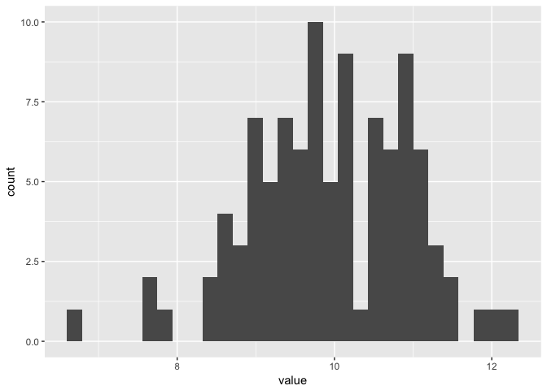
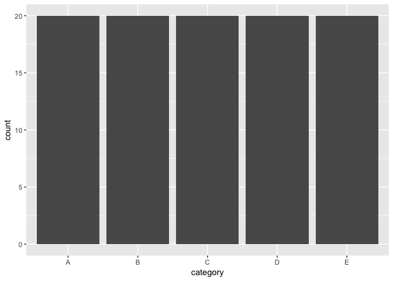

# R Club May 24
Julin N Maloof  
5/24/2017  


## 7.4.1

### 1


```r
test.data <- tibble(value=c(NA,rnorm(99,10)),
                    category=rep(LETTERS[1:5],20))
test.data
```

```
## # A tibble: 100 × 2
##        value category
##        <dbl>    <chr>
## 1         NA        A
## 2   9.852173        B
## 3  10.105460        C
## 4   9.901290        D
## 5  10.162998        E
## 6   7.549504        A
## 7   9.187138        B
## 8  10.438633        C
## 9   9.113622        D
## 10 12.260868        E
## # ... with 90 more rows
```


```r
ggplot(test.data,aes(x=value)) + geom_histogram()
```

```
## `stat_bin()` using `bins = 30`. Pick better value with `binwidth`.
```

```
## Warning: Removed 1 rows containing non-finite values (stat_bin).
```

<!-- -->


```r
ggplot(test.data,aes(x=category)) + geom_bar()
```

<!-- -->

The value is removed from histogram (because where do you put it) but not from geom_bar because we know which category it belongs in.

