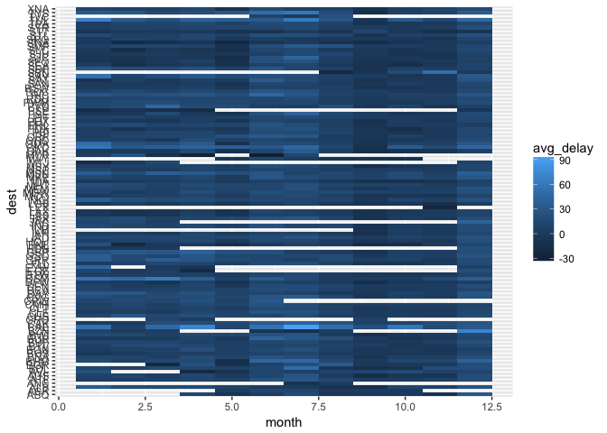
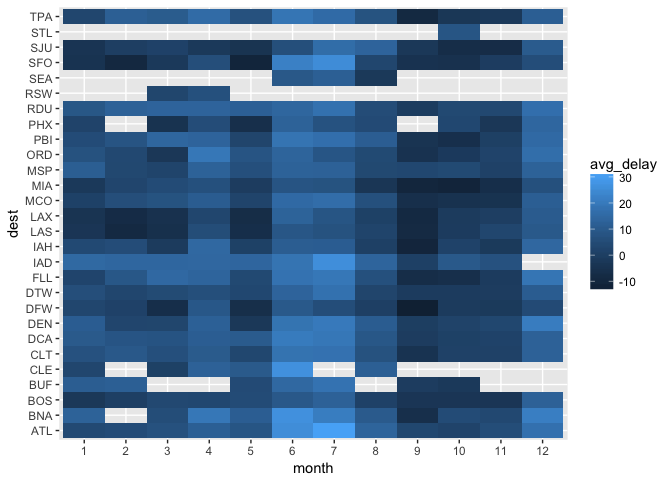
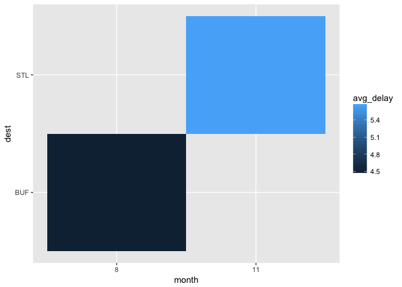

# R Club May 24
Julin N Maloof  
5/24/2017  


## 7.4.1

### 1


```r
test.data <- tibble(value=c(NA,rnorm(99,10)),
                    category=rep(LETTERS[1:5],20))
test.data
```

```
## # A tibble: 100 × 2
##        value category
##        <dbl>    <chr>
## 1         NA        A
## 2   9.266587        B
## 3  11.098623        C
## 4  10.504850        D
## 5   9.503769        E
## 6  10.975719        A
## 7  11.101286        B
## 8  10.872364        C
## 9  10.794006        D
## 10 10.109614        E
## # ... with 90 more rows
```


```r
ggplot(test.data,aes(x=value)) + geom_histogram()
```

```
## `stat_bin()` using `bins = 30`. Pick better value with `binwidth`.
```

```
## Warning: Removed 1 rows containing non-finite values (stat_bin).
```

<!-- -->


```r
ggplot(test.data,aes(x=category)) + geom_bar()
```

<!-- -->

The value is removed from histogram (because where do you put it) but not from geom_bar because we know which category it belongs in.

## 7.5.2.1

### 2

_Use geom_tile() together with dplyr to explore how average flight delays vary by destination and month of year. What makes the plot difficult to read? How could you improve it?_


```r
library(nycflights13)
not_cancelled <- flights %>% 
  filter(!is.na(dep_delay), !is.na(arr_delay))
not_cancelled %>% 
  group_by(dest,month) %>% 
  summarize(avg_delay=mean(arr_delay)) %>%
  ggplot(aes(x=month,y=dest,fill=avg_delay)) + geom_tile()
```

<!-- -->


```r
library(nycflights13)
not_cancelled <- flights %>% 
  filter(!is.na(dep_delay), !is.na(arr_delay))
not_cancelled %>% 
  mutate(month=factor(month)) %>%
  group_by(dest,month) %>% 
  filter(n() > 365) %>%
  summarize(avg_delay=mean(arr_delay)) %>%
  ggplot(aes(x=month,y=dest,fill=avg_delay)) + geom_tile()
```

<!-- -->

Test Stacey Q

```r
library(nycflights13)
not_cancelled <- flights %>% 
  filter(!is.na(dep_delay), !is.na(arr_delay))
not_cancelled %>% 
  mutate(month=factor(month)) %>%
  group_by(dest,month) %>% 
  filter(n() == 365) %>%
  summarize(avg_delay=mean(arr_delay)) %>%
  ggplot(aes(x=month,y=dest,fill=avg_delay)) + geom_tile()
```

<!-- -->
